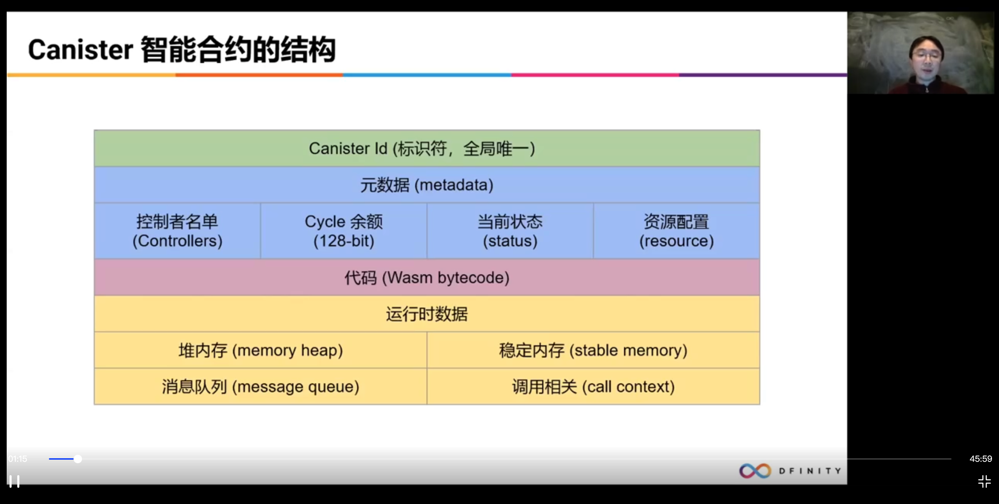
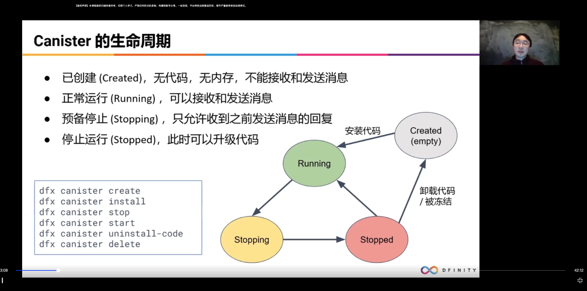
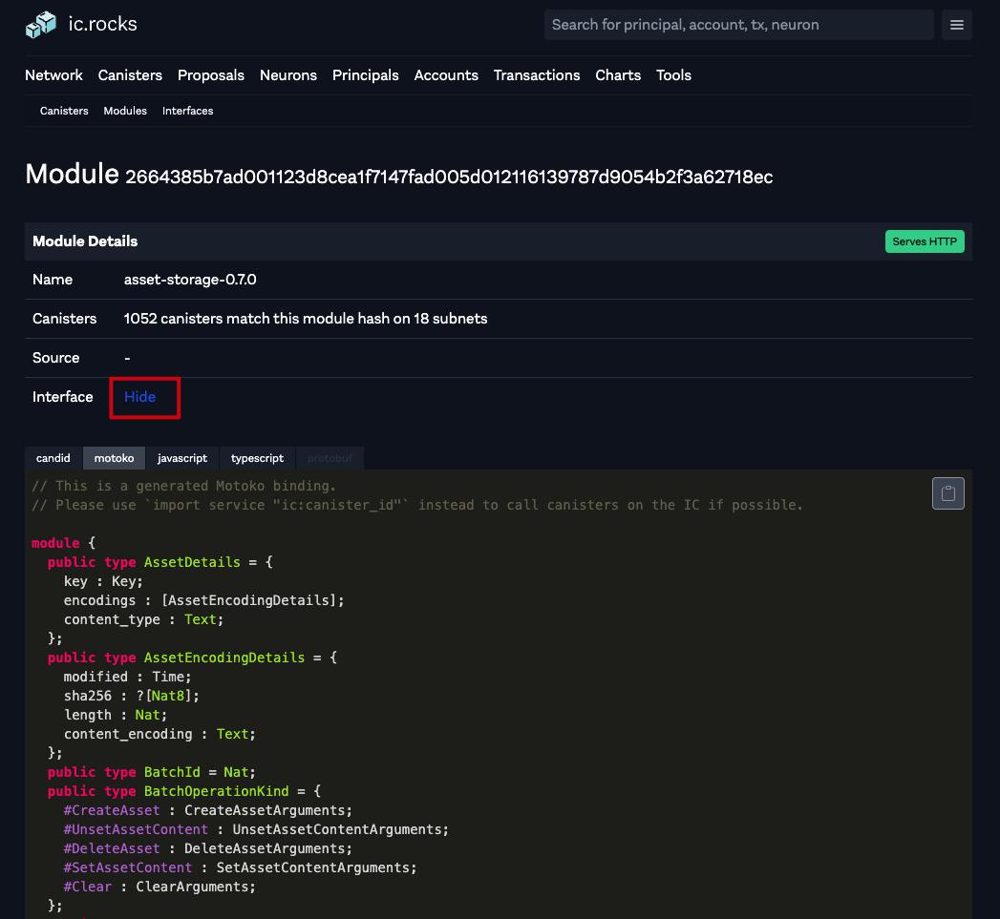
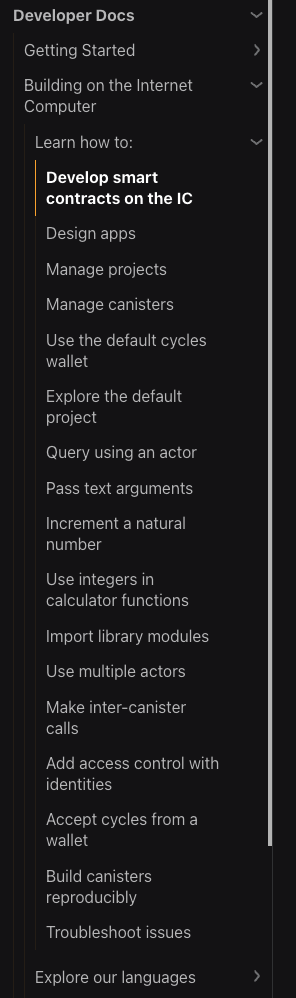

# 作业点评会

## Content
- [作业点评会](#作业点评会)
  - [Content](#content)
  - [开场白](#开场白)
  - [课程回顾](#课程回顾)
  - [作业相关](#作业相关)
    - [作业讲解](#作业讲解)
    - [作业中发现的问题](#作业中发现的问题)
  - [其他资料](#其他资料)

## 开场白
大家好，我是第 2 组助教冯力全，今天针对第三课，智能合约 canister 开发实例进行作业点评。


## 课程回顾

第三课主要是 Canister 智能合约相关的内容。先快速回顾一下相关内容，如果遇到不清晰的地方，建议直接去看第三课的瓜哥讲的视频。看完视频之后还不清晰可以去 [Developer Center](https://smartcontracts.org/docs/quickstart/quickstart-intro.html) 搜索以及在课程群里面讨论。

首先讲解了 Canister 结构。它是包含 Canister Id，元数据，Wasm 代码，运行时数据。



然后是 canister 生命周期，可以使用 dfx 去控制 canister 创建，安装代码，停止 canister，卸载代码，删除 canister 等功能。具体查看`dfx canister -h`


接着介绍了反向 Gas 模型，即 Cycles 怎么收费的。首先 canister 自己给自己付费，价格是 1 T cycles 等于 1 SDR，约等于 1.4 美元。

需要注意一点，余额不足维持 30 天时 canister 会被冻结。余额为零时会被删除。

然后讲了一下公共接口，公共接口有几个特点：
1. 只有接收到消息才开始运行
2. 每个消息相当于一次异步的方法调用
3. 可以对收到的消息进行答复，对方收到答复也是一次方法调用
4. 只有当一次调用成功完成时，状态才会保存，对外的消息才会发出（原子性）
5. Canister 的公共接口任何人都可以调用

接着演示了怎么转移 cycles。
1. 需要用到 [base/ExperimentalCycles.mo](https://github.com/dfinity/motoko-base/blob/master/src/ExperimentalCycles.mo) base 库里面的接口。接口功能可以去链接里面看。
2. canister 里面某个公共函数想要发送 cycles，需要先执行👆库里面的 add() 来携带 cycles。然后再发起一个异步调用，将 cycles 发送到某个canister。canister 想接收 cycles，也需要依次调用 available() 和 accept() 来接收 cycles。
3. 还演示了 Motoko 里面怎么讲一个函数当作参数，函数类型该怎么表示之类的。
   
接着讲了 update call 和 Query call 的区别：
整的来说，他们的区别在几点，update call 能够改变链上状态，需要共识，顺序执行，大概2-3s能够得到结果。
query call 属于只读模式，不能改变链上状态，不需要共识，可以并行执行，大概100 毫秒得到结果。

知道调用的几种形式之后，接着讲了给 canister 发送消息，字段里面有
1. 请求类型
2. 发送方
3. Nonce
4. 有效期
5. 接收方
6. 方法
7. 参数 
8. 1-7 进行 Hash 得到的 Request id 进行签名。

Principal Id，用户/canister/anonymous。

发送消息只是发送过去并执行。读取结果还需要发起一个 read_state 的消息。里面包含：
1. 请求类型
2. 发送方
3. Nonce
4. 有效期
5. 路径（Path，什么状态）

还讲了消息的处理步骤，从 http 请求开始，到消息被丢弃。

用 http_request 方法给 canister 实现网页服务：
实现这个接口就可以。具体可以参考ic.rocks里面这个 asset-storage 下面的 Interface 描述。Candid 和 Motoko 都有：
https://ic.rocks/modules/2664385b7ad001123d8cea1f7147fad005d012116139787d9054b2f3a62718ec


## 作业相关

### 作业讲解

假如你不需要一个 Canister 了，可以卸载它。但怎么回收剩余的 cycles？请写明详细操作步骤。

```sh
dfx identity get-principal
qbyxf-lll3o-rmkt4-thocb-vo3bz-d2mfj-3nwa7-pv2rf-iqfqw-rgkg2-hqe

dfx ledger account-id
2df79de9b17d7006f2be212be918a4c9f309992dc6a8cbc93fb02a819f1d9d19


dfx ledger --network ic create-canister --amount 0.4 qbyxf-lll3o-rmkt4-thocb-vo3bz-d2mfj-3nwa7-pv2rf-iqfqw-rgkg2-hqe
Transfer sent at BlockHeight: 1970211
Canister created with id: "7y72k-iiaaa-aaaam-qablq-cai"

dfx canister --network ic --no-wallet  status 7y72k-iiaaa-aaaam-qablq-cai
Canister status call result for 7y72k-iiaaa-aaaam-qablq-cai.
Status: Running
Controllers: qbyxf-lll3o-rmkt4-thocb-vo3bz-d2mfj-3nwa7-pv2rf-iqfqw-rgkg2-hqe
Memory allocation: 0
Compute allocation: 0
Freezing threshold: 2_592_000
Memory Size: Nat(0)
Balance: 9_600_038_684_000 Cycles
Module hash: None


dfx identity --network ic deploy-wallet 7y72k-iiaaa-aaaam-qablq-cai
Creating a wallet canister on the ic network.
The wallet canister on the "ic" network for user "icp2" is "7y72k-iiaaa-aaaam-qablq-cai"

dfx identity --network ic get-wallet
7y72k-iiaaa-aaaam-qablq-cai


dfx canister --network ic --no-wallet status 7y72k-iiaaa-aaaam-qablq-cai
Canister status call result for 7y72k-iiaaa-aaaam-qablq-cai.
Status: Running
Controllers: qbyxf-lll3o-rmkt4-thocb-vo3bz-d2mfj-3nwa7-pv2rf-iqfqw-rgkg2-hqe
Memory allocation: 0
Compute allocation: 0
Freezing threshold: 2_592_000
Memory Size: Nat(4798727)
Balance: 9_596_016_005_585 Cycles
Module hash: 0x9183a38dd2eb1a4295f360990f87e67aa006f225910ab14880748e091248e086

# https://github.com/dfinity/examples/blob/master/motoko/hello_cycles/src/hello_cycles/main.mo
# sudo dfx deploy --network ic --with-cycles 500_000_000_000
sudo dfx deploy --network ic 
Password:
Deploying all canisters.
All canisters have already been created.
Building canisters...
Installing canisters...
Installing code for canister cycles_hello, with canister_id 6vr6e-haaaa-aaaam-qabma-cai
Deployed canisters.


dfx canister --network ic --no-wallet status 7y72k-iiaaa-aaaam-qablq-cai
Canister status call result for 7y72k-iiaaa-aaaam-qablq-cai.
Status: Running
Controllers: qbyxf-lll3o-rmkt4-thocb-vo3bz-d2mfj-3nwa7-pv2rf-iqfqw-rgkg2-hqe
Memory allocation: 0
Compute allocation: 0
Freezing threshold: 2_592_000
Memory Size: Nat(4798727)
Balance: 5_595_476_188_378 Cycles
Module hash: 0x9183a38dd2eb1a4295f360990f87e67aa006f225910ab14880748e091248e086

dfx canister --network ic status 6vr6e-haaaa-aaaam-qabma-cai 
Canister status call result for 6vr6e-haaaa-aaaam-qabma-cai.
Status: Running
Controllers: 7y72k-iiaaa-aaaam-qablq-cai
Memory allocation: 0
Compute allocation: 0
Freezing threshold: 2_592_000
Memory Size: Nat(372876)
Balance: 3_899_999_404_503 Cycles
Module hash: 0x4cd86c39845a0090a40b6da23a476f2172d59ca9ede346b2dfe0b67433ce2ca7


dfx canister --network ic call cycles_hello transfer '(func "7y72k-iiaaa-aaaam-qablq-cai".wallet_receive, 3_700_000_000_000:nat)'
(record { refunded = 0 : nat })


dfx canister --network ic status 6vr6e-haaaa-aaaam-qabma-cai
Canister status call result for 6vr6e-haaaa-aaaam-qabma-cai.
Status: Running
Controllers: 7y72k-iiaaa-aaaam-qablq-cai
Memory allocation: 0
Compute allocation: 0
Freezing threshold: 2_592_000
Memory Size: Nat(372876)
Balance: 199_996_582_561 Cycles
Module hash: 0x4cd86c39845a0090a40b6da23a476f2172d59ca9ede346b2dfe0b67433ce2ca7


dfx canister --network ic --no-wallet status 7y72k-iiaaa-aaaam-qablq-cai
Canister status call result for 7y72k-iiaaa-aaaam-qablq-cai.
Status: Running
Controllers: qbyxf-lll3o-rmkt4-thocb-vo3bz-d2mfj-3nwa7-pv2rf-iqfqw-rgkg2-hqe
Memory allocation: 0
Compute allocation: 0
Freezing threshold: 2_592_000
Memory Size: Nat(4798727)
Balance: 9_295_467_586_808 Cycles
Module hash: 0x9183a38dd2eb1a4295f360990f87e67aa006f225910ab14880748e091248e086


dfx canister --network ic stop cycles_hello
Stopping code for canister cycles_hello, with canister_id 6vr6e-haaaa-aaaam-qabma-cai

dfx canister --network ic delete 6vr6e-haaaa-aaaam-qabma-cai
Beginning withdrawl of 189996575946 cycles to canister 7y72k-iiaaa-aaaam-qablq-cai.
Setting the controller to identity princpal.
Installing temporary wallet in canister 6vr6e-haaaa-aaaam-qabma-cai to enable transfer of cycles.
Transfering 189996575946 cycles to canister 7y72k-iiaaa-aaaam-qablq-cai.
Deleting code for canister 6vr6e-haaaa-aaaam-qabma-cai, with canister_id 6vr6e-haaaa-aaaam-qabma-cai
An error happened during communication with the replica: error sending request for url (https://ic0.app/api/v2/canister/6vr6e-haaaa-aaaam-qabma-cai/read_state): http2 error: protocol error: not a result of an error


dfx canister --network ic status 6vr6e-haaaa-aaaam-qabma-cai            
The invocation to the wallet call forward method failed with the error: An error happened during the call: 3: Canister 6vr6e-haaaa-aaaam-qabma-cai not found


dfx canister --network ic --no-wallet status 7y72k-iiaaa-aaaam-qablq-cai

Canister status call result for 7y72k-iiaaa-aaaam-qablq-cai.
Status: Running
Controllers: qbyxf-lll3o-rmkt4-thocb-vo3bz-d2mfj-3nwa7-pv2rf-iqfqw-rgkg2-hqe
Memory allocation: 0
Compute allocation: 0
Freezing threshold: 2_592_000
Memory Size: Nat(4798727)
Balance: 9_485_450_085_776 Cycles
Module hash: 0x9183a38dd2eb1a4295f360990f87e67aa006f225910ab14880748e091248e086
```

一、学习 Counter 的例子，并且部署到主网 https://smartcontracts.org/docs/developers-guide/tutorials/counter-tutorial.html 要求：提交主网完成部署的 Canister ID （URL，4 分）

实现：https://github.com/dfinity/examples/blob/master/motoko/counter/src/Main.mo
```sh
actor Counter {

  stable var counter = 0;

  // Get the value of the counter.
  public query func get() : async Nat {
    return counter;
  };

  // Set the value of the counter.
  public func set(n : Nat) : async () {
    counter := n;
  };

  // Increment the value of the counter.
  public func inc() : async () {
    counter += 1;
  };
};
```

二、给 Counter 添加一个 http_request 方法，用返回 html 的方式显示当前 count 的值。 要求： 1）提交主程序源码 URL （3 分） 2）完成主网部署并提交 URL（3 分）

这个课程上也讲得很清晰，就是设置一个 http_request 公共接口，并且它返回到类型要按照 HTTP Response 去构造。
如果简单的做，可以参考 https://github.com/mix-labs/IC-demo-11-30-21/blob/master/demo_mo/src/demo_mo/main.mo#L57，
```sh
    type HeaderField = (Text, Text);
    type HttpResponse = {
        status_code: Nat16;
        headers: [HeaderField];
        body: Blob;
    };

    public query func http_request() : async HttpResponse {
        var list = "Total " # Nat.toText(balances.size()) # " hodl: \n\n" # "Principal:                                                       balances: \n";
        for ((k,v) in balances.entries()) {
            list := list # Principal.toText(k) # "  " # Nat64.toText(v) # "\n";
        };
        {
            status_code = 200;
            headers = [("content-type", "text/plain")];
            body = Text.encodeUtf8 (list)
        }
    };
```
然后进行改造，至于打印 Hello world，就把 list 改成 `"Hello world"`，如果要 html 显示， headers 可指定为 []，默认使用 html。

如果参考 asset-storage-0.7.0，可以从这里找到它的实现： https://ic.rocks/modules/2664385b7ad001123d8cea1f7147fad005d012116139787d9054b2f3a62718ec
```sh
  public type HeaderField = (Text, Text);
  public type HttpRequest = {
    url : Text;
    method : Text;
    body : [Nat8];
    headers : [HeaderField];
  };
  public type HttpResponse = {
    body : [Nat8];
    headers : [HeaderField];
    streaming_strategy : ?StreamingStrategy;
    status_code : Nat16;
  };

    public type StreamingCallbackHttpResponse = {
    token : ?StreamingCallbackToken;
    body : [Nat8];
  };
  public type StreamingCallbackToken = {
    key : Text;
    sha256 : ?[Nat8];
    index : Nat;
    content_encoding : Text;
  };
  public type StreamingStrategy = {
    #Callback : {
      token : StreamingCallbackToken;
      callback : shared query StreamingCallbackToken -> async StreamingCallbackHttpResponse;
    };
  };
```

### 作业中发现的问题
第二组 14 人交了 9 人。基本完成的很好。然后有 1 人 http_request 没有实现。

第一题有具体文档，一步一步按照文档来即可，但是还是有 30% 左右的人没交，所以主要是态度问题，愿意不愿意花时间/精力去学习

然后 http_request 刚开始确实卡住一些人，后来群里讲了一下后提交的人数好多了。现在回头看要实现这个肯定是不难的，都是很基础的。所以这里涉及到大家对 IC 这一套技术体系不熟悉的问题。这个需要多练习，可以对照文档来一步步实习相关概念/流程，尤其是开发者文档： https://smartcontracts.org/docs/developers-guide/sdk-guide.html


还可以多多看一下 motoko-base 以及 examples

## 其他资料
* https://github.com/dfinity/motoko-base
* https://github.com/dfinity/examples