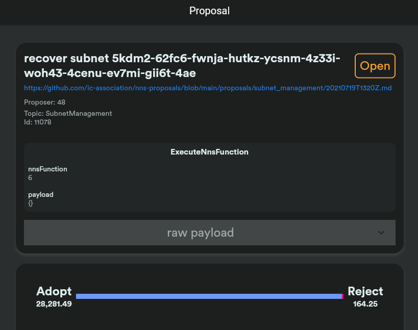

# How to use dfx to interact with NNS canisters instead of nns app

# Contents
- [How to use dfx to interact with NNS canisters instead of nns app](#how-to-use-dfx-to-interact-with-nns-canisters-instead-of-nns-app)
- [Contents](#contents)
- [Background](#background)
- [How](#how)
  - [dfx](#dfx)
  - [Create neurons](#create-neurons)
  - [Query neuron information](#query-neuron-information)
  - [Operating neuron](#operating-neuron)
    - [Set dissolve delay](#set-dissolve-delay)
    - [Neuron voting](#neuron-voting)

# Background
**My users do not have WebAuthn-supported devices, can them still participate in governance on the IC?**

Now all operations related to ICP and neuron management need to use [the NNS app](https://nns.ic0.app/).

In most cases, the NNS app is able to meet the demand. However, the demand cannot be met in the following situations:

1. When the Identity cannot be used, because the NNS app relies on the authentication of the Identity component, the NNS app will also be unavailable.
    1. For example, corresponding to the seed round users, their locked neurons are controlled by the mnemonic phrase generated in 2017, and they cannot transfer control to the account in Identity. At this time, if they want to manipulate neurons (such as voting, unlocking, etc.), they cannot use the NNS app.
    2. The amount of user management is very large. If you want to use the offline two-step verification based on the private key file, you cannot use the NNS app at this time.
    3. WebAuth is still a relatively new standard, and browser support is not complete. And there are still many terminal devices (mobile phones, computers, etc.) that do not support security chips.
2. When you need to manipulate neurons in batches, for example, you need to operate 100 neurons to vote. If it is based on the NNS app, you need to click hundreds of times, and wait for the voting results, etc., which is more troublesome


# How
## dfx
Using dfx + enough information about the IC, it is possible to complete all the operations that interact with all the canisters on the IC.

Now suppose that dfx has configured an account, icp, which has a sufficient amount of icp (at least 1.1 ICPs, of which 1 ICP is used to pledge in neurons, and 0.1 ICP is used for handling fees).
## Create neurons

tools:
[subaccount](https://github.com/flyq/blogs/blob/master/Dfinity/subaccount/src/main.rs)

```sh
# Get the account balance on the mainnet
dfx ledger --network=https://ic0.app balance
1.47200000 ICP

# Get the principal id of the account
dfx identity get-principal
yhy6j-huy54-mkzda-m26hc-yklb3-dzz4l-i2ykq-kr7tx-dhxyf-v2c2g-tae

# Get the account id of the account
dfx ledger account-id
073ca335431d6b6f6916068b5784a241730d2e3452ae650025b4bf7a975a81f0

# Set governance canister address
governance="principal \"rrkah-fqaaa-aaaaa-aaaaq-cai\""

# Call Ledger canister (ryjl3-tyaaa-aaaaa-aaaba-cai) and send 1 ICP to a sub-account (to) under the governance_canister_id.
# Where the to is generated using [subaccount](subaccount/src/main.rs). Equal to governance_canister_id + sub
# It can be seen that sub is obtained through caller (sending address) and memo (here is 0), and then after a series of changes.
# After the transaction is sent, get the block height of the transaction 291747
# The transaction link is https://dashboard.internetcomputer.org/transaction/d7eec9a3105857a94754838cb2dca9568836b3f441a89b498c5b729a02a7a9f3

dfx canister --network=https://ic0.app --no-wallet call ryjl3-tyaaa-aaaaa-aaaba-cai send_dfx "(record {memo=0:nat64;amount=record {e8s=100000000:nat64};fee=record {e8s=10000:nat64};from_subaccount=null;to=\"8ca2e53dd8b9f1924daf10cdf5879f6e4a5c3267ded5a7efb5e740b3e2f85ae3\";created_at_time=null})"
(291_747 : nat64)

# Then calling Ledger canister (ryjl3-tyaaa-aaaaa-aaaba-cai) to send a notification to the governance canister that the transfer has been successful
# The parameter block_height is the height of the previous transaction. to_canister is governance_canister_id,
# to_subaccount Use [subaccount](subaccount/src/main.rs) to generate. Similar to the previous transaction, it is obtained through caller (sending address) and memo (here is 0), and then after a series of changes.
# Finally return the neuron id (ic_nns_common::pb::v1::NeuronId)

dfx canister --network=https://ic0.app --no-wallet call ryjl3-tyaaa-aaaaa-aaaba-cai notify_dfx "(record {block_height=291747:nat64;max_fee=record{e8s=10000:nat64};from_subaccount=null;to_canister=$governance;to_subaccount=vec {151:nat8;153:nat8;127:nat8;225:nat8;241:nat8;148:nat8;194:nat8;208:nat8;107:nat8;96:nat8;196:nat8;180:nat8;189:nat8;234:nat8;210:nat8;114:nat8;65:nat8;81:nat8;192:nat8;46:nat8;165:nat8;142:nat8;58:nat8;137:nat8;118:nat8;125:nat8;47:nat8;181:nat8;92:nat8;181:nat8;165:nat8;94:nat8}})"
(record { 23_515 = 2_524_431_329_219_902_182 : nat64 })

# Check the balance, 1 ICP and part of the handling fee are missing
dfx ledger --network=https://ic0.app balance
0.47180000 ICP
```

## Query neuron information

Query and compare the governance candid file, add comments

```sh
dfx canister --network=https://ic0.app --no-wallet call rrkah-fqaaa-aaaaa-aaaaq-cai get_full_neuron "(2_524_431_329_219_902_182 : nat64)"
(
  variant { # Result_1
    17_724 = record { # Neuron
      23_515 = opt record { 23_515 = 2_524_431_329_219_902_182 : nat64 }; # id : opt NeuronId;
      79_599_772 = opt principal "yhy6j-huy54-mkzda-m26hc-yklb3-dzz4l-i2ykq-kr7tx-dhxyf-v2c2g-tae"; # controller : opt principal;
      349_671_467 = vec {}; # recent_ballots : vec BallotInfo;
      456_924_626 = true; # kyc_verified : bool;
      852_549_734 = false; # not_for_profit : bool;
      1_029_637_143 = 0 : nat64; # maturity_e8s_equivalent : nat64;
      1_257_408_332 = 100_000_000 : nat64; # cached_neuron_stake_e8s : nat64;
      1_392_680_831 = 1_626_759_699 : nat64; # created_timestamp_seconds : nat64;
      2_399_567_118 = 1_626_759_699 : nat64; # aging_since_timestamp_seconds : nat64;
      2_680_861_478 = vec {}; # hot_keys : vec principal;
      2_707_029_165 = blob "\97\99\7f\e1\f1\94\c2\d0k\60\c4\b4\bd\ea\d2rAQ\c0.\a5\8e:\89v}/\b5\5c\b5\a5^"; # account : vec nat8;
      3_084_775_299 = opt variant { 1_620_537_965 = 0 : nat64 }; # dissolve_state : opt DissolveState;
      3_407_357_762 = vec { # followees : vec record { int32; Followees };
        record {
          0 : int32;
          record { 3_407_357_762 = vec { record { 23_515 = 28 : nat64 } } };
        };
      };
      3_439_871_066 = 0 : nat64; # neuron_fees_e8s : nat64;
      3_664_621_355 = opt record { # transfer : opt NeuronStakeTransfer;
        1_077_262_001 = blob "\97\99\7f\e1\f1\94\c2\d0k\60\c4\b4\bd\ea\d2rAQ\c0.\a5\8e:\89v}/\b5\5c\b5\a5^"; #   to_subaccount : vec nat8;
        1_103_886_095 = 100_000_000 : nat64; # neuron_stake_e8s : nat64;
        1_136_829_802 = opt principal "yhy6j-huy54-mkzda-m26hc-yklb3-dzz4l-i2ykq-kr7tx-dhxyf-v2c2g-tae"; # from : opt principal;
        1_213_809_850 = 0 : nat64; # memo : nat64;
        1_835_347_746 = vec {}; # from_subaccount : vec nat8;
        3_066_807_170 = 1_626_759_699 : nat64; # transfer_timestamp : nat64;
        3_583_743_961 = 291_747 : nat64; # block_height : nat64;
      };
    }
  },
)

# Returns the id of the neuron controlled by the account, here is the one just created
dfx canister --network=https://ic0.app --no-wallet call rrkah-fqaaa-aaaaa-aaaaq-cai get_neuron_ids
(vec { 2_524_431_329_219_902_182 : nat64 })

# Get the basic information of the neuron
dfx canister --network=https://ic0.app --no-wallet call rrkah-fqaaa-aaaaa-aaaaq-cai get_neuron_info "(2_524_431_329_219_902_182 : nat64)"
(
  variant { # Result_2
    17_724 = record { # NeuronInfo
      303_619_573 = 0 : nat64; # dissolve_delay_seconds : nat64;
      349_671_467 = vec {}; # recent_ballots : vec BallotInfo;
      1_392_680_831 = 1_626_759_699 : nat64; # created_timestamp_seconds : nat64;
      2_215_343_633 = 3 : int32; # state : int32;
      3_433_024_449 = 1_626_762_752 : nat64; # retrieved_at_timestamp_seconds : nat64;
      3_871_395_629 = 100_000_604 : nat64; # voting_power : nat64;
      4_290_862_015 = 3_053 : nat64; # age_seconds : nat64;
    }
  },
)

# Get the current Pending proposal
dfx canister --network=https://ic0.app --no-wallet call rrkah-fqaaa-aaaaa-aaaaq-cai get_pending_proposals
(
  vec {
    record { # ProposalInfo
      23_515 = opt record { 23_515 = 11_078 : nat64 }; # id : opt NeuronId;
      100_394_802 = 1 : int32; # status : int32;
      338_645_423 = 7 : int32; # topic : int32;
      568_110_681 = null; # ballots : vec record { nat64; Ballot };
      718_522_127 = vec {}; 
      1_120_297_033 = 1_626_700_972 : nat64; # proposal_timestamp_seconds : nat64;
      1_138_543_385 = 0 : nat64; # reward_event_round : nat64;
      1_453_869_204 = 0 : nat64; # failed_timestamp_seconds : nat64;
      1_659_864_270 = 100_000_000 : nat64; # reject_cost_e8s : nat64;
      2_084_260_468 = opt record { # latest_tally : opt Tally;
        24_641 = 16_425_617_043 : nat64; # no : nat64;
        6_039_847 = 2_806_966_682_423 : nat64; # yes : nat64;
        338_842_564 = 31_775_041_633_396_566 : nat64; # total : nat64;
        4_174_818_006 = 1_626_760_638 : nat64; # timestamp_seconds : nat64;
      };
      2_139_208_002 = 1 : int32; # reward_status : int32;
      2_756_235_859 = 0 : nat64; # decided_timestamp_seconds : nat64;
      3_000_310_834 = opt record { # proposal : opt Proposal;
        5_843_823 = "https://github.com/ic-association/nns-proposals/blob/main/proposals/subnet_management/20210719T1320Z.md"; # url : text
        373_701_558 = opt variant { # action : opt Action
          2_746_863_190 = record { # ExecuteNnsFunction : ExecuteNnsFunction;
            1_563_405_284 = 6 : int32; # nns_function : int32;
            3_979_722_638 = blob "DIDL\06l\06\e7\8f\b0\12x\c4\c1\81D\01\bd\86\9d\8b\04h\8c\c9\9c\ae\06\03\fc\ef\cc\a6\0d\05\f7\e0\ab\c7\0dxn\02mhn\04l\03\00q\01q\02xm{\01\00\f8&T\00\00\00\00\00\01\00\01\1dE\17\8bf\a4\07\a4\d5\9c\0aMg3\bd\a2\ce?7\c1\11\b4%~\c4\19\08\f4\f8\02\00 \1d\dc\eb\c4<_\00\efp\ee\9d5Zc}\f5ZA\e8\9f\8d\bda\ab d\10K\dc\c0\c1 \b0J\8a\a5\e83\93\16"; # payload : vec nat8
          }
        };
        2_162_756_390 = "recover subnet 5kdm2-62fc6-fwnja-hutkz-ycsnm-4z33i-woh43-4cenu-ev7mi-gii6t-4ae"; # summary : text
      };
      3_000_311_732 = opt record { 23_515 = 48 : nat64 }; # proposer : opt NeuronId;
      4_133_454_822 = 0 : nat64; # executed_timestamp_seconds : nat64;
    };
  },
)
```

Proposal'situations Action type, that is, what kinds of proposals are there:
```did
type Action = variant {
  ManageNeuron : ManageNeuron;
  ExecuteNnsFunction : ExecuteNnsFunction;
  RewardNodeProvider : RewardNodeProvider;
  SetDefaultFollowees : SetDefaultFollowees;
  ManageNetworkEconomics : NetworkEconomics;
  ApproveGenesisKyc : ApproveGenesisKyc;
  AddOrRemoveNodeProvider : AddOrRemoveNodeProvider;
  Motion : Motion;
};
```

Get information about a specific neuron
```sh
dfx canister --network=https://ic0.app --no-wallet call rrkah-fqaaa-aaaaa-aaaaq-cai get_proposal_info "(11_077:nat64)"
(
  opt record { # ProposalInfo
    23_515 = opt record { 23_515 = 11_077 : nat64 }; # id : opt NeuronId;
    100_394_802 = 4 : int32;  # status : int32;
    338_645_423 = 2 : int32;  # topic : int32;
    568_110_681 = null;  # ballots : vec record { nat64; Ballot };
    718_522_127 = vec {};
    1_120_297_033 = 1_626_700_814 : nat64;  # proposal_timestamp_seconds : nat64;
    1_138_543_385 = 0 : nat64; # reward_event_round : nat64;
    1_453_869_204 = 0 : nat64; # failed_timestamp_seconds : nat64;
    1_659_864_270 = 100_000_000 : nat64; # reject_cost_e8s : nat64;
    2_084_260_468 = opt record { # latest_tally : opt Tally;
      24_641 = 0 : nat64; # no : nat64;
      6_039_847 = 31_765_476_162_104_117 : nat64;  # yes : nat64;
      338_842_564 = 31_775_041_889_086_177 : nat64;  # total : nat64;
      4_174_818_006 = 1_626_700_819 : nat64; # timestamp_seconds : nat64;
    };
    2_139_208_002 = 2 : int32; # reward_status : int32;
    2_756_235_859 = 1_626_700_819 : nat64;  # decided_timestamp_seconds : nat64;
    3_000_310_834 = opt record { # proposal : opt Proposal;
      5_843_823 = ""; # url : text
      373_701_558 = opt variant {  # action : opt Action
        2_746_863_190 = record { # # ExecuteNnsFunction : ExecuteNnsFunction;
          1_563_405_284 = 10 : int32;  # nns_function : int32;
          3_979_722_638 = blob "DIDL\01l\03\90\cb\8b\aa\01q\df\f5\81\a0\08x\d6\d5\da\c6\0fx\01\00 {\22icp\22:[\22Huobi\22],\22sdr\22:\22xe.com\22}\ccC\03\00\00\00\00\00\00|\f5\60\00\00\00\00"; # payload : vec nat8
        }
      };
      2_162_756_390 = "The ICP/XDR conversion rate is set to 21.3964."; # summary : text
    };
    3_000_311_732 = opt record { 23_515 = 25 : nat64 }; # proposer : opt NeuronId;
    4_133_454_822 = 1_626_700_819 : nat64; # executed_timestamp_seconds : nat64;
  },
)
```


```sh
dfx canister --network=https://ic0.app --no-wallet call rrkah-fqaaa-aaaaa-aaaaq-cai list_neurons "(record{neuron_ids=vec {2_524_431_329_219_902_182:nat64;};include_neurons_readable_by_caller=true;})"
(
  record { # type ListNeuronsResponse = record {
    1_319_168_057 = vec { #   neuron_infos : vec record { nat64; NeuronInfo };
      record { # 
        2_524_431_329_219_902_182 : nat64; # nat64
        record {  # NeuronInfo
          303_619_573 = 0 : nat64;  #   dissolve_delay_seconds : nat64;
          349_671_467 = vec {}; #   recent_ballots : vec BallotInfo;
          1_392_680_831 = 1_626_759_699 : nat64; #   created_timestamp_seconds : nat64;
          2_215_343_633 = 3 : int32; #   state : int32;
          3_433_024_449 = 1_626_769_938 : nat64; #   retrieved_at_timestamp_seconds : nat64;
          3_871_395_629 = 100_002_027 : nat64; #   voting_power : nat64;
          4_290_862_015 = 10_239 : nat64; #   age_seconds : nat64;
        };
      };
    };
    1_488_793_264 = vec { #   full_neurons : vec Neuron;
      record {  # type Neuron = record {
        23_515 = opt record { 23_515 = 2_524_431_329_219_902_182 : nat64 }; #   id : opt NeuronId;
        79_599_772 = opt principal "yhy6j-huy54-mkzda-m26hc-yklb3-dzz4l-i2ykq-kr7tx-dhxyf-v2c2g-tae"; #   controller : opt principal;
        349_671_467 = vec {}; #   recent_ballots : vec BallotInfo;
        456_924_626 = true; #   kyc_verified : bool;
        852_549_734 = false;  #   not_for_profit : bool;
        1_029_637_143 = 0 : nat64; #   maturity_e8s_equivalent : nat64;
        1_257_408_332 = 100_000_000 : nat64; #   cached_neuron_stake_e8s : nat64;
        1_392_680_831 = 1_626_759_699 : nat64; #   created_timestamp_seconds : nat64;
        2_399_567_118 = 1_626_759_699 : nat64; #   aging_since_timestamp_seconds : nat64;
        2_680_861_478 = vec {}; #   hot_keys : vec principal;
        2_707_029_165 = blob "\97\99\7f\e1\f1\94\c2\d0k\60\c4\b4\bd\ea\d2rAQ\c0.\a5\8e:\89v}/\b5\5c\b5\a5^"; #   account : vec nat8;
        3_084_775_299 = opt variant { 1_620_537_965 = 0 : nat64 }; #   dissolve_state : opt DissolveState;
        3_407_357_762 = vec { #   followees : vec record { int32; Followees };
          record {
            0 : int32;
            record { 3_407_357_762 = vec { record { 23_515 = 28 : nat64 } } }; # type Followees = record { followees : vec NeuronId };
          };
        };
        3_439_871_066 = 0 : nat64; #   neuron_fees_e8s : nat64;
        3_664_621_355 = opt record { #   transfer : opt NeuronStakeTransfer;
          1_077_262_001 = blob "\97\99\7f\e1\f1\94\c2\d0k\60\c4\b4\bd\ea\d2rAQ\c0.\a5\8e:\89v}/\b5\5c\b5\a5^";
          1_103_886_095 = 100_000_000 : nat64;
          1_136_829_802 = opt principal "yhy6j-huy54-mkzda-m26hc-yklb3-dzz4l-i2ykq-kr7tx-dhxyf-v2c2g-tae";
          1_213_809_850 = 0 : nat64;
          1_835_347_746 = vec {};
          3_066_807_170 = 1_626_759_699 : nat64;
          3_583_743_961 = 291_747 : nat64;
        };
      };
      record {
        23_515 = opt record { 23_515 = 2_524_431_329_219_902_182 : nat64 };
        79_599_772 = opt principal "yhy6j-huy54-mkzda-m26hc-yklb3-dzz4l-i2ykq-kr7tx-dhxyf-v2c2g-tae";
        349_671_467 = vec {};
        456_924_626 = true;
        852_549_734 = false;
        1_029_637_143 = 0 : nat64;
        1_257_408_332 = 100_000_000 : nat64;
        1_392_680_831 = 1_626_759_699 : nat64;
        2_399_567_118 = 1_626_759_699 : nat64;
        2_680_861_478 = vec {};
        2_707_029_165 = blob "\97\99\7f\e1\f1\94\c2\d0k\60\c4\b4\bd\ea\d2rAQ\c0.\a5\8e:\89v}/\b5\5c\b5\a5^";
        3_084_775_299 = opt variant { 1_620_537_965 = 0 : nat64 };
        3_407_357_762 = vec {
          record {
            0 : int32;
            record { 3_407_357_762 = vec { record { 23_515 = 28 : nat64 } } };
          };
        };
        3_439_871_066 = 0 : nat64;
        3_664_621_355 = opt record {
          1_077_262_001 = blob "\97\99\7f\e1\f1\94\c2\d0k\60\c4\b4\bd\ea\d2rAQ\c0.\a5\8e:\89v}/\b5\5c\b5\a5^";
          1_103_886_095 = 100_000_000 : nat64;
          1_136_829_802 = opt principal "yhy6j-huy54-mkzda-m26hc-yklb3-dzz4l-i2ykq-kr7tx-dhxyf-v2c2g-tae";
          1_213_809_850 = 0 : nat64;
          1_835_347_746 = vec {};
          3_066_807_170 = 1_626_759_699 : nat64;
          3_583_743_961 = 291_747 : nat64;
        };
      };
    };
  },
)

dfx canister --network=https://ic0.app --no-wallet call rrkah-fqaaa-aaaaa-aaaaq-cai list_neurons "(record{neuron_ids=vec {2_524_431_329_219_902_182:nat64;};include_neurons_readable_by_caller=false;})"
(
  record {
    1_319_168_057 = vec {
      record {
        2_524_431_329_219_902_182 : nat64;
        record {
          303_619_573 = 0 : nat64;
          349_671_467 = vec {};
          1_392_680_831 = 1_626_759_699 : nat64;
          2_215_343_633 = 3 : int32;
          3_433_024_449 = 1_626_770_001 : nat64;
          3_871_395_629 = 100_002_040 : nat64;
          4_290_862_015 = 10_302 : nat64;
        };
      };
    };
    1_488_793_264 = vec {
      record {
        23_515 = opt record { 23_515 = 2_524_431_329_219_902_182 : nat64 };
        79_599_772 = opt principal "yhy6j-huy54-mkzda-m26hc-yklb3-dzz4l-i2ykq-kr7tx-dhxyf-v2c2g-tae";
        349_671_467 = vec {};
        456_924_626 = true;
        852_549_734 = false;
        1_029_637_143 = 0 : nat64;
        1_257_408_332 = 100_000_000 : nat64;
        1_392_680_831 = 1_626_759_699 : nat64;
        2_399_567_118 = 1_626_759_699 : nat64;
        2_680_861_478 = vec {};
        2_707_029_165 = blob "\97\99\7f\e1\f1\94\c2\d0k\60\c4\b4\bd\ea\d2rAQ\c0.\a5\8e:\89v}/\b5\5c\b5\a5^";
        3_084_775_299 = opt variant { 1_620_537_965 = 0 : nat64 };
        3_407_357_762 = vec {
          record {
            0 : int32;
            record { 3_407_357_762 = vec { record { 23_515 = 28 : nat64 } } };
          };
        };
        3_439_871_066 = 0 : nat64;
        3_664_621_355 = opt record {
          1_077_262_001 = blob "\97\99\7f\e1\f1\94\c2\d0k\60\c4\b4\bd\ea\d2rAQ\c0.\a5\8e:\89v}/\b5\5c\b5\a5^";
          1_103_886_095 = 100_000_000 : nat64;
          1_136_829_802 = opt principal "yhy6j-huy54-mkzda-m26hc-yklb3-dzz4l-i2ykq-kr7tx-dhxyf-v2c2g-tae";
          1_213_809_850 = 0 : nat64;
          1_835_347_746 = vec {};
          3_066_807_170 = 1_626_759_699 : nat64;
          3_583_743_961 = 291_747 : nat64;
        };
      };
    };
  },
)
```


## Operating neuron

type of neuron operation:
```did
type Command = variant {
  Spawn : Spawn;
  Split : Split;
  Follow : Follow;
  Configure : Configure;
  RegisterVote : RegisterVote;
  DisburseToNeuron : DisburseToNeuron;
  MakeProposal : Proposal;
  Disburse : Disburse;
};
```
1. Spawn，"Laying eggs", means that the neurons mature and can produce new small neurons, which contain the ICP that has been locked for few days(about 7 days?).
2. Split，one neuron can be branched into two neurons
3. Follow，Follow other neurons to vote
4. Configure，Configure neurons
5. RegisterVote，Actively vote on a proposal
6. DisburseToNeuron，
7. MakeProposal，
8. Disburse，Take out the ICP in the neuron that has been dissolved.


### Set dissolve delay
Only when the neuron's dissolution delay is greater than 6 months can you vote

Set the dissolution delay for the neurons created earlier, 7 months: `7*30*24*3600=18144000 seconds`

```sh
dfx canister --network=https://ic0.app --no-wallet call rrkah-fqaaa-aaaaa-aaaaq-cai manage_neuron "(record {id=opt record{id=2_524_431_329_219_902_182:nat64};command=opt variant{Configure=record {operation=opt variant {IncreaseDissolveDelay= record{additional_dissolve_delay_seconds=18144000:nat32}}}}})"
(record { 2_171_433_291 = opt variant { 1_647_237_574 = record {} } })
```


### Neuron voting
**Direct voting without dissolving delay (failure)**
Use the previously generated neuron id to vote: 2_524_431_329_219_902_182

Let's find a proposal that can still be voted: 11078 Proposal:



```sh
dfx canister --network=https://ic0.app --no-wallet call rrkah-fqaaa-aaaaa-aaaaq-cai get_proposal_info "(11078:nat64)"
(
  opt record { # ProposalInfo
    23_515 = opt record { 23_515 = 11_078 : nat64 }; # id : opt NeuronId;
    100_394_802 = 1 : int32;  # status : int32;
    338_645_423 = 7 : int32;  # topic : int32;
    568_110_681 = null;  # ballots : vec record { nat64; Ballot };
    718_522_127 = vec {};  
    1_120_297_033 = 1_626_700_972 : nat64;# proposal_timestamp_seconds : nat64;
    1_138_543_385 = 0 : nat64; # reward_event_round : nat64;
    1_453_869_204 = 0 : nat64; # failed_timestamp_seconds : nat64;
    1_659_864_270 = 100_000_000 : nat64; # reject_cost_e8s : nat64;
    2_084_260_468 = opt record { # latest_tally : opt Tally;
      24_641 = 16_425_617_043 : nat64;  # no : nat64;
      6_039_847 = 5_371_532_431_420 : nat64;   # yes : nat64;
      338_842_564 = 31_775_041_633_396_566 : nat64;  # total : nat64;
      4_174_818_006 = 1_626_770_088 : nat64; # timestamp_seconds : nat64;
    };
    2_139_208_002 = 1 : int32; # reward_status : int32; 
    2_756_235_859 = 0 : nat64;  # decided_timestamp_seconds : nat64;
    3_000_310_834 = opt record { # proposal : opt Proposal;
      5_843_823 = "https://github.com/ic-association/nns-proposals/blob/main/proposals/subnet_management/20210719T1320Z.md";  # url : text
      373_701_558 = opt variant { # action : opt Action
        2_746_863_190 = record { # ExecuteNnsFunction : ExecuteNnsFunction;
          1_563_405_284 = 6 : int32; # nns_function : int32;
          3_979_722_638 = blob "DIDL\06l\06\e7\8f\b0\12x\c4\c1\81D\01\bd\86\9d\8b\04h\8c\c9\9c\ae\06\03\fc\ef\cc\a6\0d\05\f7\e0\ab\c7\0dxn\02mhn\04l\03\00q\01q\02xm{\01\00\f8&T\00\00\00\00\00\01\00\01\1dE\17\8bf\a4\07\a4\d5\9c\0aMg3\bd\a2\ce?7\c1\11\b4%~\c4\19\08\f4\f8\02\00 \1d\dc\eb\c4<_\00\efp\ee\9d5Zc}\f5ZA\e8\9f\8d\bda\ab d\10K\dc\c0\c1 \b0J\8a\a5\e83\93\16";; # payload : vec nat8
        }
      };
      2_162_756_390 = "recover subnet 5kdm2-62fc6-fwnja-hutkz-ycsnm-4z33i-woh43-4cenu-ev7mi-gii6t-4ae"; # summary : text
    };
    3_000_311_732 = opt record { 23_515 = 48 : nat64 }; # proposer : opt NeuronId;
    4_133_454_822 = 0 : nat64;  # executed_timestamp_seconds : nat64;
  },
)
```

Where vote = 1 means support, 2 means against, we support
```sh
dfx canister --network=https://ic0.app --no-wallet call rrkah-fqaaa-aaaaa-aaaaq-cai manage_neuron "(record {id=opt record{id=2_524_431_329_219_902_182:nat64};command=opt variant{RegisterVote=record {vote=1:int32;proposal=opt record{id=11078:nat64}}}})"

(
  record {
    2_171_433_291 = opt variant {
      106_380_200 = record {
        1_389_388_560 = "Neuron not authorized to vote on proposal.";
        3_790_638_545 = 3 : int32;
      }
    };
  },
)
```

**Vote after setting the dissolution delay**
```sh
dfx canister --network=https://ic0.app --no-wallet call rrkah-fqaaa-aaaaa-aaaaq-cai manage_neuron "(record {id=opt record{id=2_524_431_329_219_902_182:nat64};command=opt variant{RegisterVote=record {vote=1:int32;proposal=opt record{id=11078:nat64}}}})"
(
  record {
    2_171_433_291 = opt variant {
      106_380_200 = record {
        1_389_388_560 = "Neuron not authorized to vote on proposal.";
        3_790_638_545 = 3 : int32;
      }
    };
  },
)
```
The result was still a failure. It should be a while before you can vote after creating the neuron:
Asked a question https://forum.dfinity.org/t/how-long-does-it-take-to-start-voting-after-the-neuron-is-created/6011

After a few days, the voting period for Proposal 11078 has passed, and it has not been successfully implemented.

View neurons:

```sh
dfx canister --network=https://ic0.app --no-wallet call rrkah-fqaaa-aaaaa-aaaaq-cai get_neuron_info "(2_524_431_329_219_902_182 : nat64)"
(
  variant {
    17_724 = record {
      303_619_573 = 18_144_000 : nat64;
      349_671_467 = vec { record { 1_314_114_794 = 1 : int32; 2_744_746_248 = opt record { 23_515 = 11_428 : nat64;};}; record { 1_314_114_794 = 1 : int32; 2_744_746_248 = opt record { 23_515 = 11_394 : nat64;};}; record { 1_314_114_794 = 1 : int32; 2_744_746_248 = opt record { 23_515 = 11_395 : nat64;};}; record { 1_314_114_794 = 1 : int32; 2_744_746_248 = opt record { 23_515 = 11_396 : nat64;};}; record { 1_314_114_794 = 1 : int32; 2_744_746_248 = opt record { 23_515 = 11_397 : nat64;};}; record { 1_314_114_794 = 1 : int32; 2_744_746_248 = opt record { 23_515 = 11_398 : nat64;};}; record { 1_314_114_794 = 1 : int32; 2_744_746_248 = opt record { 23_515 = 11_400 : nat64;};}; record { 1_314_114_794 = 1 : int32; 2_744_746_248 = opt record { 23_515 = 11_401 : nat64;};}; record { 1_314_114_794 = 1 : int32; 2_744_746_248 = opt record { 23_515 = 11_402 : nat64;};}; record { 1_314_114_794 = 1 : int32; 2_744_746_248 = opt record { 23_515 = 11_403 : nat64;};}; record { 1_314_114_794 = 1 : int32; 2_744_746_248 = opt record { 23_515 = 11_404 : nat64;};}; record { 1_314_114_794 = 1 : int32; 2_744_746_248 = opt record { 23_515 = 11_405 : nat64;};}; record { 1_314_114_794 = 1 : int32; 2_744_746_248 = opt record { 23_515 = 11_406 : nat64;};}; record { 1_314_114_794 = 1 : int32; 2_744_746_248 = opt record { 23_515 = 11_407 : nat64;};}; record { 1_314_114_794 = 1 : int32; 2_744_746_248 = opt record { 23_515 = 11_408 : nat64;};}; record { 1_314_114_794 = 1 : int32; 2_744_746_248 = opt record { 23_515 = 11_410 : nat64;};}; record { 1_314_114_794 = 1 : int32; 2_744_746_248 = opt record { 23_515 = 11_411 : nat64;};}; record { 1_314_114_794 = 1 : int32; 2_744_746_248 = opt record { 23_515 = 11_412 : nat64;};}; record { 1_314_114_794 = 1 : int32; 2_744_746_248 = opt record { 23_515 = 11_413 : nat64;};}; record { 1_314_114_794 = 1 : int32; 2_744_746_248 = opt record { 23_515 = 11_414 : nat64;};}; record { 1_314_114_794 = 1 : int32; 2_744_746_248 = opt record { 23_515 = 11_415 : nat64;};}; record { 1_314_114_794 = 1 : int32; 2_744_746_248 = opt record { 23_515 = 11_290 : nat64;};}; record { 1_314_114_794 = 1 : int32; 2_744_746_248 = opt record { 23_515 = 11_291 : nat64;};}; record { 1_314_114_794 = 1 : int32; 2_744_746_248 = opt record { 23_515 = 11_292 : nat64;};}; record { 1_314_114_794 = 1 : int32; 2_744_746_248 = opt record { 23_515 = 11_289 : nat64;};}; record { 1_314_114_794 = 1 : int32; 2_744_746_248 = opt record { 23_515 = 11_283 : nat64;};}; record { 1_314_114_794 = 1 : int32; 2_744_746_248 = opt record { 23_515 = 11_282 : nat64;};}; record { 1_314_114_794 = 1 : int32; 2_744_746_248 = opt record { 23_515 = 11_280 : nat64;};}; record { 1_314_114_794 = 1 : int32; 2_744_746_248 = opt record { 23_515 = 11_279 : nat64;};}; record { 1_314_114_794 = 1 : int32; 2_744_746_248 = opt record { 23_515 = 11_254 : nat64;};}; record { 1_314_114_794 = 1 : int32; 2_744_746_248 = opt record { 23_515 = 11_256 : nat64;};}; record { 1_314_114_794 = 1 : int32; 2_744_746_248 = opt record { 23_515 = 11_257 : nat64;};}; record { 1_314_114_794 = 1 : int32; 2_744_746_248 = opt record { 23_515 = 11_258 : nat64;};}; record { 1_314_114_794 = 1 : int32; 2_744_746_248 = opt record { 23_515 = 11_259 : nat64;};}; record { 1_314_114_794 = 1 : int32; 2_744_746_248 = opt record { 23_515 = 11_260 : nat64;};}; record { 1_314_114_794 = 1 : int32; 2_744_746_248 = opt record { 23_515 = 11_262 : nat64;};};};
      1_392_680_831 = 1_626_759_699 : nat64;
      2_215_343_633 = 1 : int32;
      3_433_024_449 = 1_626_918_069 : nat64;
      3_871_395_629 = 107_217_302 : nat64;
      4_290_862_015 = 143_415 : nat64;
    }
  },
)
```
It is found that there are still a lot of voting records, which should follow the votes cast by neuron 28, that is, the neuron is successfully created and can vote normally.

Now there is no pending neuron, please try to find another pending neuron to actively vote

Someday later, voting a open proposal 12445:
```sh
 dfx canister --network=https://ic0.app --no-wallet call rrkah-fqaaa-aaaaa-aaaaq-cai manage_neuron "(record {id=opt record{id=2_524_431_329_219_902_182:nat64};command=opt variant{RegisterVote=record {vote=1:int32;proposal=opt record{id=12445:nat64}}}})"

(record { 2_171_433_291 = opt variant { 2_455_066_893 = record {} } })
```
Success!!

compare our neuron's difference before and after voting:
```sh
dfx canister --network=https://ic0.app --no-wallet call rrkah-fqaaa-aaaaa-aaaaq-cai get_neuron_info "(2_524_431_329_219_902_182 : nat64)"
(
  variant {
    17_724 = record {
      303_619_573 = 18_144_000 : nat64;
      349_671_467 = vec { record { 1_314_114_794 = 1 : int32; 2_744_746_248 = opt record { 23_515 = 12_457 : nat64;};}; record { 1_314_114_794 = 1 : int32; 2_744_746_248 = opt record { 23_515 = 12_448 : nat64;};}; record { 1_314_114_794 = 1 : int32; 2_744_746_248 = opt record { 23_515 = 12_243 : nat64;};}; record { 1_314_114_794 = 1 : int32; 2_744_746_248 = opt record { 23_515 = 12_238 : nat64;};}; record { 1_314_114_794 = 1 : int32; 2_744_746_248 = opt record { 23_515 = 12_240 : nat64;};}; record { 1_314_114_794 = 1 : int32; 2_744_746_248 = opt record { 23_515 = 12_202 : nat64;};}; record { 1_314_114_794 = 1 : int32; 2_744_746_248 = opt record { 23_515 = 11_765 : nat64;};}; record { 1_314_114_794 = 1 : int32; 2_744_746_248 = opt record { 23_515 = 11_528 : nat64;};}; record { 1_314_114_794 = 1 : int32; 2_744_746_248 = opt record { 23_515 = 11_428 : nat64;};}; record { 1_314_114_794 = 1 : int32; 2_744_746_248 = opt record { 23_515 = 11_394 : nat64;};}; record { 1_314_114_794 = 1 : int32; 2_744_746_248 = opt record { 23_515 = 11_395 : nat64;};}; record { 1_314_114_794 = 1 : int32; 2_744_746_248 = opt record { 23_515 = 11_396 : nat64;};}; record { 1_314_114_794 = 1 : int32; 2_744_746_248 = opt record { 23_515 = 11_397 : nat64;};}; record { 1_314_114_794 = 1 : int32; 2_744_746_248 = opt record { 23_515 = 11_398 : nat64;};}; record { 1_314_114_794 = 1 : int32; 2_744_746_248 = opt record { 23_515 = 11_400 : nat64;};}; record { 1_314_114_794 = 1 : int32; 2_744_746_248 = opt record { 23_515 = 11_401 : nat64;};}; record { 1_314_114_794 = 1 : int32; 2_744_746_248 = opt record { 23_515 = 11_402 : nat64;};}; record { 1_314_114_794 = 1 : int32; 2_744_746_248 = opt record { 23_515 = 11_403 : nat64;};}; record { 1_314_114_794 = 1 : int32; 2_744_746_248 = opt record { 23_515 = 11_404 : nat64;};}; record { 1_314_114_794 = 1 : int32; 2_744_746_248 = opt record { 23_515 = 11_405 : nat64;};}; record { 1_314_114_794 = 1 : int32; 2_744_746_248 = opt record { 23_515 = 11_406 : nat64;};}; record { 1_314_114_794 = 1 : int32; 2_744_746_248 = opt record { 23_515 = 11_407 : nat64;};}; record { 1_314_114_794 = 1 : int32; 2_744_746_248 = opt record { 23_515 = 11_408 : nat64;};}; record { 1_314_114_794 = 1 : int32; 2_744_746_248 = opt record { 23_515 = 11_410 : nat64;};}; record { 1_314_114_794 = 1 : int32; 2_744_746_248 = opt record { 23_515 = 11_411 : nat64;};}; record { 1_314_114_794 = 1 : int32; 2_744_746_248 = opt record { 23_515 = 11_412 : nat64;};}; record { 1_314_114_794 = 1 : int32; 2_744_746_248 = opt record { 23_515 = 11_413 : nat64;};}; record { 1_314_114_794 = 1 : int32; 2_744_746_248 = opt record { 23_515 = 11_414 : nat64;};}; record { 1_314_114_794 = 1 : int32; 2_744_746_248 = opt record { 23_515 = 11_415 : nat64;};}; record { 1_314_114_794 = 1 : int32; 2_744_746_248 = opt record { 23_515 = 11_290 : nat64;};}; record { 1_314_114_794 = 1 : int32; 2_744_746_248 = opt record { 23_515 = 11_291 : nat64;};}; record { 1_314_114_794 = 1 : int32; 2_744_746_248 = opt record { 23_515 = 11_292 : nat64;};}; record { 1_314_114_794 = 1 : int32; 2_744_746_248 = opt record { 23_515 = 11_289 : nat64;};}; record { 1_314_114_794 = 1 : int32; 2_744_746_248 = opt record { 23_515 = 11_283 : nat64;};}; record { 1_314_114_794 = 1 : int32; 2_744_746_248 = opt record { 23_515 = 11_282 : nat64;};}; record { 1_314_114_794 = 1 : int32; 2_744_746_248 = opt record { 23_515 = 11_280 : nat64;};}; record { 1_314_114_794 = 1 : int32; 2_744_746_248 = opt record { 23_515 = 11_279 : nat64;};}; record { 1_314_114_794 = 1 : int32; 2_744_746_248 = opt record { 23_515 = 11_254 : nat64;};}; record { 1_314_114_794 = 1 : int32; 2_744_746_248 = opt record { 23_515 = 11_256 : nat64;};}; record { 1_314_114_794 = 1 : int32; 2_744_746_248 = opt record { 23_515 = 11_257 : nat64;};}; record { 1_314_114_794 = 1 : int32; 2_744_746_248 = opt record { 23_515 = 11_258 : nat64;};}; record { 1_314_114_794 = 1 : int32; 2_744_746_248 = opt record { 23_515 = 11_259 : nat64;};}; record { 1_314_114_794 = 1 : int32; 2_744_746_248 = opt record { 23_515 = 11_260 : nat64;};}; record { 1_314_114_794 = 1 : int32; 2_744_746_248 = opt record { 23_515 = 11_262 : nat64;};};};
      1_392_680_831 = 1_626_759_699 : nat64;
      2_215_343_633 = 1 : int32;
      3_433_024_449 = 1_627_443_796 : nat64;
      3_871_395_629 = 107_328_906 : nat64;
      4_290_862_015 = 669_142 : nat64;
    }
  },
)

dfx canister --network=https://ic0.app --no-wallet call rrkah-fqaaa-aaaaa-aaaaq-cai get_neuron_info "(2_524_431_329_219_902_182 : nat64)"
(
  variant {
    17_724 = record {
      303_619_573 = 18_144_000 : nat64;
      349_671_467 = vec { record { 1_314_114_794 = 1 : int32; 2_744_746_248 = opt record { 23_515 = 12_445 : nat64;};}; record { 1_314_114_794 = 1 : int32; 2_744_746_248 = opt record { 23_515 = 12_457 : nat64;};}; record { 1_314_114_794 = 1 : int32; 2_744_746_248 = opt record { 23_515 = 12_448 : nat64;};}; record { 1_314_114_794 = 1 : int32; 2_744_746_248 = opt record { 23_515 = 12_243 : nat64;};}; record { 1_314_114_794 = 1 : int32; 2_744_746_248 = opt record { 23_515 = 12_238 : nat64;};}; record { 1_314_114_794 = 1 : int32; 2_744_746_248 = opt record { 23_515 = 12_240 : nat64;};}; record { 1_314_114_794 = 1 : int32; 2_744_746_248 = opt record { 23_515 = 12_202 : nat64;};}; record { 1_314_114_794 = 1 : int32; 2_744_746_248 = opt record { 23_515 = 11_765 : nat64;};}; record { 1_314_114_794 = 1 : int32; 2_744_746_248 = opt record { 23_515 = 11_528 : nat64;};}; record { 1_314_114_794 = 1 : int32; 2_744_746_248 = opt record { 23_515 = 11_428 : nat64;};}; record { 1_314_114_794 = 1 : int32; 2_744_746_248 = opt record { 23_515 = 11_394 : nat64;};}; record { 1_314_114_794 = 1 : int32; 2_744_746_248 = opt record { 23_515 = 11_395 : nat64;};}; record { 1_314_114_794 = 1 : int32; 2_744_746_248 = opt record { 23_515 = 11_396 : nat64;};}; record { 1_314_114_794 = 1 : int32; 2_744_746_248 = opt record { 23_515 = 11_397 : nat64;};}; record { 1_314_114_794 = 1 : int32; 2_744_746_248 = opt record { 23_515 = 11_398 : nat64;};}; record { 1_314_114_794 = 1 : int32; 2_744_746_248 = opt record { 23_515 = 11_400 : nat64;};}; record { 1_314_114_794 = 1 : int32; 2_744_746_248 = opt record { 23_515 = 11_401 : nat64;};}; record { 1_314_114_794 = 1 : int32; 2_744_746_248 = opt record { 23_515 = 11_402 : nat64;};}; record { 1_314_114_794 = 1 : int32; 2_744_746_248 = opt record { 23_515 = 11_403 : nat64;};}; record { 1_314_114_794 = 1 : int32; 2_744_746_248 = opt record { 23_515 = 11_404 : nat64;};}; record { 1_314_114_794 = 1 : int32; 2_744_746_248 = opt record { 23_515 = 11_405 : nat64;};}; record { 1_314_114_794 = 1 : int32; 2_744_746_248 = opt record { 23_515 = 11_406 : nat64;};}; record { 1_314_114_794 = 1 : int32; 2_744_746_248 = opt record { 23_515 = 11_407 : nat64;};}; record { 1_314_114_794 = 1 : int32; 2_744_746_248 = opt record { 23_515 = 11_408 : nat64;};}; record { 1_314_114_794 = 1 : int32; 2_744_746_248 = opt record { 23_515 = 11_410 : nat64;};}; record { 1_314_114_794 = 1 : int32; 2_744_746_248 = opt record { 23_515 = 11_411 : nat64;};}; record { 1_314_114_794 = 1 : int32; 2_744_746_248 = opt record { 23_515 = 11_412 : nat64;};}; record { 1_314_114_794 = 1 : int32; 2_744_746_248 = opt record { 23_515 = 11_413 : nat64;};}; record { 1_314_114_794 = 1 : int32; 2_744_746_248 = opt record { 23_515 = 11_414 : nat64;};}; record { 1_314_114_794 = 1 : int32; 2_744_746_248 = opt record { 23_515 = 11_415 : nat64;};}; record { 1_314_114_794 = 1 : int32; 2_744_746_248 = opt record { 23_515 = 11_290 : nat64;};}; record { 1_314_114_794 = 1 : int32; 2_744_746_248 = opt record { 23_515 = 11_291 : nat64;};}; record { 1_314_114_794 = 1 : int32; 2_744_746_248 = opt record { 23_515 = 11_292 : nat64;};}; record { 1_314_114_794 = 1 : int32; 2_744_746_248 = opt record { 23_515 = 11_289 : nat64;};}; record { 1_314_114_794 = 1 : int32; 2_744_746_248 = opt record { 23_515 = 11_283 : nat64;};}; record { 1_314_114_794 = 1 : int32; 2_744_746_248 = opt record { 23_515 = 11_282 : nat64;};}; record { 1_314_114_794 = 1 : int32; 2_744_746_248 = opt record { 23_515 = 11_280 : nat64;};}; record { 1_314_114_794 = 1 : int32; 2_744_746_248 = opt record { 23_515 = 11_279 : nat64;};}; record { 1_314_114_794 = 1 : int32; 2_744_746_248 = opt record { 23_515 = 11_254 : nat64;};}; record { 1_314_114_794 = 1 : int32; 2_744_746_248 = opt record { 23_515 = 11_256 : nat64;};}; record { 1_314_114_794 = 1 : int32; 2_744_746_248 = opt record { 23_515 = 11_257 : nat64;};}; record { 1_314_114_794 = 1 : int32; 2_744_746_248 = opt record { 23_515 = 11_258 : nat64;};}; record { 1_314_114_794 = 1 : int32; 2_744_746_248 = opt record { 23_515 = 11_259 : nat64;};}; record { 1_314_114_794 = 1 : int32; 2_744_746_248 = opt record { 23_515 = 11_260 : nat64;};}; record { 1_314_114_794 = 1 : int32; 2_744_746_248 = opt record { 23_515 = 11_262 : nat64;};};};
      1_392_680_831 = 1_626_759_699 : nat64;
      2_215_343_633 = 1 : int32;
      3_433_024_449 = 1_627_443_850 : nat64;
      3_871_395_629 = 107_328_917 : nat64;
      4_290_862_015 = 669_196 : nat64;
    }
  },
)
```
 `349_671_467 = vec { record { 1_314_114_794 = 1 : int32; 2_744_746_248 = opt record { 23_515 = 12_445 : nat64;};};` the new record 12_445 is added.

[source link](https://github.com/flyq/blogs/blob/master/Dfinity/How%20to%20use%20dfx%20to%20interact%20with%20NNS%20canisters%20instead%20of%20nns%20app_en.md)
