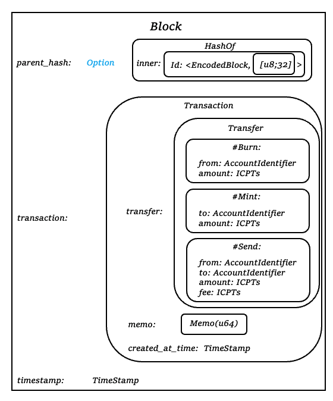
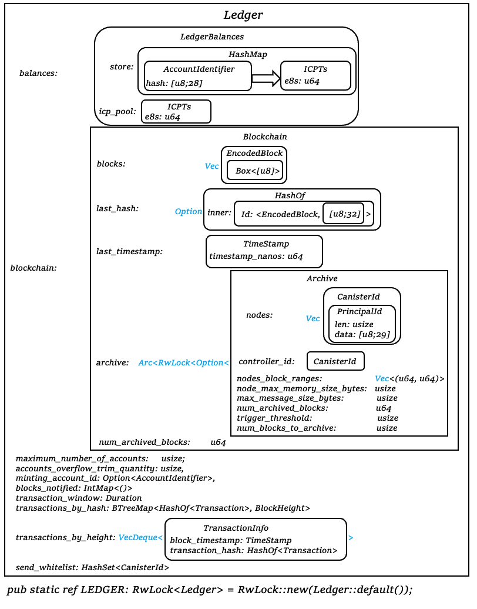

# Source Code for Ledger Canister

# contents
- [Source Code for Ledger Canister](#source-code-for-ledger-canister)
- [contents](#contents)
- [Struct](#struct)
  - [工具类型](#工具类型)
    - [HashOf](#hashof)
    - [EncodedBlock](#encodedblock)
    - [Memo](#memo)
    - [BlockHeight](#blockheight)
    - [Certification](#certification)
  - [Ledger 相关](#ledger-相关)
    - [AccountIdentifier](#accountidentifier)
    - [ICPTs](#icpts)
    - [BalancesStore (trait)](#balancesstore-trait)
    - [Balances](#balances)
    - [LedgerBalances](#ledgerbalances)
    - [Transfer](#transfer)
    - [Transaction](#transaction)
  - [achieve 存档相关](#achieve-存档相关)
    - [Block](#block)
    - [Blockchain](#blockchain)
    - [IntMapVisitor](#intmapvisitor)
    - [Ledger](#ledger)
    - [TransactionInfo](#transactioninfo)
    - [LEDGER](#ledger-1)
  - [canister 参数相关](#canister-参数相关)
    - [LedgerCanisterInitPayload](#ledgercanisterinitpayload)
    - [SendArgs](#sendargs)
    - [NotifyCanisterArgs](#notifycanisterargs)
    - [AccountBalanceArgs](#accountbalanceargs)
    - [TotalSupplyArgs](#totalsupplyargs)
    - [TipOfChainRes](#tipofchainres)
    - [GetBlocksArgs](#getblocksargs)
    - [GetBlocksRes](#getblocksres)
    - [IterBlocksArgs](#iterblocksargs)
    - [IterBlocksRes](#iterblocksres)
    - [BlockArg & BlockRes](#blockarg--blockres)
    - [CyclesResponse](#cyclesresponse)

# Struct
## 工具类型

### HashOf
```rs
#[derive(CandidType, Clone, Hash, Debug, PartialEq, Eq, PartialOrd, Ord)]
pub struct HashOf<T> {
    inner: Id<T, [u8; HASH_LENGTH]>,
}
```

### EncodedBlock
```rs
#[derive(Serialize, Deserialize, CandidType, Clone, Debug, PartialEq, Eq, PartialOrd, Ord, Hash)]
#[serde(transparent)]
pub struct EncodedBlock(pub Box<[u8]>);
```

### Memo
```rs
#[derive(
    Serialize, Deserialize, CandidType, Clone, Copy, Hash, Debug, PartialEq, Eq, PartialOrd, Ord,
)]
pub struct Memo(pub u64);
```

### BlockHeight
```rs
/// Position of a block in the chain. The first block has position 0.
pub type BlockHeight = u64;
```

### Certification
```rs
pub type Certification = Option<Vec<u8>>;
```

## Ledger 相关

### AccountIdentifier
```rs
#[derive(Clone, Copy, Hash, Debug, PartialEq, Eq, PartialOrd, Ord)]
pub struct AccountIdentifier {
    pub hash: [u8; 28],
}
```

### ICPTs
```rs
#[derive(
    Serialize,
    Deserialize,
    CandidType,
    Clone,
    Copy,
    Hash,
    Debug,
    PartialEq,
    Eq,
    PartialOrd,
    Ord,
    Default,
)]
pub struct ICPTs {
    /// Number of 10^-8 ICPs.
    /// Named because the equivalent part of a Bitcoin is called a Satoshi
    e8s: u64,
}
```

### BalancesStore (trait)
```rs
pub trait BalancesStore {
    fn get_balance(&self, k: &AccountIdentifier) -> Option<&ICPTs>;
    // Update balance for an account using function f.
    // Its arg is previous balance or None if not found and
    // return value is the new balance.
    fn update<F>(&mut self, acc: AccountIdentifier, action_on_acc: F)
    where
        F: FnMut(Option<&ICPTs>) -> ICPTs;
}
```

### Balances
```rs
/// Describes the state of users accounts at the tip of the chain
#[derive(Serialize, Deserialize, Debug, Clone, PartialEq, Eq)]
pub struct Balances<S: BalancesStore> {
    // This uses a mutable map because we don't want to risk a space leak and we only require the
    // account balances at the tip of the chain
    pub store: S,
    pub icpt_pool: ICPTs,
}
```

```rs
impl<S: Default + BalancesStore> Balances<S> {
    pub fn new() -> Self {}
    pub fn add_payment(&mut self, payment: &Transfer) {}
    pub fn debit(&mut self, from: &AccountIdentifier, amount: ICPTs) {}
    pub fn debit(&mut self, from: &AccountIdentifier, amount: ICPTs) {}
    pub fn account_balance(&self, account: &AccountIdentifier) -> ICPTs {}
    pub fn total_supply(&self) -> ICPTs {}
}
```

### LedgerBalances
```rs
pub type LedgerBalances = Balances<HashMap<AccountIdentifier, ICPTs>>;
```

### Transfer
```rs
/// An operation which modifies account balances
#[derive(Serialize, Deserialize, CandidType, Clone, Hash, Debug, PartialEq, Eq, PartialOrd, Ord)]
pub enum Transfer {
    Burn {
        from: AccountIdentifier,
        amount: ICPTs,
    },
    Mint {
        to: AccountIdentifier,
        amount: ICPTs,
    },
    Send {
        from: AccountIdentifier,
        to: AccountIdentifier,
        amount: ICPTs,
        fee: ICPTs,
    },
}
```

### Transaction
```rs
/// A transfer with the metadata the client generated attached to it
#[derive(Serialize, Deserialize, CandidType, Clone, Hash, Debug, PartialEq, Eq, PartialOrd, Ord)]
pub struct Transaction {
    pub transfer: Transfer,
    pub memo: Memo,

    /// The time this transaction was created.
    pub created_at_time: TimeStamp,
}
```

```rs
impl Transaction {
    pub fn new(
        from: AccountIdentifier,
        to: AccountIdentifier,
        amount: ICPTs,
        fee: ICPTs,
        memo: Memo,
        created_at_time: TimeStamp,
    ) -> Self {}
    pub fn hash(&self) -> HashOf<Self> {}
}
```
## achieve 存档相关
### Block
```rs
/// A transaction with the metadata the canister generated attached to it
#[derive(CandidType, Serialize, Deserialize, Clone, Debug, PartialEq, Eq)]
pub struct Block {
    pub parent_hash: Option<HashOf<EncodedBlock>>,
    pub transaction: Transaction,
    /// Nanoseconds since the Unix epoch.
    pub timestamp: TimeStamp,
}
```

```rs
impl Block {
    pub fn new(
        parent_hash: Option<HashOf<EncodedBlock>>,
        transfer: Transfer,
        memo: Memo,
        created_at_time: TimeStamp, // transaction timestamp
        timestamp: TimeStamp,       // block timestamp
    ) -> Result<Self, String> {}
    pub fn new_from_transaction(
        parent_hash: Option<HashOf<EncodedBlock>>,
        transaction: Transaction,
        timestamp: TimeStamp,
    ) -> Self {}
    pub fn encode(self) -> Result<EncodedBlock, String> {}
    pub fn parent_hash(&self) -> Option<HashOf<EncodedBlock>> {}
    pub fn transaction(&self) -> Cow<Transaction> {}
    pub fn timestamp(&self) -> TimeStamp {}
}
```

### Blockchain
```rs
/// Stores a chain of transactions with their metadata
#[derive(Serialize, Deserialize, Debug)]
pub struct Blockchain {
    pub blocks: Vec<EncodedBlock>,
    pub last_hash: Option<HashOf<EncodedBlock>>,

    /// The timestamp of the most recent block. Must be monotonically
    /// non-decreasing.
    pub last_timestamp: TimeStamp,
    pub archive: Arc<RwLock<Option<Archive>>>,

    /// How many blocks have been sent to the archive
    pub num_archived_blocks: u64,
}
```

```rs
impl Blockchain {
    pub fn add_block(&mut self, block: Block) -> Result<BlockHeight, String> {}
    pub fn add_block_with_encoded(
        &mut self,
        block: Block,
        encoded_block: EncodedBlock,
    ) -> Result<BlockHeight, String> {}
    pub fn get(&self, height: BlockHeight) -> Option<&EncodedBlock> {}
    pub fn last(&self) -> Option<&EncodedBlock> {}
    pub fn num_archived_blocks(&self) -> u64 {}
    /// This is used when we try to archive a chunk
    pub fn add_num_archived_blocks(&mut self, to_add: u64) {}
    /// This is used when we fail to archive a chunk
    pub fn sub_num_archived_blocks(&mut self, to_sub: u64) {}
    pub fn num_unarchived_blocks(&self) -> u64 {}
    pub fn chain_length(&self) -> BlockHeight {}
}
```

### IntMapVisitor
```rs
struct IntMapVisitor<V> {
    marker: PhantomData<fn() -> IntMap<V>>,
}
```

### Ledger
```rs
#[derive(Serialize, Deserialize, Debug)]
pub struct Ledger {
    pub balances: LedgerBalances,
    pub blockchain: Blockchain,
    // A cap on the maximum number of accounts
    maximum_number_of_accounts: usize,
    // When maximum number of accounts is exceeded, a specified number of
    // accounts with lowest balances are removed
    accounts_overflow_trim_quantity: usize,
    pub minting_account_id: Option<AccountIdentifier>,
    // This is a set of blockheights that have been notified
    #[serde(
        serialize_with = "serialize_int_map",
        deserialize_with = "deserialize_int_map",
        default = "IntMap::new"
    )]
    pub blocks_notified: IntMap<()>,
    /// How long transactions are remembered to detect duplicates.
    pub transaction_window: Duration,
    /// For each transaction, record the block in which the
    /// transaction was created. This only contains transactions from
    /// the last `transaction_window` period.
    transactions_by_hash: BTreeMap<HashOf<Transaction>, BlockHeight>,
    /// The transactions in the transaction window, sorted by block
    /// index / block timestamp. (Block timestamps are monotonically
    /// non-decreasing, so this is the same.)
    transactions_by_height: VecDeque<TransactionInfo>,
    /// Used to prevent non-whitelisted canisters from sending tokens
    send_whitelist: HashSet<CanisterId>,
}
```

```rs
impl Ledger {
    /// This creates a block and adds it to the ledger
    pub fn add_payment(
        &mut self,
        memo: Memo,
        payment: Transfer,
        created_at_time: Option<TimeStamp>,
    ) -> Result<(BlockHeight, HashOf<EncodedBlock>), String> {}
    /// Internal version of `add_payment` that takes a timestamp, for
    /// testing.
    fn add_payment_with_timestamp(
        &mut self,
        memo: Memo,
        payment: Transfer,
        created_at_time: Option<TimeStamp>,
        now: TimeStamp,
    ) -> Result<(BlockHeight, HashOf<EncodedBlock>), String> {}
    /// Remove transactions older than `transaction_window`.
    fn purge_old_transactions(&mut self, now: TimeStamp) {}
    /// This adds a pre created block to the ledger. This should only be used
    /// during canister migration or upgrade
    pub fn add_block(&mut self, block: Block) -> Result<BlockHeight, String> {}
    pub fn from_init(
        &mut self,
        initial_values: HashMap<AccountIdentifier, ICPTs>,
        minting_account: AccountIdentifier,
        timestamp: TimeStamp,
        transaction_window: Option<Duration>,
        send_whitelist: HashSet<CanisterId>,
    ) {}
    pub fn change_notification_state(
        &mut self,
        height: BlockHeight,
        block_timestamp: TimeStamp,
        new_state: bool,
        now: TimeStamp,
    ) -> Result<(), String> {}
    pub fn find_block_in_archive(&self, block_height: u64) -> Option<CanisterId> {}
    pub fn split_off_blocks_to_archive(&mut self, at: usize) -> VecDeque<EncodedBlock> {}
    #[allow(clippy::type_complexity)]
    pub fn archive_blocks(
        &mut self,
    ) -> Option<(VecDeque<EncodedBlock>, Arc<RwLock<Option<Archive>>>)> {}
    pub fn can_send(&self, principal_id: &PrincipalId) -> bool {}
    pub fn transactions_by_hash_len(&self) -> usize {}
    pub fn transactions_by_height_len(&self) -> usize {}
```

### TransactionInfo
```rs
#[derive(Serialize, Deserialize, Debug)]
struct TransactionInfo {
    block_timestamp: TimeStamp,
    transaction_hash: HashOf<Transaction>,
}
```

### LEDGER
```rs
lazy_static! {
    pub static ref LEDGER: RwLock<Ledger> = RwLock::new(Ledger::default());
    // Maximum inter-canister message size in bytes
    pub static ref MAX_MESSAGE_SIZE_BYTES: RwLock<usize> = RwLock::new(1024 * 1024);
}
```

```rs
pub fn add_payment(
    memo: Memo,
    payment: Transfer,
    created_at_time: Option<TimeStamp>,
) -> (BlockHeight, HashOf<EncodedBlock>) {
    LEDGER
        .write()
        .unwrap()
        .add_payment(memo, payment, created_at_time)
        .expect("Transfer failed")
}

pub fn change_notification_state(
    height: BlockHeight,
    block_timestamp: TimeStamp,
    new_state: bool,
) -> Result<(), String> {
    LEDGER.write().unwrap().change_notification_state(
        height,
        block_timestamp,
        new_state,
        now().into(),
    )
}
```


## canister 参数相关

### LedgerCanisterInitPayload
```rs
// This is how we pass arguments to 'init' in main.rs
#[derive(Serialize, Deserialize, CandidType, Clone, Debug, PartialEq, Eq)]
pub struct LedgerCanisterInitPayload {
    pub minting_account: AccountIdentifier,
    pub initial_values: HashMap<AccountIdentifier, ICPTs>,
    pub max_message_size_bytes: Option<usize>,
    pub transaction_window: Option<Duration>,
    pub archive_options: Option<ArchiveOptions>,
    pub send_whitelist: HashSet<CanisterId>,
}
```

### SendArgs
```rs
/// Argument taken by the send endpoint
#[derive(Serialize, Deserialize, CandidType, Clone, Hash, Debug, PartialEq, Eq)]
pub struct SendArgs {
    pub memo: Memo,
    pub amount: ICPTs,
    pub fee: ICPTs,
    pub from_subaccount: Option<Subaccount>,
    pub to: AccountIdentifier,
    pub created_at_time: Option<TimeStamp>,
}
```

```rs
impl LedgerCanisterInitPayload {
    pub fn new(
        minting_account: AccountIdentifier,
        initial_values: HashMap<AccountIdentifier, ICPTs>,
        archive_options: Option<ArchiveOptions>,
        max_message_size_bytes: Option<usize>,
        transaction_window: Option<Duration>,
        send_whitelist: HashSet<CanisterId>,
    ) -> Self {}
}
```

### NotifyCanisterArgs
```rs
/// Argument taken by the notification endpoint
#[derive(Serialize, Deserialize, CandidType, Clone, Hash, Debug, PartialEq, Eq)]
pub struct NotifyCanisterArgs {
    pub block_height: BlockHeight,
    pub max_fee: ICPTs,
    pub from_subaccount: Option<Subaccount>,
    pub to_canister: CanisterId,
    pub to_subaccount: Option<Subaccount>,
}
```

```rs
impl NotifyCanisterArgs {
    /// Construct a `notify` call to notify a canister about the
    /// transaction created by a previous `send` call. `block_height`
    /// is the index of the block returned by `send`.
    pub fn new_from_send(
        send_args: &SendArgs,
        block_height: BlockHeight,
        to_canister: CanisterId,
        to_subaccount: Option<Subaccount>,
    ) -> Result<Self, String> {}
}
```

### AccountBalanceArgs
```rs
/// Argument taken by the account_balance endpoint
#[derive(Serialize, Deserialize, CandidType, Clone, Hash, Debug, PartialEq, Eq)]
pub struct AccountBalanceArgs {
    pub account: AccountIdentifier,
}
```

### TotalSupplyArgs
```rs
/// Argument taken by the total_supply endpoint
///
/// The reason it is a struct is so that it can be extended -- e.g., to be able
/// to query past values. Requiring 1 candid value instead of zero is a
/// non-backward compatible change. But adding optional fields to a struct taken
/// as input is backward-compatible.
#[derive(Serialize, Deserialize, CandidType, Clone, Hash, Debug, PartialEq, Eq)]
pub struct TotalSupplyArgs {}
```

### TipOfChainRes
```rs
/// Argument returned by the tip_of_chain endpoint
pub struct TipOfChainRes {
    pub certification: Option<Vec<u8>>,
    pub tip_index: BlockHeight,
}
```

### GetBlocksArgs
```rs
pub struct GetBlocksArgs {
    pub start: BlockHeight,
    pub length: usize,
}
```

### GetBlocksRes
```rs
pub struct GetBlocksRes(pub Result<Vec<EncodedBlock>, String>);
```

### IterBlocksArgs
```rs
pub struct IterBlocksArgs {
    pub start: usize,
    pub length: usize,
}
```

### IterBlocksRes
```rs
pub struct IterBlocksRes(pub Vec<EncodedBlock>);
```

### BlockArg & BlockRes
```rs
// These is going away soon
pub struct BlockArg(pub BlockHeight);
pub struct BlockRes(pub Option<Result<EncodedBlock, CanisterId>>);
```

### CyclesResponse
```rs 
#[derive(CandidType, Deserialize)]
pub enum CyclesResponse {
    CanisterCreated(CanisterId),
    // Silly requirement by the candid derivation
    ToppedUp(()),
    Refunded(String, Option<BlockHeight>),
}
```


