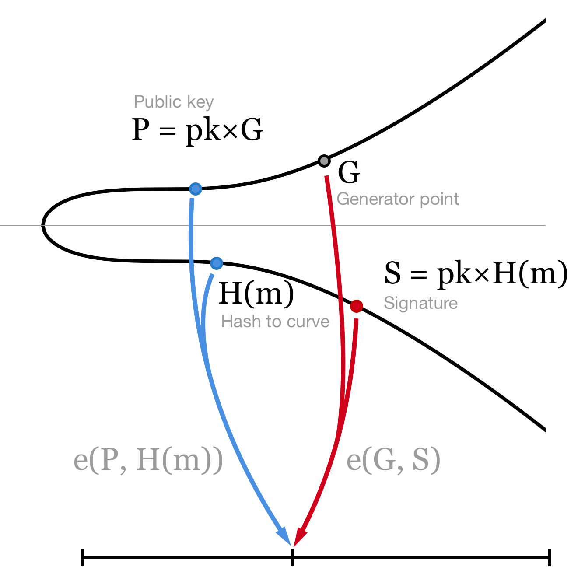

# Canister Signature

[Internet Computer(IC)](https://smartcontracts.org/docs/introduction/welcome.html) 有非常多的创新，canister signature 就是其中之一。它大大扩展了智能合约的功能。

简单来说，它提供了一个这样的功能：每一个 canister 都“持有”一个属于自己的独一无二的私钥，这个私钥可以并且只能按照 canister 逻辑生成签名。目前签名支持 BLS12-381，即将支持 secp256k1。理论上，这个私钥可以成为所有公链的 EOA 账户，即像其他的用户生产的私钥那样，可以对转账，调用合约进行签名，并通过对应公链的验签。

当然，这是通过复杂的密码学（聚合签名/门限签名）和 IC 的共识机制共同实现的，这个私钥永远是未知的，包括 Dfinity 节点和 canister 开发者。

在此基础上，IC 可以成为所有区块链的智能合约/计算层，甚至成为 Web3 的跨链 Hub。

但是怎样掌握它，并在生产环境中使用它，却是有难度的。这里准备了一份面向程序员的指南，方便开发者学会怎么使用它。

## Content
- [Canister Signature](#canister-signature)
  - [Content](#content)
  - [Cryptography Theory](#cryptography-theory)
    - [ECC](#ecc)
  - [IC Certificate](#ic-certificate)

## Cryptography Theory

### ECC
因为涉及到签名，ECC 跑不了。
关于椭圆曲线密码学，建议阅读这个系列，讲得通俗易懂。

> With a series of blog posts I'm going to give you a gentle introduction to the world of elliptic curve cryptography. My aim is not to provide a complete and detailed guide to ECC (the web is full of information on the subject), but to provide a simple overview of what ECC is and why it is considered secure, without losing time on long mathematical proofs or boring implementation details. I will also give helpful examples together with visual interactive tools and scripts to play with.

* [Elliptic Curve Cryptography: a gentle introduction](https://andrea.corbellini.name/2015/05/17/elliptic-curve-cryptography-a-gentle-introduction/)
* [Elliptic curves over finite fields and the discrete logarithm problem](https://andrea.corbellini.name/2015/05/23/elliptic-curve-cryptography-finite-fields-and-discrete-logarithms/)
* [Key pair generation and two ECC algorithms: ECDH and ECDSA](https://andrea.corbellini.name/2015/05/30/elliptic-curve-cryptography-ecdh-and-ecdsa/)
* [Algorithms for breaking ECC security, and a comparison with RSA](https://andrea.corbellini.name/2015/06/08/elliptic-curve-cryptography-breaking-security-and-a-comparison-with-rsa/)

上面介绍了 ECDSA，这是大多数区块链，比如 BTC，ETH 使用的签名验签方法。但是 IC 使用的是 BLS12-381。
具体可以参考：
* [BLS signatures: better than Schnorr](https://medium.com/cryptoadvance/bls-signatures-better-than-schnorr-5a7fe30ea716)

BLS12-381 在椭圆曲线有限域里面的点运算和上面的 ECC 相同，它的签名验签依赖于一个配对函数 e，满足
$$e(P, H(m)) = e(pk×G, H(m)) = e(G, pk×H(m)) = e(G, S)$$

## IC Certificate
> A certificate consists of
> * a tree
> * a signature on the tree root hash valid under some public key
> * an optional delegation that links that public key to root public key.