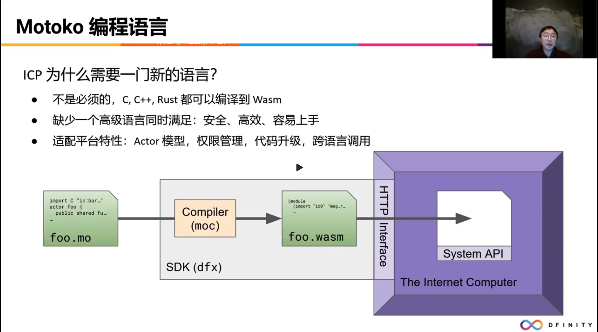

# 日本社区技术相关问题_资料

## 1. 关于IC上的token标准和NFT标准

* IS20 https://www.dfinitycommunity.com/infinityswap-the-is20-token-standard-tested-and-interoperable/
* DIP20 https://github.com/Psychedelic/DIP20
* EXT https://github.com/Toniq-Labs/extendable-token
* Origyn https://gist.github.com/dpori/380177f111899bfda59e0f17f620bdc5
* Deland https://github.com/Deland-Labs/dfinity-fungible-token-standard

## 2. II认证时，使用private browser的时候，有时候不太好使，之前用private browser登陆 的时候有20天左右登陆不上去
建议这个问一下 Neeboo

## 3. IC的site的url非常的⻓，有没有改善的计划?
这个需要问官方

## 4. Chainkey的其它应用场景? (除了II和bitcion的统合外)
canister signature。可以让智能合约在满足条件的时候，生成一个签名，签名可以在任何满足验签算法的地方验证.

https://smartcontracts.org/docs/interface-spec/index.html#canister-signatures

## 5. 现在从技术层面来讲，IC面临的最大的挑战是什么?
这个需要问官方

## 6. Motoko是一种对开发来讲很新的语言，为什么依然选择Motoko在Ocaml Main实行
Motoko 不是必须的。除了 Motoko 之外，理论上任何能编译成 WebAssembly 字节码的语言都可以写智能合约。比如 C/C++，Rust，JS等。甚至你还可以直接写 wasm，具体参考：https://github.com/dfinity/examples

不过考虑到现有工具链的完善程度，生产环境中 Rust 和 Motoko 是用得最多的。

我们需要一个语言，同时满足：
1. 安全，高效，容易上手。

## 7. Backend canister安装时，使用的Motoko/Rust要以什么样的标准来选定呢? Motoko跟Rust的优缺点是什么?
1. 运行性能，需要官方说一下，个人感觉平分秋色，甚至 motoko 会有特定的优化。
2. 开发效率，可能是 Motoko。
3. 上手难度，Motoko 更容易上手
4. 是否有 GC，Rust 不存在 GC，在升级时不需要留出大块内存来跑GC算法。
5. 库的丰富性，Rust 有大量的库，

## 8. 比起Motoko的GC，Rust的ownership难道不是更好吗?
在内存管理这块，确实是 Rust 更好。但是我们要平衡看待一个问题

## 9. 匿名TX的问题，因为已经存在的秘密分布式的note,MPC是最好的选择 还是花了好几年 的时间，在这期间，匿名的TX是怎么实现的? *TEE/SEV的supply net 以及secret network、 oasisnetwork的统合可以作为替补， 能不能告诉一下这个的优先顺序跟实现的可能性?
这个需要问官方

## 10. 关于Lightning network的提问. 将BTC的统合之后BTC将会进入IC网络，随之而来会生 成大量的btc地址，因此有很大的可能性会生成大的节点? 对此有没有什么计划?很好奇跟 CEX的持有的大节点的比列是如何构成的，icp的话应该会生成无需信任的节点的可能性很 大。
这个需要问官方

## 11. 是否有可能从浏览器加密到智能合约?(包括加密)。是否可以保护隐私数据以及不对 外开放的公司数据库中的隐私数据?能讲一下目前的情况和未来的对应之策吗?
可以链下加密数据再上链。
https://github.com/timohanke/icvault

