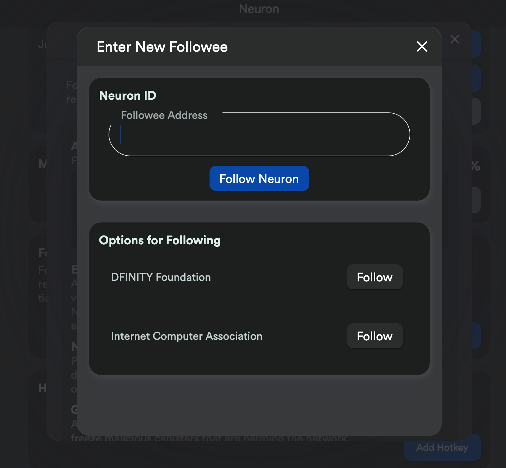
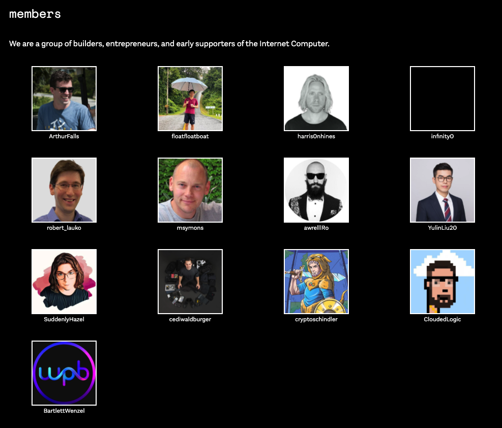
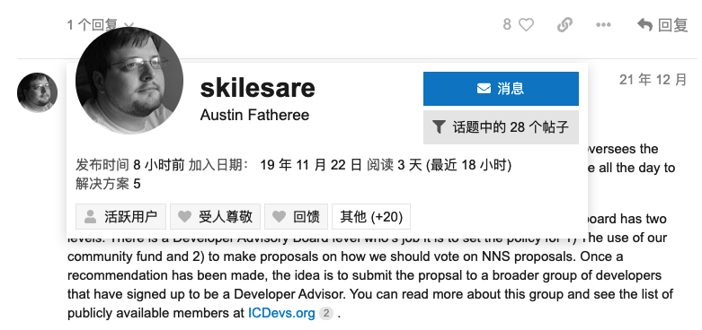
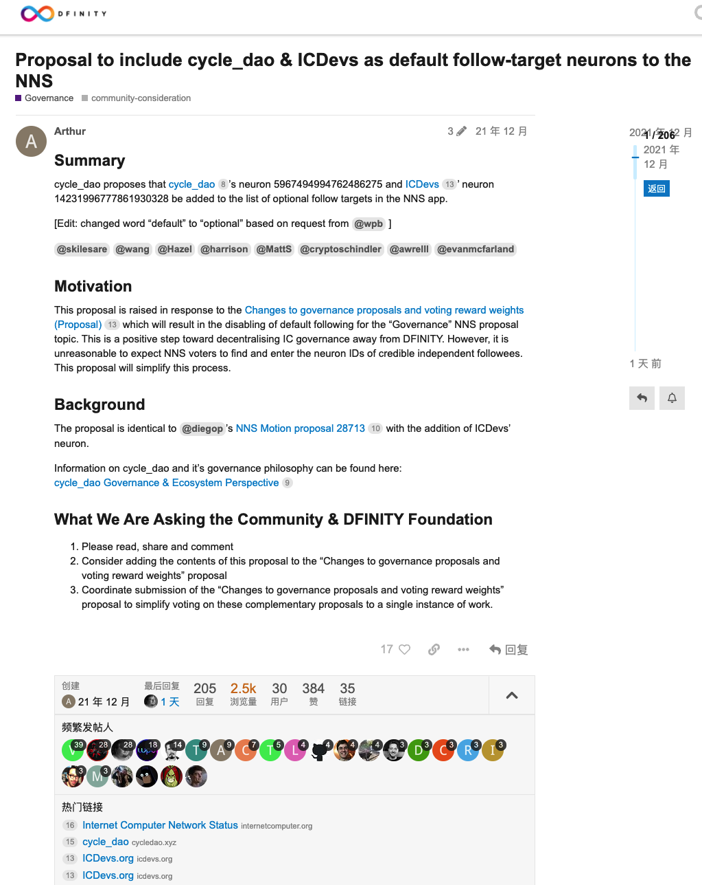

# 神经元

## 神经元命名现状
目前神经能够在 [nns app](https://nns.ic0.app/) 显示名字的，只有官方的两个神经元，并且是硬编码在 nns app 前端：

```dart
  static List<FolloweeSuggestion> followerSuggestions = [
    FolloweeSuggestion("DFINITY Foundation", "", "27"),
    FolloweeSuggestion("Internet Computer Association", "", "28"),
  ];
```
[src](https://github.com/dfinity/nns-dapp/blob/b84c55262c8cbacbf197fdfdba376406d7af169b/frontend/dart/lib/ui/neurons/following/followee_suggestions.dart#L117-L120)

在用户添加 followee 时的效果：


## 其他组织的现状

目前有两个组织公开尝试将自己的神经元作为 follow-target 神经元。

### cycle_dao

**meta info**
* official website: [https://cycledao.xyz/](https://cycledao.xyz/)
* mission: Our mission is to support the creation of autonomous services, applications, and infrastructure to facilitate global access to the open web and decentralized finance on the Internet Computer.
* neuron: 5967494994762486275

成员是包括生态项目创始人，前官方团队成员，投资人等。在 IC 生态有些影响力：


### ICDevs

**meta info**
* official website: [https://icdevs.org/](https://icdevs.org/)
* mission: ICDevs.org (registered as The Internet Computer Developers Education and Discovery Corporation) is a 501(c)3 Texas Non-profit.
* neuron: 14231996777861930328

整体来说通过捐献/募资来获取 ICP，并通过定期发布 bounty 的形式鼓励社区开发者开发一些 Motoko 的库。

目前由一个社区 KOL 负责。他也深度参与 Forum 上的讨论。



### 他们的提案希望将自己神经元命名的提案：
目前用户提交一个提案的推荐流程是：先在 Forum 上 Governance 板块发个帖，经过详细讨论，听听社区意见之后，再去 NNS 上发起一个投票提案。下面来复盘一下这个流程：


> cycle_dao proposes that cycle_dao’s neuron 5967494994762486275 and ICDevs’ neuron 14231996777861930328 be added to the list of optional follow targets in the NNS app.

[src](https://forum.dfinity.org/t/proposal-to-include-cycle-dao-icdevs-as-default-follow-target-neurons-to-the-nns/9363)

最后提了三个 motion 提案（建议型提案，通过后不会马上执行）。

[38984](https://dashboard.internetcomputer.org/proposal/38984)

[38983](https://dashboard.internetcomputer.org/proposal/38983)

[38982](https://dashboard.internetcomputer.org/proposal/38982)

其中多了一个 [ICPMN](https://www.ic.community/followee-neuron-for-icp-maximalist-network/)

结果是 ICPMN，cycle_dao 通过。ICDevs.org 被拒绝。
ICDevs 被拒绝因为有大量票力（34,000,000）反对，帖子里面说这个组织的成员里面不完全是 IC 生态的。个人觉得除了这个原因之外，还有上次 ICDevs 拒绝了 PeopleParty 的提案。

## MixDao 神经元建议
1. 建立官网，对 MixDao 有一个介绍。
2. 建立对应的神经元，让周边的人的人跟随，然后在一些开放性提案中发出自己的声音，建立一定的影响力。所以需要一个专门的人跟踪 IC 生态，基本每天都要把 Forum 上新帖看一遍，包括当前有哪些 RoadMap，有哪些 Governance，全球社区里面大家关心的是什么之类的。
3. 等时机差不多了，再发起一个 Forum 帖子，介绍 MixDao 之前在生态里面做得一些贡献。回答大家一些问题。
4. 创建 motion 提案，投票。
