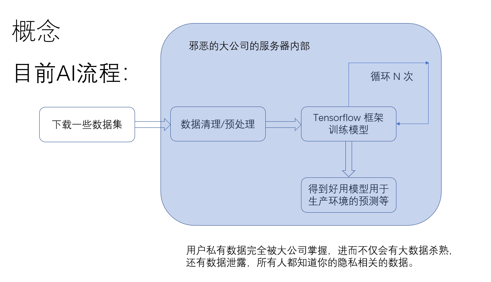

# 联邦学习分享

今天分享一下联邦学习的相关内容

这里我先提一下，联邦学习是AI(人工智能)下面的概念，类似于机器学习的那个学习。

接下来将从一下五个大的方面分享，包括背景介绍，背景介绍包含数据孤岛和隐私保护相关的内容；概念，概念会介绍它的本质和目标；分类，从不同数据集来将联邦学习其划分为横向联邦，纵向联邦，联邦迁移。分支，主要介绍微众银行的 FATE 框架和 Google 的 Tensorflow Federated 框架。最后谈谈我觉得它和区块链之间可能会产生的联系吧

## contents
- [联邦学习分享](#%e8%81%94%e9%82%a6%e5%ad%a6%e4%b9%a0%e5%88%86%e4%ba%ab)
  - [contents](#contents)
  - [背景介绍](#%e8%83%8c%e6%99%af%e4%bb%8b%e7%bb%8d)
    - [BI(Business Intelligent)](#bibusiness-intelligent)
    - [目前 AI 流程](#%e7%9b%ae%e5%89%8d-ai-%e6%b5%81%e7%a8%8b)
    - [隐私保护](#%e9%9a%90%e7%a7%81%e4%bf%9d%e6%8a%a4)
    - [数据孤岛](#%e6%95%b0%e6%8d%ae%e5%ad%a4%e5%b2%9b)
  - [概念](#%e6%a6%82%e5%bf%b5)
    - [本质](#%e6%9c%ac%e8%b4%a8)
    - [目标](#%e7%9b%ae%e6%a0%87)
  - [分类](#%e5%88%86%e7%b1%bb)
    - [横向联邦](#%e6%a8%aa%e5%90%91%e8%81%94%e9%82%a6)
    - [纵向联邦](#%e7%ba%b5%e5%90%91%e8%81%94%e9%82%a6)
    - [联邦迁移](#%e8%81%94%e9%82%a6%e8%bf%81%e7%a7%bb)
  - [分支](#%e5%88%86%e6%94%af)
    - [微众银行](#%e5%be%ae%e4%bc%97%e9%93%b6%e8%a1%8c)
    - [Google](#google)
  - [和区块链可能的联系](#%e5%92%8c%e5%8c%ba%e5%9d%97%e9%93%be%e5%8f%af%e8%83%bd%e7%9a%84%e8%81%94%e7%b3%bb)

## 背景介绍

### BI(Business Intelligent)

目前有个概念叫做 BI，商业智能，比如阿里在杭州搞的城市大脑，就是通过人工智能和大数据进行城市管理的一个项目，是人流、车流、资金流和信息流结合的产物。

这肯定有很多好处的，比如帮助更好的决策，资源的配置，提高生产力等。

### 目前 AI 流程

我们先来看一下简化的目前的模型训练流程：

大公司会会在用户端收集一些用户数据，上传到它们的服务器里，然后经过数据清理以及预处理之后，就让这些数据训练它们对应的模型，循环很多次之后，最后，它们的模型能够很好预测用户的行为，然后就可以用于生产环境，给用户推荐商品，推荐短视频之类的。

整个训练过程，就是图中的淡蓝色部分，都是在大公司的服务器里面完成的。用户的隐私数据被大公司肆无忌惮的使用，甚至被泄露，让个人毫无隐私可言。前几天微博就泄露了5个多亿个账户的个人数据。

### 隐私保护

像刚刚说得城市大脑，这种大公司全天候，无死角的收集个人信息，会存在对用户的隐私权造成侵犯的风险。

隐私保护提了很久了，也不仅仅是区块链圈子或者密码朋克圈子在提。比如欧盟GDPR、数据安全管理等法规
就很严格。然后国内也在逐步的加强这方面的约束。

那么怎样使用用户数据，并且不侵犯用户隐私，其实很多公司都在努力。
### 数据孤岛

## 概念

### 本质

联邦学习 Federated Learning，一种加密分布式机器学习范式，使得各方在不披露原始数据的情况下达到共建模型的目的，为 AI 落地更多场景提供了更多可能性。因此，它是 AI 里面的概念。它下面包含有好几种 类似于 TensorFlow 是一种深度学习框架，帮助程序员更容易用数据训练那些模型。而联邦

### 目标

## 分类

### 横向联邦

### 纵向联邦

### 联邦迁移

## 分支

### 微众银行

### Google 

## 和区块链可能的联系

