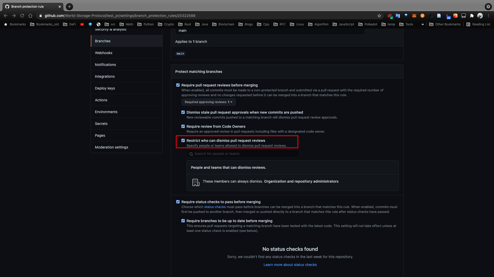
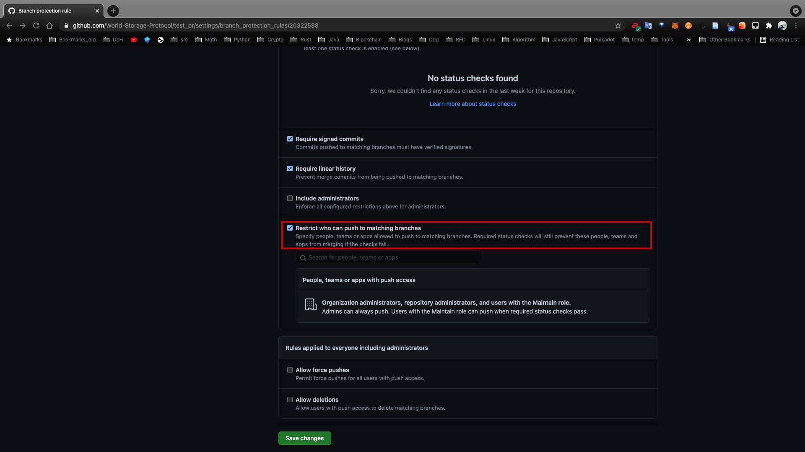
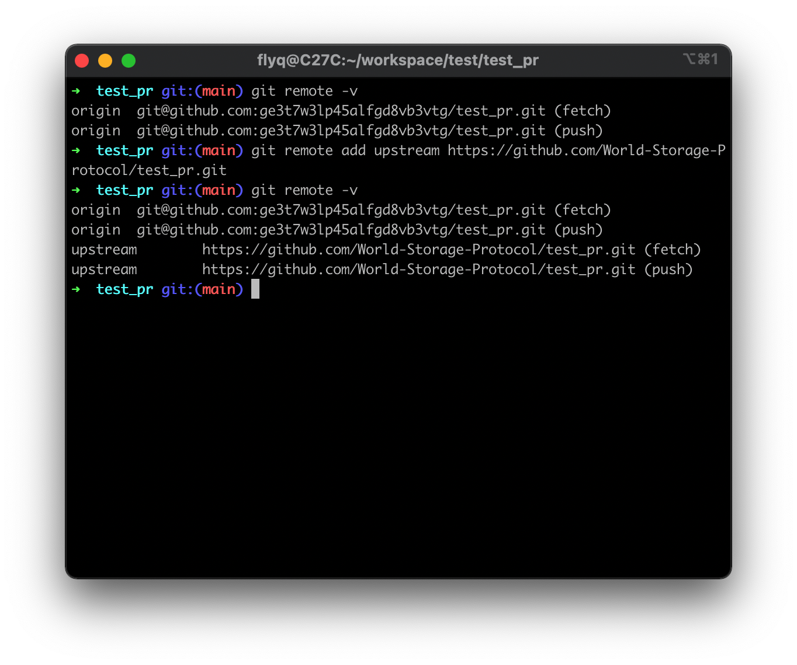

# GitHub 工作流

https://stackoverflow.com/questions/38864405/how-to-restrict-access-to-master-branch-on-git#:~:text=On%20GitHub%2C%20navigate%20to%20the,rules%22%2C%20click%20Add%20rule.

https://gist.github.com/Chaser324/ce0505fbed06b947d962

## Content
- [GitHub 工作流](#github-工作流)
  - [Content](#content)
  - [概述](#概述)
  - [设置仓库权限](#设置仓库权限)
  - [工作流程](#工作流程)


## 概述
无论是开源工作，还是xx

落实在这里，

原则，尽量冲突在本地解决

一个组织，有三种角色，owner，member，和 billing managers。billing managers 定位是偏财务人员，这里不详细讲解。owner，[建议](https://docs.github.com/en/organizations/managing-peoples-access-to-your-organization-with-roles/maintaining-ownership-continuity-for-your-organization)两个人，owner 有所有的权限，然后 members 有部分权限。详细信息见[此处](https://docs.github.com/organizations/managing-peoples-access-to-your-organization-with-roles/permission-levels-for-an-organization)。

对于一个组织里面的仓库，有五种权限等级，从高到低依次为读取/Read、分配/Triage、写入/Write、维护/Maintain、管理/Admin。具体权限内容参考[这里](https://docs.github.com/en/organizations/managing-access-to-your-organizations-repositories/repository-permission-levels-for-an-organization)。默认情况下，组织的 member 拥有仓库的 Read 权限。组织的 owner 拥有仓库的 Admin 权限。


为了将整个工作流讲清楚，我在一个的组织里面创建一个 test_pr 仓库，并使用两个账号 flyq 和 ge3t7w3lp45alfgd8vb3vtg 进行实验。其中，flyq 是 org 以及 test_pr 仓库的创建者，扮演 owner 角色。ge3t7w3lp45alfgd8vb3vtg 扮演 members 角色。


## 设置仓库权限
1. 在 GitHub 上，登陆 flyq 账号，并进入到 test_pr 仓库的主页，并跳转到 Settings：   
     
2. 点击 Branches，并点击 Add rule
   
3. 在 Branch name pattern 下面输入 main，并回车
   
4. 默认情况下只允许 admin 可以合并 PR 到 main 分支。最后点击 Save changes，保存更改。
        
   
   
这样，任何人都可以 Fork 并且提交 PR，但是 PR 必须得到 owner 的 review 才能被合并进 main 分支。

## 工作流程
1. 在 GitHub 上，登陆 ge3t7w3lp45alfgd8vb3vtg 账号，并且在 org/test_pr 界面点击 Fork，仓库会被 fork 到 ge3t7w3lp45alfgd8vb3vtg 账号下，并且页面也会显示：
        
   
2. 将仓库下载到本地：
   ```sh
   git clone git@github.com:ge3t7w3lp45alfgd8vb3vtg/test_pr.git
   ```
   

   
3. 设置远程同步：
   ```sh
   git remote add upstream https://github.com/World-Storage-Protocol/test_pr.git
   ```
   
4. 之前很多问题的出现是因为 org 仓库里面的分支有更改，但是那些 Fork 了 org 仓库的开发者仓库里面的分支没有同步，因此发送冲突，无法合并。解决办法是同步 org 里面的分支：
   ```sh
   git fetch upstream
   ```
   

   并且可以通过：
   ```sh
   git branch -va
   ```
   查看分支的关系：   
   
   现在可以看到本地 main 分支和远程自己仓库（ge3t7w3lp45alfgd8vb3vtg）下 origin/main 分支和远程 org 仓库下的 upstream/main 分支已经同步，都是 9d05 哈希。我们只是用 main 分支，因此不需要管其他分支。

5. 情形一：  
   现在我去用 flyq 账号在 org 下的仓库修改并commit。即在最初的仓库有更改的情况下，开发者改怎么处理：
   
   ge3t7w3lp45alfgd8vb3vtg 需要先获取 org 仓库的更新：
   
   
   可以看出 org 的仓库已经更新到了 f35a 哈希，但是本地以及远程 ge3t7w3lp45alfgd8vb3vtg 账号下的都还是 9d05。即慢一个 commit，符合预期。

   通过切换到本地 main 分支，并且合并来自 org 的更改，就能让本地 main 分支和远程 org 仓库的 main 分支同步。这次因为本地没有修改，所以不会产生冲突，直接就能合并。这也是提倡在本地修改之前先同步 org 仓库里面 main 分支的原因。如果实在有冲突，请在尊重 org 仓库的变动下解决冲突：
   

5. 现在，本地 main 分支是最新的。   
   每当开始研发新功能或错误修正时，重要的是创建一个新分支。它不仅是正确的 git 工作流，而且还让更改更加井井有条，并与 main 分支分离，因此您可以轻松地为完成的每个任务提交和管理多个请求。
   