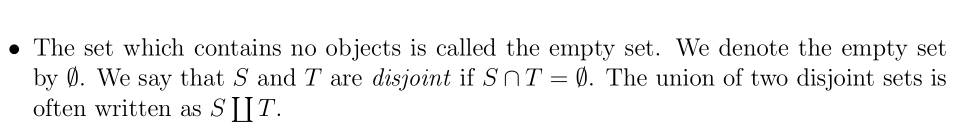
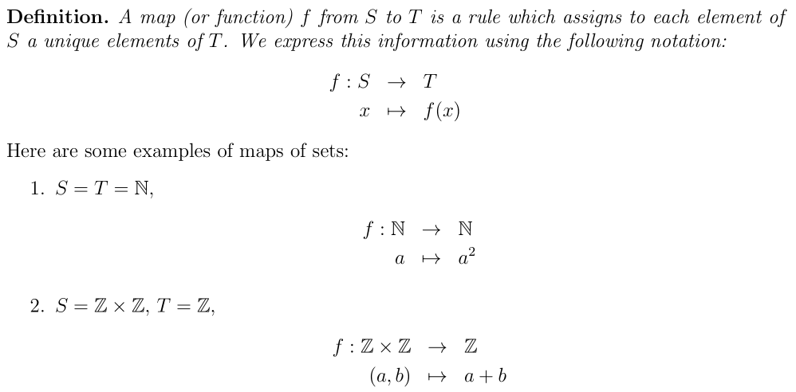
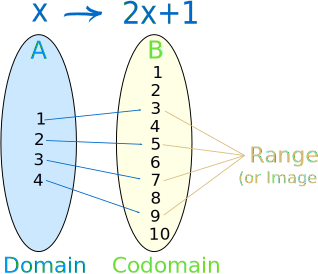
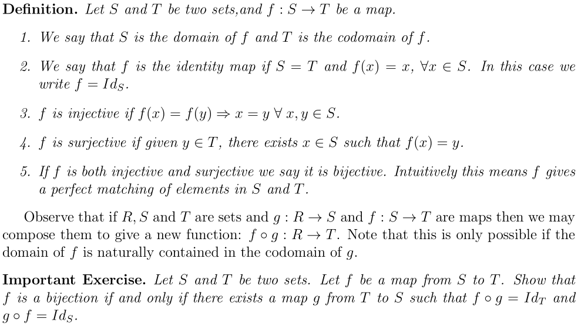
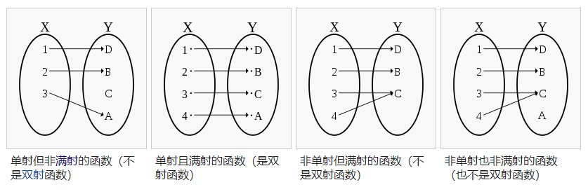
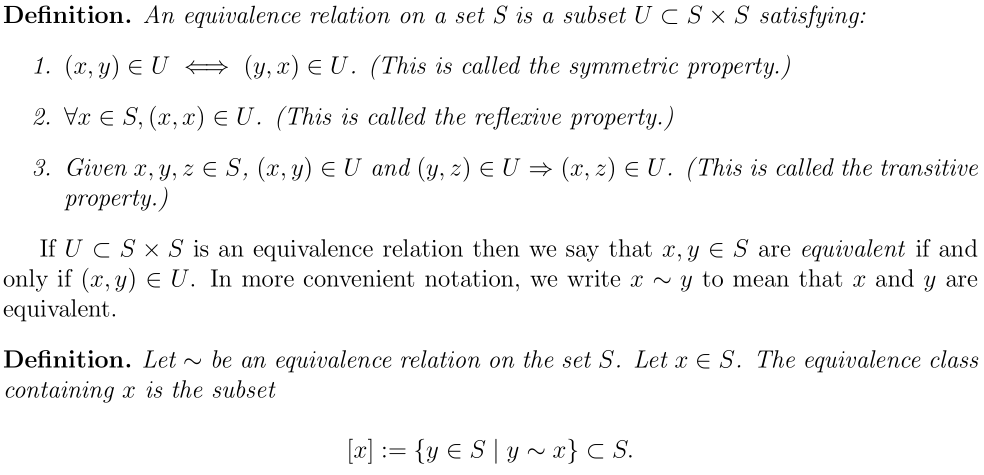

# Introduction to Abstract Algebra(Math 113)

`Algebra is the abstract encapsulation of our intuition for composition` 

| English | 翻译 |
| :---: | :---: |
|encapsulation|封装|
|intuition|直觉|
|composition|组成，结构|

`mathematical intuitions` 数学直觉

`As we shall discover, the seemly simple idea of composition hides vast hidden depth.`

| English | 翻译 |
| :---: | :---: |
|permeate|渗透，弥漫|
|Unity|单位一|
|geometric|几何的|
|the natural numbers|自然数|
|rational|合理的|


`geometric intuition` 几何直觉

`a line` 数轴

`Addition on Z has particularly good properties` 同一个运算，在不同的结构上有不同的特性

`additive inverses` 加法逆，减法

`the rational numbers` 有理数

`the real numbers` 实数

`the complex numbers` 复数

| English | 翻译 |
| :---: | :---: |
|profound|深刻，深奥|
|vague|模糊|
|precise|精确|

`The central idea behind abstract algebra is to define a larger class of objects (sets with extra structure), of which Z and Q are definitive members.` 把运算规则也看成一种结构？(with extra structure)

```
(Z,+) −→ Groups
(Z,+,×) −→ Rings
(Q,+,×) −→ Fields
```
In linear algebra the analogous idea is

(R<sup>n</sup> ,+,scalar multiplication) −→ Vector Spaces over R

`The amazing thing is that these vague ideas mean something very precise and have far far more depth than one could ever imagine.`

## set
`A set is any collection of objects`
| English | 翻译 |
| :---: | :---: |
|intricate|错综复杂|
|notation|符号|
|crucial|关键，临界|
|cardinality|基数|
|disjoint|集合不相交|

集合的基数或大小用 |S|

```
P => Q
任意 => for all
存在 => there exists
存在! => there exists unique
element 属于 set
```

`curly bracket` 大括号

`S × T = {(a,b)|a ∈ S,b ∈ T}. We call this new set the (cartesian) product of S and T. We may naturally extend this concept to finite collections of sets.` 集合的笛卡尔积







`This very simple looking abstract concept hides enormous depth. To illustrate this, observe that calculus is just the study of certain classes of functions (continuous, differentiable or integrable) from R to R.`


| English | 翻译 |
| :---: | :---: |
|enormous|巨大，庞大，极大|
|illustrate|说明，演示|
|calculus|微积分学|
|continuous|连续性|
|differentiable|可微的|
|integrable|可积的|
|domain|定义域|
|codomain|共域，陪域，值域，可能出来的值的范围|
|range|值域，范围，实际出来的值的范围|





| English | 翻译 |
| :---: | :---: |
|identity map| 恒等变换，恒等映射|
|injective | 单射、内射（函数） |
|surjective|满射|
|bijective|双射|

单射函数，嵌射函数：injection，injective function， one-to-one function。陪域里面的y，存在最多一个定义域里面的x使得f(x) = y

满射函数： surjection，onto，他的值域f(x)和陪域Y相等。




| English | 翻译 |
| :---: | :---: |
|Equivalence|恒等关系|
|formalized|形式化|



