# 区块链里面的地址
人们往往忽视熟悉的事物，即使这件事是一个伟大的奇迹。而区块链就是这样一个奇迹。
想象一下目前的互联网世界，这绝对是一个鱼龙混杂的世界，里面充斥着强权，诈骗，虚假消息，垃圾信息等各种深深地勾引着人性中的恶的东西。而在一个这样的无序世界里自发涌现出来的区块链，确实如此的有序。这一切，和三十五亿年前，从混沌的海洋热汤中交汇出来的生化聚合物经历了漫长的地质纪年发展为有机大分子，而后产生了生机勃勃的生物圈，是如此的相似：都是从无序的混乱中，诞生了一个有序的有机系统，这是一个熵减的过程。真是呼应了那句话，天下万物生于有，有生于无。

而这样一个系统的基石之一，是区块链系统里面的地址系统。地址系统确认了某个区块链系统的边界是什么，也就是搞清了谁是我们的朋友，谁是我们的敌人。

## `Contents`
- [区块链里面的地址](#%e5%8c%ba%e5%9d%97%e9%93%be%e9%87%8c%e9%9d%a2%e7%9a%84%e5%9c%b0%e5%9d%80)
  - [Contents](#contents)
  - [地址前传](#%e5%9c%b0%e5%9d%80%e5%89%8d%e4%bc%a0)
  - [Bitcoin 地址生成](#bitcoin-%e5%9c%b0%e5%9d%80%e7%94%9f%e6%88%90)
    - [一、生成私钥](#%e4%b8%80%e7%94%9f%e6%88%90%e7%a7%81%e9%92%a5)
      - [什么是编码/解码](#%e4%bb%80%e4%b9%88%e6%98%af%e7%bc%96%e7%a0%81%e8%a7%a3%e7%a0%81)
      - [什么是进制](#%e4%bb%80%e4%b9%88%e6%98%af%e8%bf%9b%e5%88%b6)
      - [什么是 Base64](#%e4%bb%80%e4%b9%88%e6%98%af-base64)
      - [Binary 与 Base64 之间的互转](#binary-%e4%b8%8e-base64-%e4%b9%8b%e9%97%b4%e7%9a%84%e4%ba%92%e8%bd%ac)
      - [什么是 Base58](#%e4%bb%80%e4%b9%88%e6%98%af-base58)
        - [Base58 来源](#base58-%e6%9d%a5%e6%ba%90)
        - [Base58 原理与规则](#base58-%e5%8e%9f%e7%90%86%e4%b8%8e%e8%a7%84%e5%88%99)
        - [Base58 的代码实现](#base58-%e7%9a%84%e4%bb%a3%e7%a0%81%e5%ae%9e%e7%8e%b0)
        - [Base58 应用](#base58-%e5%ba%94%e7%94%a8)
      - [什么是 Base58Check](#%e4%bb%80%e4%b9%88%e6%98%af-base58check)
      - [什么是 WIF](#%e4%bb%80%e4%b9%88%e6%98%af-wif)
      - [什么是 SHA-256](#%e4%bb%80%e4%b9%88%e6%98%af-sha-256)


## 地址前传
地址系统基于数学难题以及一个秘密。数学难题是指在公钥密码体系中，仅根据公钥很难计算出私钥（工程上基本不可能）。一个秘密就是指生成私钥的随机数。可以想象，三体人是无法直接使用 Bitcoin 系统的，因为所有三体人的脑回路是相连的，他们缺少一个秘密。关于三体人怎么使用 Bitcoin，敬请期待 *三体人会使用比特币吗*

下面将详细讲解 Bitcoin、Ethereum、Polkadot 的地址系统。

## Bitcoin 地址生成
整体来讲，Bitcoin 的地址生成可以分为一下 5 步：

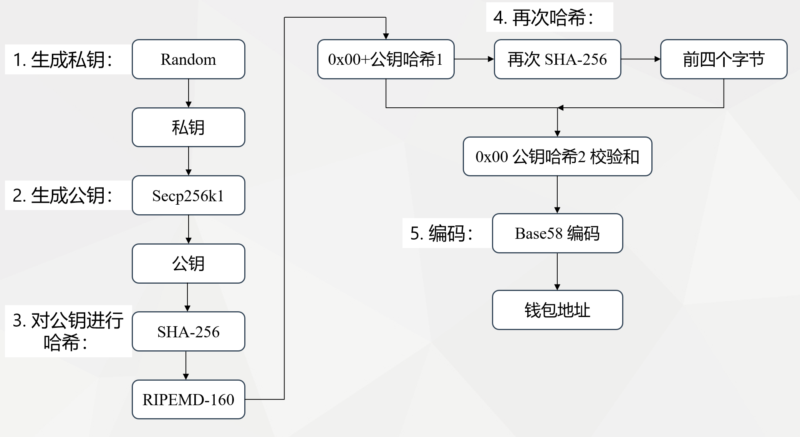

### 一、生成私钥
Bitcoin 的私钥本质是一个特殊的随机数。说它特殊，因为它要满足 Secp256k1 的私钥条件：
1. 长度是 256 bit，即 256 位二进制数；
2. 它要小于 `FFFFFFFFFFFFFFFFFFFFFFFFFFFFFFFEBAAEDCE6AF48A03BBFD25E8CD0364141`；

具体为什么要满足这两个条件，第二步会讲。

本身这个随机数是有很多表现形式的，可以通过不同的编码规则把它编码成不同的形式。

#### 什么是编码/解码
这里科普一下编码/解码(Encode/Decode)，根据[维基百科](https://zh.wikipedia.org/wiki/%E7%BC%96%E7%A0%81)：

> 编码是信息从一种形式或格式转换为另一种形式的过程；解码则是编码的逆过程。

编码解决的是信息的表示方式。在通信以及计算机的发展过程中，根据不同的场景需求，诞生了很多有用的编码方法。比如：
- [摩尔斯电码(Morse code)](https://zh.wikipedia.org/zh-cn/%E6%91%A9%E5%B0%94%E6%96%AF%E7%94%B5%E7%A0%81)：满足远距离电报通信。选取点和划为编码基本单元。并用点和划的不同组合代表不同字母，从而组合成信息。
- [Unicode 编码](https://en.wikipedia.org/wiki/Unicode)：解决全世界不同语言的统一编码形式。
- [哈夫曼编码 (Huffman coding)](https://en.wikipedia.org/wiki/Huffman_coding)：为了实现数据的无损压缩。
- [涡轮码 (Turbo code)](https://zh.wikipedia.org/wiki/%E6%B6%A1%E8%BD%AE%E7%A0%81)：具有[前向纠错](https://zh.wikipedia.org/wiki/%E5%89%8D%E5%90%91%E9%8C%AF%E8%AA%A4%E6%9B%B4%E6%AD%A3)的编码技术。涡轮码是首个得以接近香农极限的现实可行的编码，在低信噪比条件下有着优越的性能，广泛运用于3G/4G移动通信（如UMTS与LTE）、深空卫星通信等领域。

上面举了几个编码的示例，其实还有非常多的应用，甚至可以说整个数字世界都是建立在编码的基础上的，从日常通信，上网，到与旅行者系列飞船正确的传输信息，编码技术功不可没。


#### 什么是进制

比如，十进制的 (10)<sub>10</sub>，可以按照对应的编码规则编码成二进制的 (1010)<sub>2</sub>，也可以编码成八进制的 (12)<sub>8</sub>，还可以编码成十六进制的 (A)<sub>16</sub>。其中 (X)<sub>y</sub> 表示在 y 进制下用 X 表示。

这里科普一下不同[进制](https://zh.wikipedia.org/wiki/%E8%BF%9B%E4%BD%8D%E5%88%B6)下的数怎么来的。简单的说 y 进制下任何数的某一位有且仅有 y 个可能的数，然后满 y 进一。比如二进制数的某一个位只有两种可能：(0)<sub>2</sub> 或者 (1)<sub>2</sub>，如果是 (1)<sub>2</sub> + (1)<sub>2</sub>，满 2，就得进一位，得到 (10)<sub>2</sub>。根据上述规则，可以得到不同进制的数其实是一个多项式的简略表示：

* (10)<sub>10</sub> = **1** * 10<sup>1</sup> + **0** * 10<sup>0</sup>
* (1010)<sub>2</sub> = **1** * 2<sup>3</sup> + **0** * 2<sup>2</sup> + **1** * 2<sup>1</sup> + **0** * 2<sup>0</sup>
* (12)<sub>8</sub> = **1** * 8<sup>1</sup> + **2** * 8<sup>0</sup>
* (A)<sub>16</sub> = **A** * 16<sup>0</sup> = (10)<sub>10</sub>

而上面这四个数其实表达的数学含义是相等，都是 (10)<sub>10</sub>

这也说明了编码的一个特点：只是同一个信息的不同表现形式，不同的编码都能表示某个相同的信息，并且可以**相互转化**。这一点和哈希/加密不同，一般来说，仅根据哈希后的东西在任何情况下都无法得到哈希前的东西，而加密后的东西只有在拥有对应的私钥的情况下才能得到加密前的东西。

有了进制的概念后，这样的笑话，就知道是什么意思了：`世界上有10种人：一种是懂得二进制的，另一种是不懂二进制的。`

接下来我们来看一下私钥的不同格式：

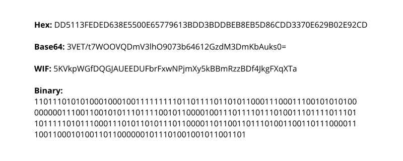

图片来源：[The same private key, written in different formats.
](https://www.freecodecamp.org/news/how-to-generate-your-very-own-bitcoin-private-key-7ad0f4936e6c/)

文字版：  
**Hex**：
`DD5113FEDED638E5500E65779613BDD3BDDBEB8EB5D86CDD3370E629B02E92CD`

**Base64**:
`3VET/t7WOOVQDmV3lhO9073b64612GzdM3DmKbAuks0=`

**WIF**:
`5KVkpWGfDQGJAUEEDUFbrFxwNPjmXy5kBBmRzzBDf4JkgFXqXTa`


**Binary**:
`1101110101010001000100111111111011011110110101100011100011100101010100000000111001100101011101111001011000010011101111011101001110111101110110111110101110001110101101011101100001101100110111010011001101110000111001100010100110110000001011101001001011001101`

> 使用[不同编码格式在线转换工具](https://cryptii.com/pipes/base64-to-hex)

上面是同一个私钥的不同表现形式，它们之间可以相互转化。我们从最底层的 **Binary** 看起，这个就是一个 256 bit 的二进制数。然后接着看一下第一行的 **Hex**，这是这个数的十六进制表示形式。这里补充一下，前面说了 y 进制下任何数的某一位有且仅有 y 个可能的数，十六进制是通过使用 0~9，再用 "(A)<sub>16</sub>，(B)<sub>16</sub>，(C)<sub>16</sub>，(D)<sub>16</sub>，(E)<sub>16</sub>，(F)<sub>16</sub>"(不区分大小写) 分别表示 "(10)<sub>10</sub>，(11)<sub>10</sub>，(12)<sub>10</sub>，(13)<sub>10</sub>，(14)<sub>10</sub>，(15)<sub>10</sub>" 来凑齐 16 个数的。而且可以看到每 4 位二进制数表示的范围是 (0000)<sub>2</sub> ~ (1111)<sub>2</sub>，也就是 (0)<sub>10</sub> ~ (15)<sub>10</sub>，也就是 (0)<sub>16</sub> ~ (F)<sub>16</sub>。因此每 4 位二进制数恰好和 1 位十六进制数完全匹配。

4 位二进制与 1 位 十六进制一一对应表：

| Index(十进制下的表示) | 二进制下的表示 | 十六进制下的表示 |
| :---: | :---: | :---: |
| 0 | 0000 | 0 |
1|0001|1
2|0010|2
3|0011|3
4|0100|4
5|0101|5
6|0110|6
7|0111|7
8|1000|8
9|1001|9
10|1010|A
11|1011|B
12|1100|C
13|1101|D
14|1110|E
15|1111|F

所以，我们可以看到私钥的二进制形式的开头四个位 (1101)<sub>2</sub>，就是表示 (13)<sub>10</sub>，也就是表示 (D)<sub>16</sub>，正好和十六进制的第一个数 (D)<sub>16</sub> 对应上了。后续的也是如此，以此类推，最后将会得到一个 `256/4 = 64` 位的十六进制数。因此，我们可以轻易实现 **Hex** (十六进制)形式与 **Binary** (二进制)形式的相互转换。

如果我们想要知道用 Base64 编码得到的私钥形式，就需要介绍一下 Base64 编码算法了。

#### 什么是 [Base64](https://en.wikipedia.org/wiki/Base64)
>[Base64](https://base64.guru/learn/what-is-base64) 是一组二进制到文本的编码方案，允许您将任何字符转换为由拉丁字母，数字，加号和斜杠组成的字母。有了它，您可以将汉字，表情符号甚至图像转换成“可读”字符串，可以将其保存或传输到任何地方。

上面的描述可能有点抽象，其实我们可以这么想：
十六进制是选取了 16 个不同的"符号"来表示每一位中不同的数字，那 Base64 就是选取了 64 个不同的"符号"来表示每一位数字，我们只需要明白其对应转化规则就行了。本身它的名字就是以 64 个基本 (base) 的字符来编码的意思。

[Base64](https://zh.wikipedia.org/wiki/Base64) 的一位的表示范围在 0~63，正好对应 6 位二进制数的表示范围：(000000)<sub>2</sub> ~ (111111)<sub>2</sub>。因为 (111111)<sub>2</sub> = **1** * 2<sup>5</sup> + **1** * 2<sup>4</sup> + **1** * 2<sup>3</sup> + **1** * 2<sup>2</sup> + **1** * 2<sup>1</sup> + **1** * 2<sup>0</sup> = (32)<sub>10</sub> + (16)<sub>10</sub> + (8)<sub>10</sub> + (4)<sub>10</sub> + (2)<sub>10</sub> + (1)<sub>10</sub> = (63)<sub>10</sub>

那么 Base64 选取了什么符号来分别表示 64 个不同的数呢？这些符号和数之间有什么一一对应关系？

十进制以及 6 位二进制与 1 位 Base64 格式一一对应表：

Index(十进制大小)|Base64 Character| 二进制形式 |    |Index(十进制大小)|Base64 Character|  二进制形式 | |Index(十进制大小)|Base64 Character| 二进制形式| |Index(十进制大小)|Base64 Character| 二进制形式| 
| --- | :---: | :---: | :---: | :---: |:---: | :---: | :---: | :---: | :---: | :---: | :---: | :---: | :---: | :---: |
0|  A|000000| |26|a|011010| |52|0|110100| |62|+|111110|
1|  B|000001| |27|b|011011| |53|1|110101| |63|/|111111|
2|	C|000010| |28|c|011100| |54|2|110110|
3|	D|000011| |29|d|011101| |55|3|110111|
4|	E|000100| |30|e|011110| |56|4|111000|
5|	F|000101| |31|f|011111| |57|5|111001|
6|	G|000110| |32|g|100000| |58|6|111010|
7|	H|000111| |33|h|100001| |59|7|111011|
8|	I|001000| |34|i|100010| |60|8|111100|
9|	J|001001| |35|j|100011| |61|9|111101|
10|	K|001010| |36|k|100100|
11|	L|001011| |37|l|100101|
12|	M|001100| |38|m|100110|
13|	N|001101| |39|n|100111|
14|	O|001110| |40|o|101000|
15|	P|001111| |41|p|101001|
16|	Q|010000| |42|q|101010|
17|	R|010001| |43|r|101011|
18|	S|010010| |44|s|101100|
19|	T|010011| |45|t|101101|
20|	U|010100| |46|u|101110|
21|	V|010101| |47|v|101111|
22|	W|010110| |48|w|110000|
23|	X|010111| |49|x|110001|
24|	Y|011000| |50|y|110010|
25|	Z|011001| |51|z|110011|

从上表可以看出，Base64 编码使用到的字符可以分为四组：
- 大写字母（索引0-25）：`ABCDEFGHIJKLMNOPQRSTUVWXYZ`
- 小写字母（索引26-51）：`abcdefghijklmnopqrstuvwxyz`
- 数字（索引52-61）：`0123456789`
- 特殊符号（索引62-63）：`+/`

因为 Base64 编码中，不同字母的大小写代表不同的含义，因此是区分大小写的。这一点和十六进制不同，十六进制不区分，A 与 a 表示的是同一个含义。

上面这个对应表已经包含了 Base64 的大部分规则了。接下来是一些细节方面的。
计算机是以字节 (Bytes) 为基本单元的。其中 1 字节 = 8 bit，也就是说计算机本身按照每 8 位二进制数来处理。而 Base64 是按照每 6 位二进制数处理。而 8 和 6 的最小公倍数是 24，因此就是 24 位二进制，对应 3 个字节，也对应 4 个 Base64 单元。  

当然会存在位数对不上的情况，一般在进制转化时，如果位数不够，在前面补 0 就行了，比如 1 和 001 表示都是 1 。但 Base64 不是这样，它是在末尾补全。因此 Base64 和六十四进制还是有很大区别的，至于为什么采取在末尾补 0 这样的措施，我猜测这种方式能够在解码后得到之前有多少个 0。前面补 0 无法还原出原本信息是 1 还是 001：

> 如果要编码的字节数不能被 3 整除，最后会多出 1 个或 2 个字节，那么可以使用下面的方法进行处理：先使用 0 字节值在末尾补足，使其能够被 3 整除，然后再进行 Base64 的编码。在编码后的 Base64 文本后加上一个或两个 = 号，代表补足的字节数。也就是说，当最后剩余两个八位(待补足)字节（2 个 byte）时，最后一个 6 位的 Base64 字节块有四位是 0 值，最后附加上两个等号；如果最后剩余一个八位(待补足)字节（1 个byte）时，最后一个6位的base字节块有两位是 0 值，最后附加一个等号。 参考下表：


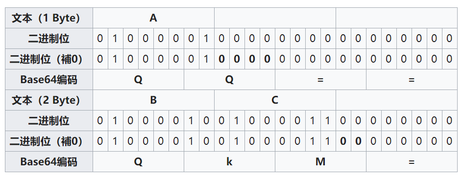

如上图，我们要编码 `A` 这个字符。在[美国信息交换标准代码 (ASCII)](https://en.wikipedia.org/wiki/ASCII) 中，A 仅占一个字节 (Byte)，并且用 (65)<sub>10</sub> 表示，8 位二进制下就是 (01000001)<sub>2</sub>。现在只有 1 个字节 (Byte)，不够三个字节，就需要补充两个字节的 0，也就是 16 位的二进制形式的 0，最后我们将得到 3 个字节，也就是 24 bit 的数。最后，我们根据上面的对照表，找到 (010000)<sub>2</sub> 对应了 Base64 里面的 Q，同理，第二个 6 位对应的也是 Q，最后，我们遇到了 (000000)<sub>2</sub>，这时有两个选择，一个是上述对应表里面的 (000000)<sub>2</sub>，它对应 Base64 里面的 A，一个是补全规则里面的 =。具体是哪个根据这 6 bit 的 0 是不是 **全部** 通过补全得到，如果是，就是 =，否则有任意一个 0 是原来文本自有的，就用 A 表示。因此这里用 =。
同理，当我们缺 1 个字节时，也可以按上图方法补全。

根据上面的规则，我们可以得出一个结论，任何数据进行 Base64 编码后的结果的位数是 4 的倍数。比如 32 Byte 的私钥进行 Base64 编码后的长度是 (32+1)/3 * 4 = 44 位。

这里因为要讲到私钥的某种格式，所以涉及到了 Base64 编码。其实 Base64 最常用于编码二进制数据（例如，图像或声音文件）以嵌入HTML，CSS，EML和其他文本文档中。此外，Base64 用于对在传输，存储或输出期间可能不受支持或损坏的数据进行编码。这是该算法的一些广泛应用：
- 发送电子邮件时附加文件
- 通过数据 URI 将图像嵌入 HTML 或 CSS
- 保留加密函数的原始字节
- 在 API 响应中将二进制数据输出为 XML 或 JSON
- BLOB不可用时将二进制文件保存到数据库

#### Binary 与 Base64 之间的互转
根据上一小节，可以知道 6 位二进制和 Base64 之间是一一对应的。那么把一个二进制数转换成 Base64 也是非常容易的。这里我们尝试把前面那个示例里面的二进制私钥转换成 Base64 形式。首先，256 bit 的私钥正好对应 32 Bytes，不能被 3 整除，因此需要补 1 Byte 的 0，也就是 (00000000)<sub>2</sub>。因此我们的私钥从：

`1101110101010001000100111111111011011110110101100011100011100101010100000000111001100101011101111001011000010011101111011101001110111101110110111110101110001110101101011101100001101100110111010011001101110000111001100010100110110000001011101001001011001101`

通过补全变成：

`110111010101000100010011111111101101111011010110001110001110010101010000000011100110010101110111100101100001001110111101110100111011110111011011111010111000111010110101110110000110110011011101001100110111000011100110001010011011000000101110100100101100110100000000`

然后这里通过每六位分组，并通过前面的对照表对比得到：

二进制数|110111|010101|000100|010011|111111|101101|111011|010110|001110|001110|010101|
| --- | :---: | :---: | :---: | :---: | :---: |:---:|:---:|:---:|:---:|:---:|:---:|
Base64|3|V|E|T|/|t|7|W|O|O|V|
二进制数|010000|000011|100110|010101|110111|100101|100001|001110|111101|110100|111011|
Base64|Q|D|m|V|3|l|h|O|9|0|7|
二进制数|110111|011011|111010|111000|111010|110101|110110|000110|110011|011101|001100|
Base64|3|b|6|4|6|1|2|G|z|d|M|
二进制数|110111|000011|100110|001010|011011|000000|101110|100100|101100|110100|000000|
Base64|3|D|m|K|b|A|u|k|s|0|=|

这里因为最后 6 bit 的 0 都是通过之前补 0 得到，因此编码成 =，其他的都是和上面的对照表一一对应。

最后一汇总，毫无疑问，这正好是我们之前给出的结果：
`3VET/t7WOOVQDmV3lhO9073b64612GzdM3DmKbAuks0=`

这里我们通过 Base64 的规则，动手转化出了某一私钥的 Base64 形式。这就是科学迷人的地方：没有什么高深莫测，似是而非的神秘迷雾，只有明确的规则和标准。

Less Trust, More Truth


#### 什么是 [Base58](https://zh.wikipedia.org/wiki/Base58)

##### Base58 来源

上面的 Base64 编码是很久以前就有的技术。而 Base58 诞生于 Bitcoin。

> Base58 是用于 Bitcoin 中使用的一种独特的编码方式，主要用于产生 Bitcoin 的钱包地址。相比 Base64，Base58 不使用数字"0" (zero)，字母大写"O"(capital o)，字母大写"I"(capital i)，和字母小写"l"(lower case L)，以及"+"和"/"符号。
> 
> 设计Base58主要的目的是：
> * 避免混淆。在某些字体下，数字0和字母大写O，以及字母大写I和字母小写l会非常相似。
> * 不使用"+"和"/"的原因是非字母或数字的字符串作为帐号较难被接受。
> * 没有标点符号，通常不会被从中间分行。
> * 大部分的软件支持双击选择整个字符串。

其中中本聪在 base58.h 中的注释：
```c
//
// Why base-58 instead of standard base-64 encoding?
// - Don't want 0OIl characters that look the same in some fonts and
//      could be used to create visually identical looking account numbers.
// - A string with non-alphanumeric characters is not as easily accepted as an account number.
// - E-mail usually won't line-break if there's no punctuation to break at.
// - Doubleclicking selects the whole number as one word if it's all alphanumeric.
//
```

##### Base58 原理与规则

因此表面上看 Base58 就是 Base64 删掉了 6 个基本数字(字符)，但是其实差别挺大的。

Base64 设计得很巧妙，它在编码和解码的时候可以通过 位 操作就能得到结果。它的简单和高效性也表现在我们仅仅根据一个对照表就能够“目测”得到编码后的结果。这也是 Base64 之前就大量流行的原因之一：计算机能够快速的进行 Base64 编码和解码。而 Base58 就不同了，Base58 的编码解码涉及到大数的除法。

下面介绍一下 Base58 的规则：

| Value |	Char | Value | Char | Value | Char | Value | Char |
| --- | --- | --- | --- | --- | --- | --- | --- |
|0| 1|  16| H|  32| Z|  48| q|
|1| 2|  17| J|  33| a|  49| r|
|2| 3|	18| K|	34|	b|	50|	s|
|3|	4|	19|	L|	35|	c|	51|	t|
|4|	5|	20|	M|	36|	d|	52|	u|
|5|	6|	21|	N|	37|	e|	53|	v|
|6|	7|	22|	P|	38|	f|	54|	w|
|7|	8|	23|	Q|	39|	g|	55|	x|
|8|	9|	24|	R|	40|	h|	56|	y|
|9|	A|	25|	S|	41|	i|	57|	z|
|10|	B|	26|	T|	42|	j|
|11|	C|	27|	U|	43|	k|
|12|	D|	28|	V|	44|	m|
|13|	E|	29|	W|	45|	n|
|14|	F|	30|	X|	46|	o|
|15|	G|	31|	Y|	47|	p|

根据对照表规则可知，Base58 不仅少了 6 个基本字符，而且剩下的字符的对应规则也是完全不同。

根据之前对进制的解释，其实可以得出一个这样粗糙的说法：
1. 不同进制只是选取不同的“基数”来表示数。
2. 某一进制下的数可以得到对应的多项式展开形式。

因此，Base58 可以说是某种意义上的 58 进制数了。我们尝试进行一下 Base58 编码：  
(100)<sub>10</sub> = (58)<sub>10</sub> + (42)<sub>10</sub> = **1** * 58<sup>1</sup> + **42** * 58<sup>0</sup> = (**2j**)<sub>Base58</sub>  
最后一步是因为 (**1**)<sub>10</sub> 对应 (**2**)<sub>Base58</sub>，(**42**)<sub>10</sub> 对应 (**j**)<sub>Base58</sub>


然后我们可以找一个[在线 Base58 转换](https://incoherency.co.uk/base58/)，去检验一下。因为这个网站只支持 16 进制 (Hexadecimal)，我们需要先将 (100)<sub>10</sub> 转换成 (64)<sub>16</sub> (因为 6 * 16 + 4 = 100)，最后结果和我们算出来的一样，都是 `2j`：

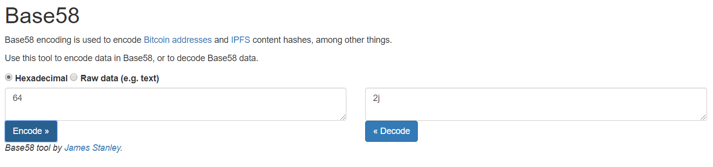

其实上面的转换过程就是一个除法，100 / 58 商 1 余 42。这就是把其他数转换成 Base58 的方法。

更一般的，我们可以参考一个大一点的数。比如十进制下的 123456789：

|  |
| ---: |
| base10 = 123456789 |
| 123456789 % 58 = 19 |
|   2128565 % 58 = 23 |
|     36699 % 58 = 43 |
|       632 % 58 = 52 |
|        10 % 58 = 10 |

> base58 = [10][52][43][23][19]  
> base58 = BukQL


图片来源：https://learnmeabitcoin.com/guide/base58

因此，总的来讲，Base58 就类似一个五十八进制，通过除法可以把数字编码成 Base58 格式。

##### Base58 的代码实现

[官方给出的算法描述](https://zh.wikipedia.org/wiki/Base58)思路就是不断整除 58：

```C++
    code_string = "123456789ABCDEFGHJKLMNPQRSTUVWXYZabcdefghijkmnopqrstuvwxyz";
    x = convert_bytes_to_big_integer(hash_result);

    output_string = "";

    while(x > 0) 
    {
        (x, remainder) = divide(x, 58);
        output_string.append(code_string[remainder]);
    }

    repeat(number_of_leading_zero_bytes_in_hash)
    {
        output_string.append(code_string[0]);
    }
    
    output_string.reverse();
```


##### Base58 应用

|Application|	Alphabet|Sample|
| :---: | :---: | :---: |
|[Bitcoin addresses](https://en.bitcoin.it/wiki/Technical_background_of_version_1_Bitcoin_addresses)|123456789ABCDEFGHJKLMNPQRSTUVWXYZabcdefghijkmnopqrstuvwxyz|16VTxDzziQKyQMN3s6kEngh9jeNCsiQb6j|
|[IPFS hashes](https://ipfs.io/ipfs/QmNtpA5TBNqHrKf3cLQ1AiUKXiE4JmUodbG5gXrajg8wdv)|123456789ABCDEFGHJKLMNPQRSTUVWXYZabcdefghijkmnopqrstuvwxyz|QmNtpA5TBNqHrKf3cLQ1AiUKXiE4JmUodbG5gXrajg8wdv|
|short URLs for [Flickr](https://www.flickr.com/services/api/misc.urls.html#short)|123456789abcdefghijkmnopqrstuvwxyzABCDEFGHJKLMNPQRSTUVWXYZ|无|

上面可以看出，IPFS 的 Hash 的编码也用到了 Base58。截止目前，用到了 Base58 的应用不多，就三个。但是 Base58 已经有了两种，Bitcoin 和 IPFS 是同一种，Flickr 是另一种，这两种 Base58 的不同体现在它们的字母顺序不同，通过上面的表可以看出，Flickr 用到的那种先用到了小写字母表。Flickr 是一个保存图片的服务商，不是区块链行业的，它们的的网络链接的短地址编码用到了 Base58。


科普时间结束，下面进入吐槽时间：   
当初中本聪整出了 Base58，仿佛是为了让地址更加人性化，更加符合人类的习惯。但是，用过 Bitcoin 的人，真的觉得它很人性化吗？  

用户并不领情，你整出这么个一堆乱码一样的东西来让我用，[就别怪我吐槽了](https://mp.weixin.qq.com/s/MAYZN_A1eZdyKKSLvQSeZQ)：

> * 如果我打错了东西，或者复制粘贴错了，我的钱就会永远消失；
> * 如果出现软件故障，我的钱就会永远消失；
> * 如果有人入侵我的电脑或手机，我的钱就会永远消失......
>
> **看到这一趋势了吗？犯任何错误，你就完蛋了。这就像在悬崖边上骑摩托车，而且还没有护栏。**
>
> 主流的钱包非常难用，我上次升级时忘了保留我的私钥，所以我不得不全部还原。
>
> 今年早些时候，我有一款老旧的比特币，从2013年开始就被卡在了一个古老版本的Multibit上。我花了一个星期的时间才把它取出来，原因是软件错误的认为，我发送了一个从来没有真正产生过的交易。
>
> 想象一下，五年后这些钱包还能被使用吗？当量子计算机出现时，我们需要完全更新系统的基本协议，会发生什么？
>
> 普通人将永远无法完成这些步骤，没有任何可能。
>
> 20年的IT经历告诉我，人们可以并且将会以技术人员完全无法想象的方式搞砸他们的机器，这是活生生的墨菲定律。

原文链接： https://hackernoon.com/what-will-bitcoin-look-like-in-twenty-years-7e75481a798c


现在的地址系统，确实给人粗粝之感。大家操控着三四十位"乱码"的地址或者公钥，对，就是每一个字符你都认识，但是合在一起你就不认识了的感觉，而且这么偏“底层”的东西裸露给别人用，这不就像发动汽车的时候直接用手把带电的导线接到到火花塞上？（虽然我并不清楚火花塞点火原理）

不过话说回来，就像刚刚把蒸汽机用在了火车上的那阵子的情形：白茫茫的蒸汽混杂着燃煤后的黑烟肆无忌惮地从火车头喷出，飘到你脸上；杂乱无章的金属碰撞噪声震耳欲聋；因缺乏减震设计而导致的震动仿佛要山崩地裂了。。。这一切根本无法和目前的高铁相比，但是不妨碍它的伟大。

伟大如斯，Bitcoin！


#### 什么是 [Base58Check](https://en.bitcoin.it/wiki/Base58Check_encoding)

已经有了 Base58 编码，为什么还要搞一个 Base58Check 编码？  
因为仅仅只是用 Base58 编码，是有他的局限性的。比如现在你钱包里面有一堆地址，有的是测试网的，有的是主网上的。有次你需要接收主网上的 BTC，结果一不小心给了测试网的地址，你可能就收不到这笔 BTC 了。如果在设计 Bitcoin 的系统的时候，我们在地址的前缀加上 1 Byte 来表示版本号，比如主网的 是 1，测试网的是 m/n，这样即使有上述误操作，系统也会拒绝。这就是地址前缀的由来，具体查看 [List of address prefixes](https://en.bitcoin.it/wiki/List_of_address_prefixes)；  
还有一个需求就是要是输入地址的时候输错一位或者几位，BTC 又会被转到错误的地址以至丢失。所以我们在后面再加 4 Bytes 的数字来保证尽量出了错误能够被发现。

因此就有了下面的 Base58Check 编码方法：

注：下面这个流程图我是参考这里的信息画的： https://en.bitcoin.it/wiki/Base58Check_encoding#Creating_a_Base58Check_string   
这里的描述只有一次 SHA-256 的哈希运算。而接下来 WIF 以及 Bitcoin 地址生成都有两次。我的理解是，Base58Check 只要保证在 Base58 基础上加上版本号以及[校验码](https://zh.wikipedia.org/wiki/%E6%A0%A1%E9%AA%8C%E7%A0%81)就行了。还没有定下一个统一的标准。所以具体到某一个 Base58Check 还需要具体看它的实现规则。

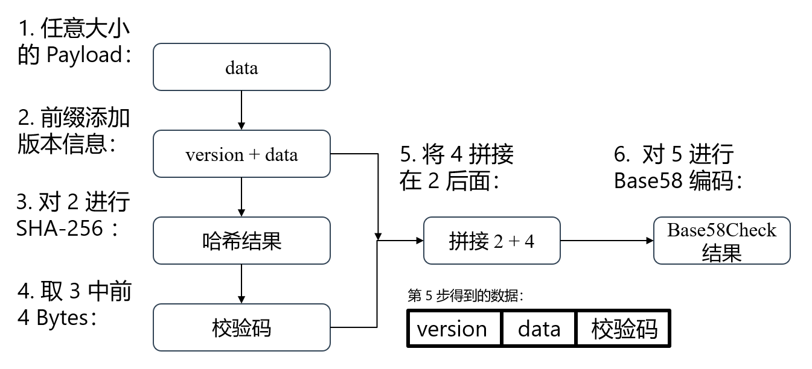

这里看起来可能会有点抽象，我们再遇到具体 Base58Check 编码时(比如 WIF 以及 Bitcoin 地址生成。)，再举例详细说。

#### 什么是 [WIF](https://en.bitcoin.it/wiki/Wallet_import_format)

和 Base58 一样， WIF 也是因为有了 Bitcoin 才提出来的：
> Wallet Import Format (WIF, also known as Wallet Export Format) is a way of encoding a private ECDSA key so as to make it easier to copy.

下面是生成主网私钥的 WIF 格式的一般流程：这里拿主网的私钥举例，[标准](https://en.bitcoin.it/wiki/List_of_address_prefixes)规定它的版本号(或者说前缀)是 (80)<sub>16</sub>：

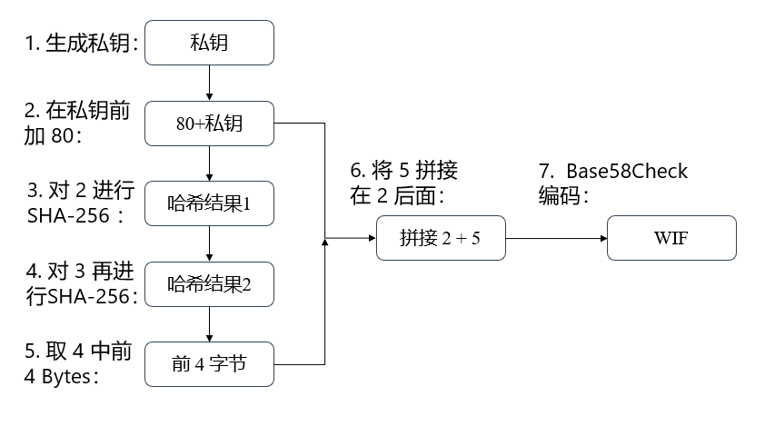

下面这个是另外一种形式的流程图，其中 prv_key 代表私钥：

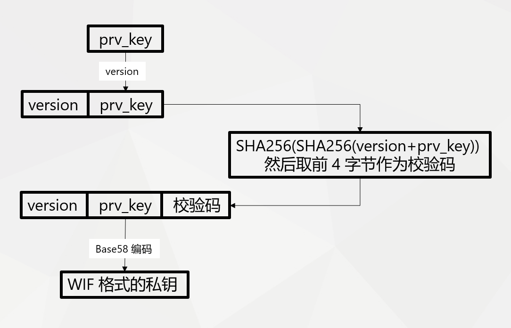

我们前面以及推导出了下面这个私钥的三种格式了。还剩下 WIF 格式没有推导出来，所以我们尝试动手推导出来：


- 一、得到十六进制私钥：**Hex**：  
`DD5113FEDED638E5500E65779613BDD3BDDBEB8EB5D86CDD3370E629B02E92CD`
- 二、在前面加上 80 ：  
`80DD5113FEDED638E5500E65779613BDD3BDDBEB8EB5D86CDD3370E629B02E92CD`
- 三、对它进行 SHA-256 哈希，我们利用[这个在线工具](https://cryptii.com/pipes/hash-function)，得到：
  > 因为哈希运算结果是一个十六进制的数，而十六进制是不区分大小写的。因此从上面的工具得到的哈希结果里涉及到字母的是小写，需要利用[这个工具](https://convertcase.net/)统一转换成大写

  `3864ACBB060F15F6110398A4B51271FB7A64F282D01E9AD716DFF181F3CB1F26`
  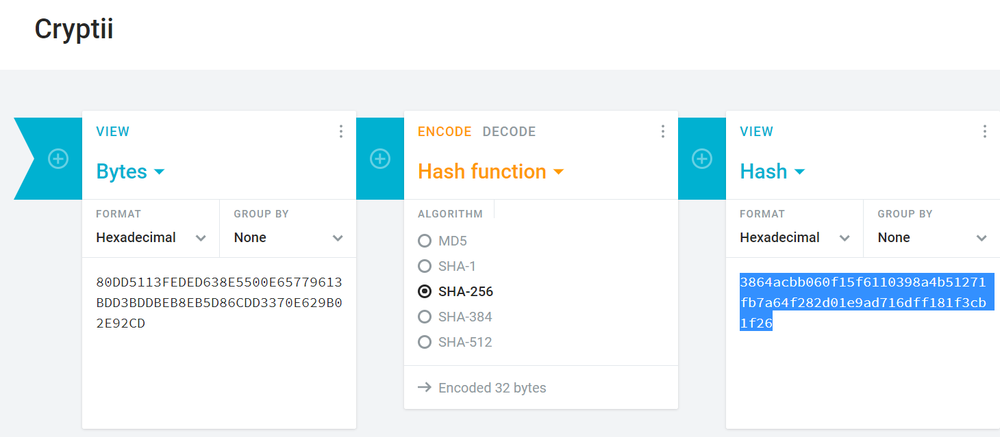
- 四、对第三步的结果再次进行 SHA-256 哈希：  
`E3C3FC9D51B230727C1560CF1402D5207EEC8F2710683982CEBDF2FDADA44D53`
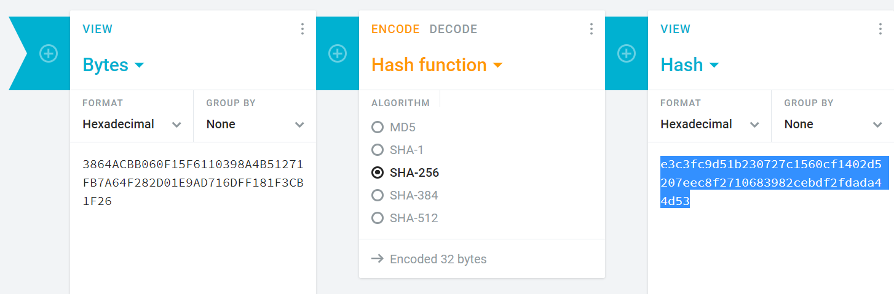
- 五、拿到第四步中的结果的前 4 个字节，因为 1 字节对应 2 位十六进制数，因此就是拿 8 位十六进制数。下面这个数就是 Checksum 又称[校验和](https://zh.wikipedia.org/zh-hans/%E6%A0%A1%E9%AA%8C%E5%92%8C)
`E3C3FC9D`
- 六、拼接数据：  
`80DD5113FEDED638E5500E65779613BDD3BDDBEB8EB5D86CDD3370E629B02E92CDE3C3FC9D`
- 七、对第六步中得到数进行 Base58 编码，当然，我们这里又要使用[在线工具](https://incoherency.co.uk/base58/)了：
`5KVkpWGfDQGJAUEEDUFbrFxwNPjmXy5kBBmRzzBDf4JkgFXqXTa`
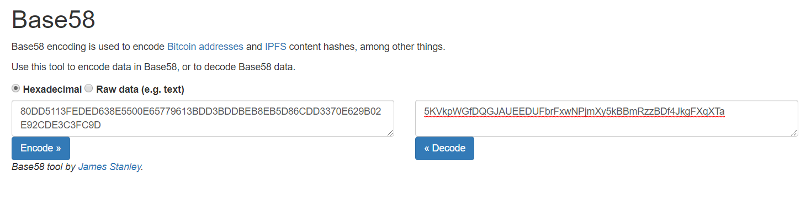

和前面的图片一对比，发现成功转化出了这个私钥的 WIF 格式。

这里本身有一个 Bitcoin 十六进制使用转 WIF 的[在线工具](http://gobittest.appspot.com/PrivateKey)，从这里得到结果也能够印证正确性：

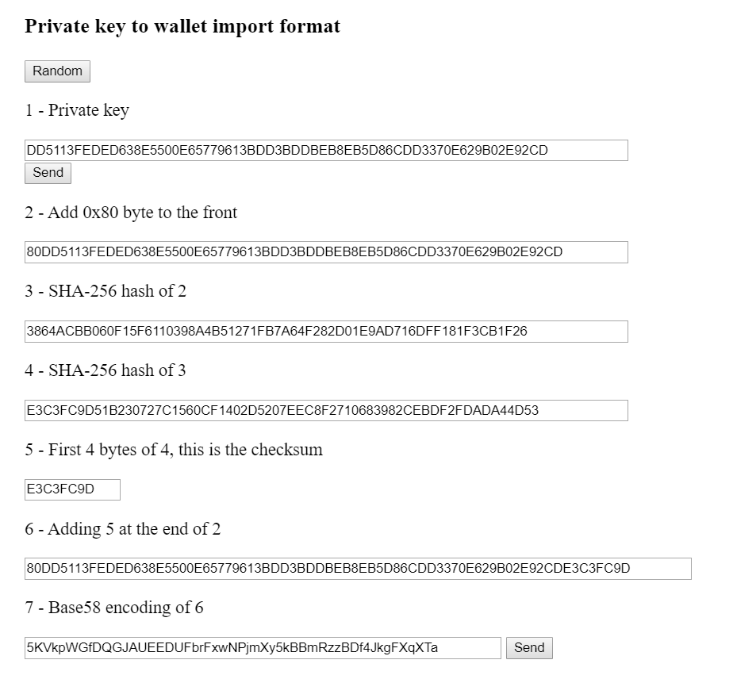

对应 WIF 这个小话题就结束了吗？其实我有点不满意的，上面的私钥格式有 4 种：**Hex（十六进制）**、**Base64 编码格式**、**WIF 编码格式**、**Binary（二进制）**。除了 WIF，其他三种每一个数字（或者字符）是怎么来的都很清楚，但是 WIF 里面好几个步骤都是借助于在线工具。具体来讲有两个黑盒，一个是 SHA-256，一个是 Base58 编码。因为难度上升，这两个不能像之前那样直接对照一下就出结果，需要大量运算。这两个黑盒，SHA-256 后续我们再讨论，Base58 编码我们先尝试用 Rust 实现一下，具体代码在[这里](https://github.com/flyq/blogs/tree/master/address/myaddr)：


```rust
extern crate num_bigint;
extern crate num_traits;

use num_bigint::BigUint;
use num_traits::Zero;

fn main() {
    let s =String::from("80DD5113FEDED638E5500E65779613BDD3BDDBEB8EB5D86CDD3370E629B02E92CDE3C3FC9D");
    
    println!("{:?}", hexstring_to_base58(&s));
}

fn hexstring_to_base58(s: &String) -> String {
    // 按照顺序的 58 个基本字符
    let base_char = String::from("123456789ABCDEFGHJKLMNPQRSTUVWXYZabcdefghijkmnopqrstuvwxyz");
    // 转换成字符数组，方便拿取
    let base_char_vec: Vec<char> = base_char.chars().collect();
    // 将输入的字符串转换成大整数 BigUint，这里要求数据是 16 进制格式
    // 参考：https://docs.rs/num-bigint/0.2.3/num_bigint/struct.BigUint.html#method.parse_bytes
    let mut a: BigUint = BigUint::parse_bytes(s.as_bytes(),16).unwrap();

    let mut res = vec![];
    while a.clone() > Zero::zero() {
        let index = a.clone() % BigUint::from(58u32);
        // BigUint 类型转换成 usize，这样才能用 index 当做索引去从字符数组里面拿字符。
        let index = *index.to_bytes_le().get(0).unwrap() as usize;
        res.push(base_char_vec[index]);
        a /= BigUint::from(58u32);
    }

    let res: String = res.iter().rev().collect();
    res
}
```
main 函数里面有个示例，就是用了我们之前第六步拼接得到的数据


```shell
cargo run 
    Finished dev [unoptimized + debuginfo] target(s) in 0.02s
     Running `target/debug/myaddr`
"5KVkpWGfDQGJAUEEDUFbrFxwNPjmXy5kBBmRzzBDf4JkgFXqXTa"
```

结果正是之前的那个。

#### 什么是 SHA-256
#####
