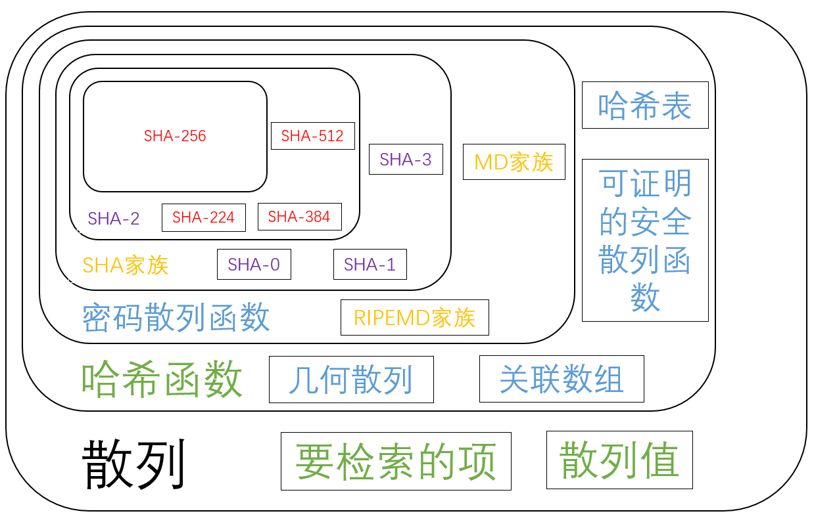
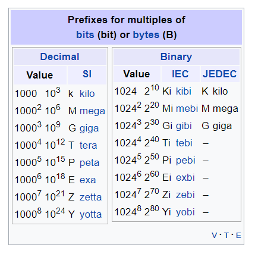
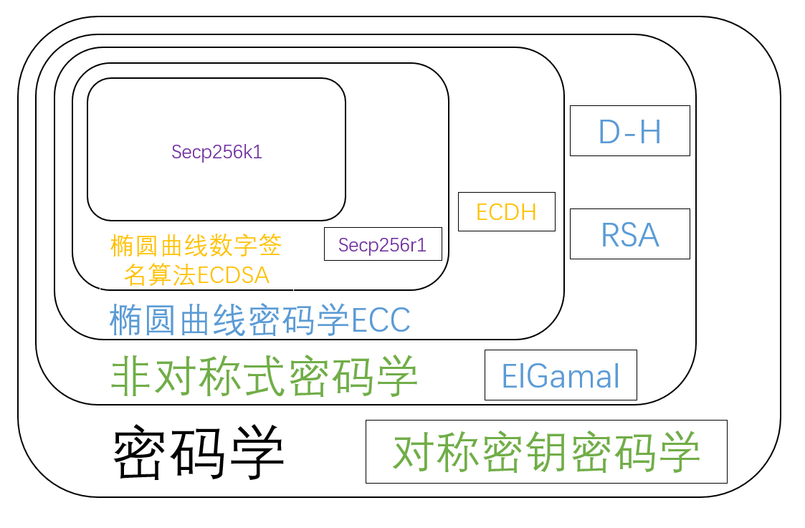

# 区块链里面的地址
> 天下万物生於有，有生於无。        --老子

互联网世界是混沌的，里面充斥着真假消息，垃圾信息。而在一个这样的无序世界里自发涌现出来的区块链，确实如此的有序。这一切，和三十五亿年前，从混沌的海洋热汤中交汇出来的生化聚合物经历了漫长的地质纪年发展为有机大分子，而后产生了生机勃勃的生物圈，是如此的相似：都是从无序的混乱中，诞生了一个有序的有机系统，这是一个熵减的过程。

而这样一个系统的基石之一，是区块链系统里面的地址系统。地址系统确认了某个区块链系统的边界（参与者）是什么，也就是搞清了谁是我们的朋友，谁是我们的敌人。

## `Contents`
- [区块链里面的地址](#%e5%8c%ba%e5%9d%97%e9%93%be%e9%87%8c%e9%9d%a2%e7%9a%84%e5%9c%b0%e5%9d%80)
  - [`Contents`](#contents)
  - [地址前传](#%e5%9c%b0%e5%9d%80%e5%89%8d%e4%bc%a0)
  - [Bitcoin 地址生成](#bitcoin-%e5%9c%b0%e5%9d%80%e7%94%9f%e6%88%90)
    - [一、生成私钥](#%e4%b8%80%e7%94%9f%e6%88%90%e7%a7%81%e9%92%a5)
      - [什么是编码/解码](#%e4%bb%80%e4%b9%88%e6%98%af%e7%bc%96%e7%a0%81%e8%a7%a3%e7%a0%81)
      - [什么是进制](#%e4%bb%80%e4%b9%88%e6%98%af%e8%bf%9b%e5%88%b6)
      - [什么是 Base64](#%e4%bb%80%e4%b9%88%e6%98%af-base64)
      - [Binary 与 Base64 之间的互转](#binary-%e4%b8%8e-base64-%e4%b9%8b%e9%97%b4%e7%9a%84%e4%ba%92%e8%bd%ac)
      - [什么是 Base58](#%e4%bb%80%e4%b9%88%e6%98%af-base58)
        - [Base58 来源](#base58-%e6%9d%a5%e6%ba%90)
        - [Base58 原理与规则](#base58-%e5%8e%9f%e7%90%86%e4%b8%8e%e8%a7%84%e5%88%99)
        - [Base58 的代码实现](#base58-%e7%9a%84%e4%bb%a3%e7%a0%81%e5%ae%9e%e7%8e%b0)
        - [Base58 应用](#base58-%e5%ba%94%e7%94%a8)
      - [什么是 Base58Check](#%e4%bb%80%e4%b9%88%e6%98%af-base58check)
      - [什么是 WIF](#%e4%bb%80%e4%b9%88%e6%98%af-wif)
      - [什么是 SHA-256](#%e4%bb%80%e4%b9%88%e6%98%af-sha-256)
        - [什么是散列](#%e4%bb%80%e4%b9%88%e6%98%af%e6%95%a3%e5%88%97)
        - [什么是哈希函数](#%e4%bb%80%e4%b9%88%e6%98%af%e5%93%88%e5%b8%8c%e5%87%bd%e6%95%b0)
        - [什么是加密散列函数](#%e4%bb%80%e4%b9%88%e6%98%af%e5%8a%a0%e5%af%86%e6%95%a3%e5%88%97%e5%87%bd%e6%95%b0)
        - [什么是 SHA 家族](#%e4%bb%80%e4%b9%88%e6%98%af-sha-%e5%ae%b6%e6%97%8f)
        - [SHA-256 的原理与代码实现](#sha-256-%e7%9a%84%e5%8e%9f%e7%90%86%e4%b8%8e%e4%bb%a3%e7%a0%81%e5%ae%9e%e7%8e%b0)
      - [随机数的生成](#%e9%9a%8f%e6%9c%ba%e6%95%b0%e7%9a%84%e7%94%9f%e6%88%90)
      - [私钥怎么保证安全](#%e7%a7%81%e9%92%a5%e6%80%8e%e4%b9%88%e4%bf%9d%e8%af%81%e5%ae%89%e5%85%a8)
      - [HD 钱包与助剂词](#hd-%e9%92%b1%e5%8c%85%e4%b8%8e%e5%8a%a9%e5%89%82%e8%af%8d)
    - [二、生成公钥](#%e4%ba%8c%e7%94%9f%e6%88%90%e5%85%ac%e9%92%a5)
      - [什么是 Secp256k1](#%e4%bb%80%e4%b9%88%e6%98%af-secp256k1)
        - [什么是公开密钥加密](#%e4%bb%80%e4%b9%88%e6%98%af%e5%85%ac%e5%bc%80%e5%af%86%e9%92%a5%e5%8a%a0%e5%af%86)
          - [应用：](#%e5%ba%94%e7%94%a8)
          - [问题：](#%e9%97%ae%e9%a2%98)
        - [什么是椭圆曲线密码](#%e4%bb%80%e4%b9%88%e6%98%af%e6%a4%ad%e5%9c%86%e6%9b%b2%e7%ba%bf%e5%af%86%e7%a0%81)


## 地址前传
地址系统基于数学难题以及一个秘密。数学难题是指在公钥密码体系中，仅根据公钥很难计算出私钥（工程上基本不可能）。一个秘密就是指生成私钥的随机数。可以想象，三体人是无法直接使用 Bitcoin 系统的，因为所有三体人的脑回路是相连的，他们缺少一个秘密。关于三体人怎么使用 Bitcoin，敬请期待 *三体人会使用比特币吗*

下面将详细讲解 Bitcoin、Ethereum、Polkadot 的地址系统。因为部分内容写着写着发现要先介绍其他内容，因此就就近介绍其他内容。这样整体布局上虽然有点混乱，但是介绍这些内容的原因会比较清晰，符合思路流程，也就知道了整个的来龙去脉。

## Bitcoin 地址生成
整体来讲，Bitcoin 的地址生成可以分为一下 5 步：


### 一、生成私钥
Bitcoin 的私钥本质是一个特殊的随机数。说它特殊，因为它要满足 Secp256k1 的私钥条件：
1. 长度是 256 bit，即 256 位二进制数；
2. 它要小于 `FFFFFFFFFFFFFFFFFFFFFFFFFFFFFFFEBAAEDCE6AF48A03BBFD25E8CD0364141`；

具体为什么要满足这两个条件，第二步会讲。

本身这个随机数是有很多表现形式的，可以通过不同的编码规则把它编码成不同的形式。

#### 什么是编码/解码
这里科普一下编码/解码(Encode/Decode)，根据[维基百科](https://zh.wikipedia.org/wiki/%E7%BC%96%E7%A0%81)：

> 编码是信息从一种形式或格式转换为另一种形式的过程；解码则是编码的逆过程。

编码解决的是信息的表示方式。在通信以及计算机的发展过程中，根据不同的场景需求，诞生了很多有用的编码方法。比如：
- [摩尔斯电码(Morse code)](https://zh.wikipedia.org/zh-cn/%E6%91%A9%E5%B0%94%E6%96%AF%E7%94%B5%E7%A0%81)：满足远距离电报通信。选取点和划为编码基本单元。并用点和划的不同组合代表不同字母，从而组合成信息。
- [Unicode 编码](https://en.wikipedia.org/wiki/Unicode)：解决全世界不同语言的统一编码形式。
- [哈夫曼编码 (Huffman coding)](https://en.wikipedia.org/wiki/Huffman_coding)：为了实现数据的无损压缩。
- [涡轮码 (Turbo code)](https://zh.wikipedia.org/wiki/%E6%B6%A1%E8%BD%AE%E7%A0%81)：具有[前向纠错](https://zh.wikipedia.org/wiki/%E5%89%8D%E5%90%91%E9%8C%AF%E8%AA%A4%E6%9B%B4%E6%AD%A3)的编码技术。涡轮码是首个得以接近香农极限的现实可行的编码，在低信噪比条件下有着优越的性能，广泛运用于3G/4G移动通信（如UMTS与LTE）、深空卫星通信等领域。

上面举了几个编码的示例，其实还有非常多的应用，甚至可以说整个数字世界都是建立在编码的基础上的，从日常通信，上网，到与旅行者系列飞船正确的传输信息，编码技术功不可没。


#### 什么是进制

比如，十进制的 (10)<sub>10</sub>，可以按照对应的编码规则编码成二进制的 (1010)<sub>2</sub>，也可以编码成八进制的 (12)<sub>8</sub>，还可以编码成十六进制的 (A)<sub>16</sub>。其中 (X)<sub>y</sub> 表示在 y 进制下用 X 表示。

这里科普一下不同[进制](https://zh.wikipedia.org/wiki/%E8%BF%9B%E4%BD%8D%E5%88%B6)下的数怎么来的。简单的说 y 进制下任何数的某一位有且仅有 y 个可能的数，然后满 y 进一。比如二进制数的某一个位只有两种可能：(0)<sub>2</sub> 或者 (1)<sub>2</sub>，如果是 (1)<sub>2</sub> + (1)<sub>2</sub>，满 2，就得进一位，得到 (10)<sub>2</sub>。根据上述规则，可以得到不同进制的数其实是一个多项式的简略表示：

* (10)<sub>10</sub> = **1** * 10<sup>1</sup> + **0** * 10<sup>0</sup>
* (1010)<sub>2</sub> = **1** * 2<sup>3</sup> + **0** * 2<sup>2</sup> + **1** * 2<sup>1</sup> + **0** * 2<sup>0</sup>
* (12)<sub>8</sub> = **1** * 8<sup>1</sup> + **2** * 8<sup>0</sup>
* (A)<sub>16</sub> = **A** * 16<sup>0</sup> = (10)<sub>10</sub>

而上面这四个数其实表达的数学含义是相等，都是 (10)<sub>10</sub>

这也说明了编码的一个特点：只是同一个信息的不同表现形式，不同的编码都能表示某个相同的信息，并且可以**相互转化**。这一点和哈希/加密不同，一般来说，仅根据哈希后的东西在任何情况下都无法得到哈希前的东西，而加密后的东西只有在拥有对应的私钥的情况下才能得到加密前的东西。

有了进制的概念后，这样的笑话，就知道是什么意思了：`世界上有10种人：一种是懂得二进制的，另一种是不懂二进制的。`

接下来我们来看一下私钥的不同格式：


图片来源：[The same private key, written in different formats.
](https://www.freecodecamp.org/news/how-to-generate-your-very-own-bitcoin-private-key-7ad0f4936e6c/)

文字版：  
**Hex**：
`DD5113FEDED638E5500E65779613BDD3BDDBEB8EB5D86CDD3370E629B02E92CD`

**Base64**:
`3VET/t7WOOVQDmV3lhO9073b64612GzdM3DmKbAuks0=`

**WIF**:
`5KVkpWGfDQGJAUEEDUFbrFxwNPjmXy5kBBmRzzBDf4JkgFXqXTa`


**Binary**:
`1101110101010001000100111111111011011110110101100011100011100101010100000000111001100101011101111001011000010011101111011101001110111101110110111110101110001110101101011101100001101100110111010011001101110000111001100010100110110000001011101001001011001101`

> 使用[不同编码格式在线转换工具](https://cryptii.com/pipes/base64-to-hex)

上面是同一个私钥的不同表现形式，它们之间可以相互转化。我们从最底层的 **Binary** 看起，这个就是一个 256 bit 的二进制数。然后接着看一下第一行的 **Hex**，这是这个数的十六进制表示形式。这里补充一下，前面说了 y 进制下任何数的某一位有且仅有 y 个可能的数，十六进制是通过使用 0~9，再用 "(A)<sub>16</sub>，(B)<sub>16</sub>，(C)<sub>16</sub>，(D)<sub>16</sub>，(E)<sub>16</sub>，(F)<sub>16</sub>"(不区分大小写) 分别表示 "(10)<sub>10</sub>，(11)<sub>10</sub>，(12)<sub>10</sub>，(13)<sub>10</sub>，(14)<sub>10</sub>，(15)<sub>10</sub>" 来凑齐 16 个数的。而且可以看到每 4 位二进制数表示的范围是 (0000)<sub>2</sub> ~ (1111)<sub>2</sub>，也就是 (0)<sub>10</sub> ~ (15)<sub>10</sub>，也就是 (0)<sub>16</sub> ~ (F)<sub>16</sub>。因此每 4 位二进制数恰好和 1 位十六进制数完全匹配。

4 位二进制与 1 位 十六进制一一对应表：

| Index(十进制下的表示) | 二进制下的表示 | 十六进制下的表示 |
| :---: | :---: | :---: |
| 0 | 0000 | 0 |
1|0001|1
2|0010|2
3|0011|3
4|0100|4
5|0101|5
6|0110|6
7|0111|7
8|1000|8
9|1001|9
10|1010|A
11|1011|B
12|1100|C
13|1101|D
14|1110|E
15|1111|F

所以，我们可以看到私钥的二进制形式的开头四个位 (1101)<sub>2</sub>，就是表示 (13)<sub>10</sub>，也就是表示 (D)<sub>16</sub>，正好和十六进制的第一个数 (D)<sub>16</sub> 对应上了。后续的也是如此，以此类推，最后将会得到一个 `256/4 = 64` 位的十六进制数。因此，我们可以轻易实现 **Hex** (十六进制)形式与 **Binary** (二进制)形式的相互转换。

如果我们想要知道用 Base64 编码得到的私钥形式，就需要介绍一下 Base64 编码算法了。

#### 什么是 [Base64](https://en.wikipedia.org/wiki/Base64)
>[Base64](https://base64.guru/learn/what-is-base64) 是一组二进制到文本的编码方案，允许您将任何字符转换为由拉丁字母，数字，加号和斜杠组成的字母。有了它，您可以将汉字，表情符号甚至图像转换成“可读”字符串，可以将其保存或传输到任何地方。

上面的描述可能有点抽象，其实我们可以这么想：
十六进制是选取了 16 个不同的"符号"来表示每一位中不同的数字，那 Base64 就是选取了 64 个不同的"符号"来表示每一位数字，我们只需要明白其对应转化规则就行了。本身它的名字就是以 64 个基本 (base) 的字符来编码的意思。

[Base64](https://zh.wikipedia.org/wiki/Base64) 的一位的表示范围在 0~63，正好对应 6 位二进制数的表示范围：(000000)<sub>2</sub> ~ (111111)<sub>2</sub>。因为 (111111)<sub>2</sub> = **1** * 2<sup>5</sup> + **1** * 2<sup>4</sup> + **1** * 2<sup>3</sup> + **1** * 2<sup>2</sup> + **1** * 2<sup>1</sup> + **1** * 2<sup>0</sup> = (32)<sub>10</sub> + (16)<sub>10</sub> + (8)<sub>10</sub> + (4)<sub>10</sub> + (2)<sub>10</sub> + (1)<sub>10</sub> = (63)<sub>10</sub>

那么 Base64 选取了什么符号来分别表示 64 个不同的数呢？这些符号和数之间有什么一一对应关系？

十进制以及 6 位二进制与 1 位 Base64 格式一一对应表：

Index(十进制大小)|Base64 Character| 二进制形式 |    |Index(十进制大小)|Base64 Character|  二进制形式 | |Index(十进制大小)|Base64 Character| 二进制形式| |Index(十进制大小)|Base64 Character| 二进制形式| 
| --- | :---: | :---: | :---: | :---: |:---: | :---: | :---: | :---: | :---: | :---: | :---: | :---: | :---: | :---: |
0|  A|000000| |26|a|011010| |52|0|110100| |62|+|111110|
1|  B|000001| |27|b|011011| |53|1|110101| |63|/|111111|
2|	C|000010| |28|c|011100| |54|2|110110|
3|	D|000011| |29|d|011101| |55|3|110111|
4|	E|000100| |30|e|011110| |56|4|111000|
5|	F|000101| |31|f|011111| |57|5|111001|
6|	G|000110| |32|g|100000| |58|6|111010|
7|	H|000111| |33|h|100001| |59|7|111011|
8|	I|001000| |34|i|100010| |60|8|111100|
9|	J|001001| |35|j|100011| |61|9|111101|
10|	K|001010| |36|k|100100|
11|	L|001011| |37|l|100101|
12|	M|001100| |38|m|100110|
13|	N|001101| |39|n|100111|
14|	O|001110| |40|o|101000|
15|	P|001111| |41|p|101001|
16|	Q|010000| |42|q|101010|
17|	R|010001| |43|r|101011|
18|	S|010010| |44|s|101100|
19|	T|010011| |45|t|101101|
20|	U|010100| |46|u|101110|
21|	V|010101| |47|v|101111|
22|	W|010110| |48|w|110000|
23|	X|010111| |49|x|110001|
24|	Y|011000| |50|y|110010|
25|	Z|011001| |51|z|110011|

从上表可以看出，Base64 编码使用到的字符可以分为四组：
- 大写字母（索引0-25）：`ABCDEFGHIJKLMNOPQRSTUVWXYZ`
- 小写字母（索引26-51）：`abcdefghijklmnopqrstuvwxyz`
- 数字（索引52-61）：`0123456789`
- 特殊符号（索引62-63）：`+/`

因为 Base64 编码中，不同字母的大小写代表不同的含义，因此是区分大小写的。这一点和十六进制不同，十六进制不区分，A 与 a 表示的是同一个含义。

上面这个对应表已经包含了 Base64 的大部分规则了。接下来是一些细节方面的。
计算机是以字节 (Bytes) 为基本单元的。其中 1 字节 = 8 bit，也就是说计算机本身按照每 8 位二进制数来处理。而 Base64 是按照每 6 位二进制数处理。而 8 和 6 的最小公倍数是 24，因此就是 24 位二进制，对应 3 个字节，也对应 4 个 Base64 单元。  

当然会存在位数对不上的情况，一般在进制转化时，如果位数不够，在前面补 0 就行了，比如 1 和 001 表示都是 1 。但 Base64 不是这样，它是在末尾补全。因此 Base64 和六十四进制还是有很大区别的，至于为什么采取在末尾补 0 这样的措施，我猜测这种方式能够在解码后得到之前有多少个 0。前面补 0 无法还原出原本信息是 1 还是 001：

> 如果要编码的字节数不能被 3 整除，最后会多出 1 个或 2 个字节，那么可以使用下面的方法进行处理：先使用 0 字节值在末尾补足，使其能够被 3 整除，然后再进行 Base64 的编码。在编码后的 Base64 文本后加上一个或两个 = 号，代表补足的字节数。也就是说，当最后剩余两个八位(待补足)字节（2 个 byte）时，最后一个 6 位的 Base64 字节块有四位是 0 值，最后附加上两个等号；如果最后剩余一个八位(待补足)字节（1 个byte）时，最后一个6位的base字节块有两位是 0 值，最后附加一个等号。 参考下表：


如上图，我们要编码 `A` 这个字符。在[美国信息交换标准代码 (ASCII)](https://en.wikipedia.org/wiki/ASCII) 中，A 仅占一个字节 (Byte)，并且用 (65)<sub>10</sub> 表示，8 位二进制下就是 (01000001)<sub>2</sub>。现在只有 1 个字节 (Byte)，不够三个字节，就需要补充两个字节的 0，也就是 16 位的二进制形式的 0，最后我们将得到 3 个字节，也就是 24 bit 的数。最后，我们根据上面的对照表，找到 (010000)<sub>2</sub> 对应了 Base64 里面的 Q，同理，第二个 6 位对应的也是 Q，最后，我们遇到了 (000000)<sub>2</sub>，这时有两个选择，一个是上述对应表里面的 (000000)<sub>2</sub>，它对应 Base64 里面的 A，一个是补全规则里面的 =。具体是哪个根据这 6 bit 的 0 是不是 **全部** 通过补全得到，如果是，就是 =，否则有任意一个 0 是原来文本自有的，就用 A 表示。因此这里用 =。
同理，当我们缺 1 个字节时，也可以按上图方法补全。

根据上面的规则，我们可以得出一个结论，任何数据进行 Base64 编码后的结果的位数是 4 的倍数。比如 32 Byte 的私钥进行 Base64 编码后的长度是 (32+1)/3 * 4 = 44 位。

这里因为要讲到私钥的某种格式，所以涉及到了 Base64 编码。其实 Base64 最常用于编码二进制数据（例如，图像或声音文件）以嵌入HTML，CSS，EML和其他文本文档中。此外，Base64 用于对在传输，存储或输出期间可能不受支持或损坏的数据进行编码。这是该算法的一些广泛应用：
- 发送电子邮件时附加文件
- 通过数据 URI 将图像嵌入 HTML 或 CSS
- 保留加密函数的原始字节
- 在 API 响应中将二进制数据输出为 XML 或 JSON
- BLOB不可用时将二进制文件保存到数据库

#### Binary 与 Base64 之间的互转
根据上一小节，可以知道 6 位二进制和 Base64 之间是一一对应的。那么把一个二进制数转换成 Base64 也是非常容易的。这里我们尝试把前面那个示例里面的二进制私钥转换成 Base64 形式。首先，256 bit 的私钥正好对应 32 Bytes，不能被 3 整除，因此需要补 1 Byte 的 0，也就是 (00000000)<sub>2</sub>。因此我们的私钥从：

`1101110101010001000100111111111011011110110101100011100011100101010100000000111001100101011101111001011000010011101111011101001110111101110110111110101110001110101101011101100001101100110111010011001101110000111001100010100110110000001011101001001011001101`

通过补全变成：

`110111010101000100010011111111101101111011010110001110001110010101010000000011100110010101110111100101100001001110111101110100111011110111011011111010111000111010110101110110000110110011011101001100110111000011100110001010011011000000101110100100101100110100000000`

然后这里通过每六位分组，并通过前面的对照表对比得到：

二进制数|110111|010101|000100|010011|111111|101101|111011|010110|001110|001110|010101|
| --- | :---: | :---: | :---: | :---: | :---: |:---:|:---:|:---:|:---:|:---:|:---:|
Base64|3|V|E|T|/|t|7|W|O|O|V|
二进制数|010000|000011|100110|010101|110111|100101|100001|001110|111101|110100|111011|
Base64|Q|D|m|V|3|l|h|O|9|0|7|
二进制数|110111|011011|111010|111000|111010|110101|110110|000110|110011|011101|001100|
Base64|3|b|6|4|6|1|2|G|z|d|M|
二进制数|110111|000011|100110|001010|011011|000000|101110|100100|101100|110100|000000|
Base64|3|D|m|K|b|A|u|k|s|0|=|

这里因为最后 6 bit 的 0 都是通过之前补 0 得到，因此编码成 =，其他的都是和上面的对照表一一对应。

最后一汇总，毫无疑问，这正好是我们之前给出的结果：
`3VET/t7WOOVQDmV3lhO9073b64612GzdM3DmKbAuks0=`

这里我们通过 Base64 的规则，动手转化出了某一私钥的 Base64 形式。这就是科学迷人的地方：没有什么高深莫测，似是而非的神秘迷雾，只有明确的规则和标准。

Less Trust, More Truth


#### 什么是 [Base58](https://zh.wikipedia.org/wiki/Base58)

##### Base58 来源

上面的 Base64 编码是很久以前就有的技术。而 Base58 诞生于 Bitcoin。

> Base58 是用于 Bitcoin 中使用的一种独特的编码方式，主要用于产生 Bitcoin 的钱包地址。相比 Base64，Base58 不使用数字"0" (zero)，字母大写"O"(capital o)，字母大写"I"(capital i)，和字母小写"l"(lower case L)，以及"+"和"/"符号。
> 
> 设计Base58主要的目的是：
> * 避免混淆。在某些字体下，数字0和字母大写O，以及字母大写I和字母小写l会非常相似。
> * 不使用"+"和"/"的原因是非字母或数字的字符串作为帐号较难被接受。
> * 没有标点符号，通常不会被从中间分行。
> * 大部分的软件支持双击选择整个字符串。

其中中本聪在 base58.h 中的注释：
```c
//
// Why base-58 instead of standard base-64 encoding?
// - Don't want 0OIl characters that look the same in some fonts and
//      could be used to create visually identical looking account numbers.
// - A string with non-alphanumeric characters is not as easily accepted as an account number.
// - E-mail usually won't line-break if there's no punctuation to break at.
// - Doubleclicking selects the whole number as one word if it's all alphanumeric.
//
```

##### Base58 原理与规则

因此表面上看 Base58 就是 Base64 删掉了 6 个基本数字(字符)，但是其实差别挺大的。

Base64 设计得很巧妙，它在编码和解码的时候可以通过 位 操作就能得到结果。它的简单和高效性也表现在我们仅仅根据一个对照表就能够“目测”得到编码后的结果。这也是 Base64 之前就大量流行的原因之一：计算机能够快速的进行 Base64 编码和解码。而 Base58 就不同了，Base58 的编码解码涉及到大数的除法。

下面介绍一下 Base58 的规则：

| Value |	Char | Value | Char | Value | Char | Value | Char |
| --- | --- | --- | --- | --- | --- | --- | --- |
|0| 1|  16| H|  32| Z|  48| q|
|1| 2|  17| J|  33| a|  49| r|
|2| 3|	18| K|	34|	b|	50|	s|
|3|	4|	19|	L|	35|	c|	51|	t|
|4|	5|	20|	M|	36|	d|	52|	u|
|5|	6|	21|	N|	37|	e|	53|	v|
|6|	7|	22|	P|	38|	f|	54|	w|
|7|	8|	23|	Q|	39|	g|	55|	x|
|8|	9|	24|	R|	40|	h|	56|	y|
|9|	A|	25|	S|	41|	i|	57|	z|
|10|	B|	26|	T|	42|	j|
|11|	C|	27|	U|	43|	k|
|12|	D|	28|	V|	44|	m|
|13|	E|	29|	W|	45|	n|
|14|	F|	30|	X|	46|	o|
|15|	G|	31|	Y|	47|	p|

根据对照表规则可知，Base58 不仅少了 6 个基本字符，而且剩下的字符的对应规则也是完全不同。

根据之前对进制的解释，其实可以得出一个这样粗糙的说法：
1. 不同进制只是选取不同的“基数”来表示数。
2. 某一进制下的数可以得到对应的多项式展开形式。

因此，Base58 可以说是某种意义上的 58 进制数了。我们尝试进行一下 Base58 编码：  
(100)<sub>10</sub> = (58)<sub>10</sub> + (42)<sub>10</sub> = **1** * 58<sup>1</sup> + **42** * 58<sup>0</sup> = (**2j**)<sub>Base58</sub>  
最后一步是因为 (**1**)<sub>10</sub> 对应 (**2**)<sub>Base58</sub>，(**42**)<sub>10</sub> 对应 (**j**)<sub>Base58</sub>


然后我们可以找一个[在线 Base58 转换](https://incoherency.co.uk/base58/)，去检验一下。因为这个网站只支持 16 进制 (Hexadecimal)，我们需要先将 (100)<sub>10</sub> 转换成 (64)<sub>16</sub> (因为 6 * 16 + 4 = 100)，最后结果和我们算出来的一样，都是 `2j`：


其实上面的转换过程就是一个除法，100 / 58 商 1 余 42。这就是把其他数转换成 Base58 的方法。

更一般的，我们可以参考一个大一点的数。比如十进制下的 123456789：

|  |
| ---: |
| base10 = 123456789 |
| 123456789 % 58 = 19 |
|   2128565 % 58 = 23 |
|     36699 % 58 = 43 |
|       632 % 58 = 52 |
|        10 % 58 = 10 |

> base58 = [10][52][43][23][19]  
> base58 = BukQL


图片来源：https://learnmeabitcoin.com/guide/base58

因此，总的来讲，Base58 就类似一个五十八进制，通过除法可以把数字编码成 Base58 格式。

##### Base58 的代码实现

[官方给出的算法描述](https://zh.wikipedia.org/wiki/Base58)思路就是不断整除 58：

```C++
    code_string = "123456789ABCDEFGHJKLMNPQRSTUVWXYZabcdefghijkmnopqrstuvwxyz";
    x = convert_bytes_to_big_integer(hash_result);

    output_string = "";

    while(x > 0) 
    {
        (x, remainder) = divide(x, 58);
        output_string.append(code_string[remainder]);
    }

    repeat(number_of_leading_zero_bytes_in_hash)
    {
        output_string.append(code_string[0]);
    }
    
    output_string.reverse();
```


##### Base58 应用

|Application|	Alphabet|Sample|
| :---: | :---: | :---: |
|[Bitcoin addresses](https://en.bitcoin.it/wiki/Technical_background_of_version_1_Bitcoin_addresses)|123456789ABCDEFGHJKLMNPQRSTUVWXYZabcdefghijkmnopqrstuvwxyz|16VTxDzziQKyQMN3s6kEngh9jeNCsiQb6j|
|[IPFS hashes](https://ipfs.io/ipfs/QmNtpA5TBNqHrKf3cLQ1AiUKXiE4JmUodbG5gXrajg8wdv)|123456789ABCDEFGHJKLMNPQRSTUVWXYZabcdefghijkmnopqrstuvwxyz|QmNtpA5TBNqHrKf3cLQ1AiUKXiE4JmUodbG5gXrajg8wdv|
|short URLs for [Flickr](https://www.flickr.com/services/api/misc.urls.html#short)|123456789abcdefghijkmnopqrstuvwxyzABCDEFGHJKLMNPQRSTUVWXYZ|无|

上面可以看出，IPFS 的 Hash 的编码也用到了 Base58。截止目前，用到了 Base58 的应用不多，就三个。但是 Base58 已经有了两种，Bitcoin 和 IPFS 是同一种，Flickr 是另一种，这两种 Base58 的不同体现在它们的字母顺序不同，通过上面的表可以看出，Flickr 用到的那种先用到了小写字母表。Flickr 是一个保存图片的服务商，不是区块链行业的，它们的的网络链接的短地址编码用到了 Base58。


科普时间结束，下面进入吐槽时间：   
当初中本聪整出了 Base58，仿佛是为了让地址更加人性化，更加符合人类的习惯。但是，用过 Bitcoin 的人，真的觉得它很人性化吗？  

用户并不领情，你整出这么个一堆乱码一样的东西来让我用，[就别怪我吐槽了](https://mp.weixin.qq.com/s/MAYZN_A1eZdyKKSLvQSeZQ)：

> * 如果我打错了东西，或者复制粘贴错了，我的钱就会永远消失；
> * 如果出现软件故障，我的钱就会永远消失；
> * 如果有人入侵我的电脑或手机，我的钱就会永远消失......
>
> **看到这一趋势了吗？犯任何错误，你就完蛋了。这就像在悬崖边上骑摩托车，而且还没有护栏。**
>
> 主流的钱包非常难用，我上次升级时忘了保留我的私钥，所以我不得不全部还原。
>
> 今年早些时候，我有一款老旧的比特币，从2013年开始就被卡在了一个古老版本的Multibit上。我花了一个星期的时间才把它取出来，原因是软件错误的认为，我发送了一个从来没有真正产生过的交易。
>
> 想象一下，五年后这些钱包还能被使用吗？当量子计算机出现时，我们需要完全更新系统的基本协议，会发生什么？
>
> 普通人将永远无法完成这些步骤，没有任何可能。
>
> 20年的IT经历告诉我，人们可以并且将会以技术人员完全无法想象的方式搞砸他们的机器，这是活生生的墨菲定律。

原文链接： https://hackernoon.com/what-will-bitcoin-look-like-in-twenty-years-7e75481a798c


现在的地址系统，确实给人粗粝之感。大家操控着三四十位"乱码"的地址或者公钥，对，就是每一个字符你都认识，但是合在一起你就不认识了的感觉，而且这么偏“底层”的东西裸露给别人用，这不就像发动汽车的时候直接用手把带电的导线接到到火花塞上？（虽然我并不清楚火花塞点火原理）

不过话说回来，就像刚刚把蒸汽机用在了火车上的那阵子的情形：白茫茫的蒸汽混杂着燃煤后的黑烟肆无忌惮地从火车头喷出，飘到你脸上；杂乱无章的金属碰撞噪声震耳欲聋；因缺乏减震设计而导致的震动仿佛要山崩地裂了。。。这一切根本无法和目前的高铁相比，但是不妨碍它的伟大。

伟大如斯，Bitcoin！


#### 什么是 [Base58Check](https://en.bitcoin.it/wiki/Base58Check_encoding)

已经有了 Base58 编码，为什么还要搞一个 Base58Check 编码？  

因为仅仅只是用 Base58 编码，是有他的局限性的。比如现在你钱包里面有一堆地址，有的是测试网的，有的是主网上的。有次你需要接收主网上的 BTC，结果一不小心给了测试网的地址，你可能就收不到这笔 BTC 了。如果在设计 Bitcoin 的系统的时候，我们在地址的前缀加上 1 Byte 来表示版本号，比如主网的 是 1，测试网的是 m/n，这样即使有上述误操作，系统也会拒绝。这就是地址前缀的由来，具体查看 [List of address prefixes](https://en.bitcoin.it/wiki/List_of_address_prefixes)；  
还有一个需求就是要是输入地址的时候输错一位或者几位，BTC 又会被转到错误的地址以至丢失。所以我们在后面再加 4 Bytes 的数字来保证尽量出了错误能够被发现。

因此就有了下面的 Base58Check 编码方法：

注：下面这个流程图我是参考这里的信息画的： https://en.bitcoin.it/wiki/Base58Check_encoding#Creating_a_Base58Check_string   
这里的描述只有一次 SHA-256 的哈希运算。而接下来 WIF 以及 Bitcoin 地址生成都有两次。我的理解是，Base58Check 只要保证在 Base58 基础上加上版本号以及[校验码](https://zh.wikipedia.org/wiki/%E6%A0%A1%E9%AA%8C%E7%A0%81)就行了。还没有定下一个统一的标准。所以具体到某一个 Base58Check 还需要具体看它的实现规则。


这里看起来可能会有点抽象，我们再遇到具体 Base58Check 编码时(比如 WIF 以及 Bitcoin 地址生成。)，再举例详细说。

总体来说，Base58Check 就是主体是 Base58 编码，然后前后加一些 meta data （元数据），得到可以校验的数据。代价是数据的长度变长了。

#### 什么是 [WIF](https://en.bitcoin.it/wiki/Wallet_import_format)

和 Base58 一样， WIF 也是因为有了 Bitcoin 才提出来的：
> Wallet Import Format (WIF, also known as Wallet Export Format) is a way of encoding a private ECDSA key so as to make it easier to copy.

下面是生成主网私钥的 WIF 格式的一般流程：这里拿主网的私钥举例，[标准](https://en.bitcoin.it/wiki/List_of_address_prefixes)规定它的版本号(或者说前缀)是 (80)<sub>16</sub>：


下面这个是另外一种形式的流程图，其中 prv_key 代表私钥：


我们前面以及推导出了下面这个私钥的三种格式了。还剩下 WIF 格式没有推导出来，所以我们尝试动手推导出来：


- 一、得到十六进制私钥：**Hex**：  
`DD5113FEDED638E5500E65779613BDD3BDDBEB8EB5D86CDD3370E629B02E92CD`
- 二、在前面加上 80 ：  
`80DD5113FEDED638E5500E65779613BDD3BDDBEB8EB5D86CDD3370E629B02E92CD`
- 三、对它进行 SHA-256 哈希，我们利用[这个在线工具](https://cryptii.com/pipes/hash-function)，得到：
  > 因为哈希运算结果是一个十六进制的数，而十六进制是不区分大小写的。因此从上面的工具得到的哈希结果里涉及到字母的是小写，需要利用[这个工具](https://convertcase.net/)统一转换成大写

  `3864ACBB060F15F6110398A4B51271FB7A64F282D01E9AD716DFF181F3CB1F26`
  
- 四、对第三步的结果再次进行 SHA-256 哈希：  
`E3C3FC9D51B230727C1560CF1402D5207EEC8F2710683982CEBDF2FDADA44D53`

- 五、拿到第四步中的结果的前 4 个字节，因为 1 字节对应 2 位十六进制数，因此就是拿 8 位十六进制数。下面这个数就是 Checksum 又称[校验和](https://zh.wikipedia.org/zh-hans/%E6%A0%A1%E9%AA%8C%E5%92%8C)
`E3C3FC9D`
- 六、拼接数据：  
`80DD5113FEDED638E5500E65779613BDD3BDDBEB8EB5D86CDD3370E629B02E92CDE3C3FC9D`
- 七、对第六步中得到数进行 Base58 编码，当然，我们这里又要使用[在线工具](https://incoherency.co.uk/base58/)了：
`5KVkpWGfDQGJAUEEDUFbrFxwNPjmXy5kBBmRzzBDf4JkgFXqXTa`


和前面的图片一对比，发现成功转化出了这个私钥的 WIF 格式。

这里本身有一个 Bitcoin 十六进制使用转 WIF 的[在线工具](http://gobittest.appspot.com/PrivateKey)，从这里得到结果也能够印证正确性：


对应 WIF 这个小话题就结束了吗？其实我有点不满意的，上面的私钥格式有 4 种：**Hex（十六进制）**、**Base64 编码格式**、**WIF 编码格式**、**Binary（二进制）**。除了 WIF，其他三种每一个数字（或者字符）是怎么来的都很清楚，但是 WIF 里面好几个步骤都是借助于在线工具。具体来讲有两个黑盒，一个是 SHA-256，一个是 Base58 编码。因为难度上升，这两个不能像之前那样直接对照一下就出结果，需要大量运算。这两个黑盒，SHA-256 后续我们再讨论，Base58 编码我们先尝试用 Rust 实现一下，具体代码在[这里](https://github.com/flyq/blogs/tree/master/address/myaddr)：


```rust
extern crate num_bigint;
extern crate num_traits;

use num_bigint::BigUint;
use num_traits::Zero;

fn main() {
    let s =String::from("80DD5113FEDED638E5500E65779613BDD3BDDBEB8EB5D86CDD3370E629B02E92CDE3C3FC9D");
    
    println!("{:?}", hexstring_to_base58(&s));
}

fn hexstring_to_base58(s: &String) -> String {
    // 按照顺序排列的 base58 的 58 个基本字符
    let base_char = String::from("123456789ABCDEFGHJKLMNPQRSTUVWXYZabcdefghijkmnopqrstuvwxyz");
    // 转换成字符数组，方便拿取
    let base_char_vec: Vec<char> = base_char.chars().collect();
    // 将输入的字符串转换成大整数 BigUint，这里要求数据是 16 进制格式
    // 参考：https://docs.rs/num-bigint/0.2.3/num_bigint/struct.BigUint.html#method.parse_bytes
    let mut a: BigUint = BigUint::parse_bytes(s.as_bytes(),16).unwrap();

    let mut res = vec![];
    while a.clone() > Zero::zero() {
        let index = a.clone() % BigUint::from(58u32);
        // BigUint 类型转换成 usize，这样才能用 index 当做索引去从字符数组里面拿字符。
        let index = *index.to_bytes_le().get(0).unwrap() as usize;
        res.push(base_char_vec[index]);
        a /= BigUint::from(58u32);
    }
    // 这里需要反转一下 res 里面的字符，因为越是最后得到的字符，它被除得最多，即它的位数越高。
    let res: String = res.iter().rev().collect();
    res
}
```
main 函数里面有个示例，就是用了我们之前第六步拼接得到的数据


```shell
$ cargo run 
warning: custom registry support via the `registry.index` configuration is being removed, this functionality will not work in the future
    Updating `https://mirrors.ustc.edu.cn/crates.io-index/` index
  Downloaded num-bigint v0.2.5 (registry `https://mirrors.ustc.edu.cn/crates.io-index/`)
  Downloaded num-traits v0.2.11 (registry `https://mirrors.ustc.edu.cn/crates.io-index/`)
  Downloaded num-integer v0.1.42 (registry `https://mirrors.ustc.edu.cn/crates.io-index/`)
  Downloaded autocfg v1.0.0 (registry `https://mirrors.ustc.edu.cn/crates.io-index/`)
   Compiling autocfg v1.0.0 (registry `https://mirrors.ustc.edu.cn/crates.io-index/`)
   Compiling num-traits v0.2.11 (registry `https://mirrors.ustc.edu.cn/crates.io-index/`)
   Compiling num-integer v0.1.42 (registry `https://mirrors.ustc.edu.cn/crates.io-index/`)
   Compiling num-bigint v0.2.5 (registry `https://mirrors.ustc.edu.cn/crates.io-index/`)
   Compiling myaddr v0.1.0 (/home/flyq/workspaces/flyq/blogs/address/myaddr)
    Finished dev [unoptimized + debuginfo] target(s) in 17.95s
     Running `target/debug/myaddr`
"5KVkpWGfDQGJAUEEDUFbrFxwNPjmXy5kBBmRzzBDf4JkgFXqXTa"
```

结果 `5KVkpWGfDQGJAUEEDUFbrFxwNPjmXy5kBBmRzzBDf4JkgFXqXTa` 正是之前的那个。

上面这个程序直接使用大数直接硬算，其效率是不高的，甚至在运行它时都可以感受到其停顿。我们看看实际生产环境中的 base58 是怎么得到的。

我们参考 [parity-bitcoin](https://github.com/paritytech/parity-bitcoin/blob/495f62021c/keys/Cargo.toml) 里面的实现：  
  

里面使用到的是外部的 base58 库，版本是 0.1 。

我们可以看一下这个 [Base58 库的源码实现](https://docs.rs/crate/base58/0.1.0/source/src/lib.rs)。同样的，把这个实现的部分代码（从 [u8] 到 base58 ）放在一个[能运行的项目里面](https://github.com/flyq/blogs/tree/master/address/parity-base58)：
```rust
extern crate hex;

const ALPHABET: &'static [u8] = b"123456789ABCDEFGHJKLMNPQRSTUVWXYZabcdefghijkmnopqrstuvwxyz";

fn main() {
    let input = "80DD5113FEDED638E5500E65779613BDD3BDDBEB8EB5D86CDD3370E629B02E92CDE3C3FC9D";
    let decoded = hex::decode(input).expect("Decoding failed");
    let res = to_base58(&decoded);
    println!("{:?}\n{:?}", decoded, res);
    
}

fn to_base58(v: &[u8]) -> String {
    // zcount 记录输入的 byte slice 里面值为 0 的个数。
    let zcount = v.iter().take_while(|x| **x == 0).count();
    let size = (v.len() - zcount) * 138 / 100 + 1;
    let mut buffer = vec![0u8; size];

    let mut i = zcount;
    let mut high = size - 1;

    while i < v.len() {
        let mut carry = v[i] as u32;
        let mut j = size - 1;

        while j > high || carry != 0 {
            carry += 256 * buffer[j] as u32;
            buffer[j] = (carry % 58) as u8;
            carry /= 58;

            // in original trezor implementation it was underflowing
            if j  > 0 {
                j -= 1;
            }
        }

        i += 1;
        high = j;
    }

    let mut j = buffer.iter().take_while(|x| **x == 0).count();

    let mut result = String::new();
    for _ in 0..zcount {
        result.push('1');
    }

    while j < size {
        result.push(ALPHABET[buffer[j] as usize] as char);
        j += 1;
    }

    result
}
```

最后运行结果同样符合预期：
```shell
cargo run 
   Compiling parity-base58 v0.1.0 (/home/flyq/workspaces/flyq/blogs/address/parity-base58)
    Finished dev [unoptimized + debuginfo] target(s) in 0.66s
     Running `target/debug/parity-base58`
[128, 221, 81, 19, 254, 222, 214, 56, 229, 80, 14, 101, 119, 150, 19, 189, 211, 189, 219, 235, 142, 181, 216, 108, 221, 51, 112, 230, 41, 176, 46, 146, 205, 227, 195, 252, 157]
"5KVkpWGfDQGJAUEEDUFbrFxwNPjmXy5kBBmRzzBDf4JkgFXqXTa"
```


#### 什么是 SHA-256

要清楚地回答这个问题，就需要把哈希/散列的整个来龙去脉介绍一遍。



在整个散列里面，我们的 SHA-256 只占最里面的一小块。这个图里面相同颜色的项目表示同一级别。下面我们将由外到内依次介绍各个部分。

##### 什么是[散列](https://zh.wikipedia.org/zh-cn/%E6%95%A3%E5%88%97)
> 散列（英语：Hashing）是电脑科学中一种对数据的处理方法，通过某种特定的函数/算法（称为散列函数/算法）将要检索的项与用来检索的索引（称为散列，或者散列值）关联起来，生成一种便于搜索的数据结构（称为散列表）。旧译**哈希**（误以为是人名而采用了音译）。它也常用作一种信息安全的实现方法，由一串数据中经过散列算法（Hashing algorithms）计算出来的数据指纹（data fingerprint），经常用来识别文件与数据是否有被窜改，以保证文件与数据确实是由原创者所提供。


看起来比较绕，我们接着往下看，下面更加具体，最后会给出一个层次图。  
至少我们知道了哈希和散列在某些语境下是一回事，只是翻译的不同。


##### 什么是[哈希函数](https://zh.wikipedia.org/zh-cn/%E6%95%A3%E5%88%97%E5%87%BD%E6%95%B8)
> 散列函数（英语：Hash function）又称散列算法、哈希函数，是一种从任何一种数据中创建小的数字“指纹”的方法。散列函数把消息或数据压缩成摘要，使得数据量变小，将数据的格式固定下来。该函数将数据打乱混合，重新创建一个叫做散列值（hash values，hash codes，hash sums，或hashes）的指纹。散列值通常用一个短的随机字母和数字组成的字符串来代表。好的散列函数在输入域中很少出现散列冲突。在散列表和数据处理中，不抑制冲突来区别数据，会使得数据库记录更难找到。

总的来说，哈希函数就是用于生成哈希（散列）的函数。输入任意长度的数据，输出某一固定格式（某一定长的）的数据。严格地说，有些哈希函数对输入数据长度有限制，但限制完后允许输入的数据也是非常大的，比如 SHA-256 哈希函数，它最大允许输入 2<sup>64</sup> - 1 bits 的数据。
根据：  
  
*图片来源：https://en.wikipedia.org/wiki/Unit_prefix*

2<sup>64</sup> bit = 2<sup>61</sup> Bytes > 10<sup>18</sup> Bytes = 1,000,000 TB。普通 P C也就 1 TB 的存储，这里上限达到了一百万 TB，因此普通电脑根本达不到上限。所以可以说`输入任意长度的数据`。

哈希函数有很多应用：
1. [加密哈希函数](https://zh.wikipedia.org/zh-cn/%E5%AF%86%E7%A2%BC%E9%9B%9C%E6%B9%8A%E5%87%BD%E6%95%B8)
2. [哈希表](https://zh.wikipedia.org/wiki/%E9%9B%9C%E6%B9%8A%E8%A1%A8)
3. [关联数组](https://zh.wikipedia.org/wiki/%E5%85%B3%E8%81%94%E6%95%B0%E7%BB%84)
4. 几何散列

这里，我们只关心加密哈希函数。


哈希函数有一些性质：  
1. 任意输入只有唯一的确定性结果：如果两个散列值是不相同的（根据同一函数），那么这两个散列值的原始输入也是不相同的。这个特性是散列函数具有确定性的结果，具有这种性质的散列函数称为单向散列函数。
2. 不同输入，可能有相同结果：散列函数的输入和输出不是唯一对应关系的，如果两个散列值相同，两个输入值很可能是相同的，但也可能不同，这种情况称为“散列碰撞（collision）”，这通常是两个不同长度的输入值，刻意计算出相同的输出值。输入一些数据计算出散列值，然后部分改变输入值，一个具有强混淆特性的散列函数会产生一个完全不同的散列值。
3. 定义域非常大：典型的散列函数都有非常大的定义域，比如SHA-2最高接受(2^64-1)/8长度的字节字符串。
4. 有限的值域：同时散列函数一定有着有限的值域，比如固定长度的比特串。
5. 在密码学中，即加密散列函数，散列函数必须具有不可逆性。即仅根据结果无法推导出输入。

第 2 个和第 3，4 个有很大的关联，比如 SHA-256 哈希函数，它允许输入长度为 0 到长度为 2<sup>64</sup> - 1 bits 的数据。因此它的定义域空间大小为

$$
\sum_{i=0}^{2^{64} -1} 2^i = 2^{2^{64}} - 1
$$

而 SHA-256 的输出是 256 bit 的数，因此它的值域空间大小是 2<sup>256</sup>，这个是远小于定义域大小的，因此肯定存在两个输入对应一个输出（即发生哈希碰撞的情况）。

[哈希函数的应用](https://zh.wikipedia.org/zh-cn/%E6%95%A3%E5%88%97%E5%87%BD%E6%95%B8)：
* 保护数据
* 确保传递真实的信息
* 哈希表
* 错误校正
* 语音识别
* Rabin-Karp字符串搜索算法

**常见散列算法**：

| 算法名称 | 输出大小（bits） | 内部大小 | 区块大小 | 长度大小 |  字符尺寸 | 碰撞情形 |
| --- | --- | --- | --- | --- | --- | --- |
|HAVAL | 256/224/192/160/128	|256|	1024|	64|	32|	是|
|MD2	| 128|	384	|128|	No	|8	|大多数|
|[MD4](https://zh.wikipedia.org/wiki/MD4)|	128	|128|	512|	64|	32|	是|
|[MD5](https://zh.wikipedia.org/wiki/MD5) | 128|	128	|512|	64|	32	|是|
| PANAMA|	256|	8736|	256|	否|	32|	是|
|RadioGatún|	任意长度|	58字|	3字	|否|	1-64|	否|
|[RIPEMD](https://zh.wikipedia.org/wiki/RIPEMD)	|128|	128	|512|	64	|32|	是|
|[RIPEMD-128/256](https://zh.wikipedia.org/wiki/RIPEMD)|	128/256	|128/256|	512	|64|	32|	否|
| [RIPEMD-160/320](https://zh.wikipedia.org/wiki/RIPEMD) |	160/320|160/320|	512|	64|	32|	否|
|[SHA-0](https://zh.wikipedia.org/wiki/SHA-1)|	160	|160|	512|	64|	32|	是|
|[SHA-1](https://zh.wikipedia.org/wiki/SHA-1)|	160	|160|	512	|64| 32|有缺陷|
|[SHA-256/224](https://zh.wikipedia.org/wiki/SHA-2)|256/224	|256|512|64|32|	否|
|[SHA-512/384](https://zh.wikipedia.org/wiki/SHA-2)	|512/384|	512	| 1024	|128|	64|	否|
| Tiger（2）-192/160/128|	192/160/128	|192|	512	|64|	64	|否|
| WHIRLPOOL	|512|	512	|512|	256	|8|	否|

##### 什么是[加密散列函数](https://zh.wikipedia.org/zh-cn/%E5%AF%86%E7%A2%BC%E9%9B%9C%E6%B9%8A%E5%87%BD%E6%95%B8)
> 密码散列函数（英语：Cryptographic hash function），又译为加密散列函数、密码散列函数、加密散列函数，是散列函数的一种。它被认为是一种单向函数，也就是说极其难以由散列函数输出的结果，回推输入的数据是什么。这样的单向函数被称为“现代密码学的驮马”。[1]这种散列函数的输入数据，通常被称为消息（message），而它的输出结果，经常被称为消息摘要（message digest）或摘要（digest）。

在信息安全中，有许多重要的应用，都使用了密码散列函数来实现，例如数字签名，消息认证码。

一个**理想**的密码散列函数应该有四个主要的特性：
1. 对于任何一个给定的消息，它都很容易就能运算出散列数值。
2. 难以由一个已知的散列数值，去推算出原始的消息。
3. 在不更动散列数值的前提下，修改消息内容是不可行的。
4. 对于两个不同的消息，它不能给与相同的散列数值。

散列函数包含密码散列函数和**可证明的安全散列函数**。第二类中的函数最安全，但对于大多数实际目的而言也太慢。密码散列函数透过生成非常大的散列值来部分地实现抗碰撞。例如，SHA-2 是最广泛使用的密码散列函数之一，它生成256比特值。

这是理想情况下的，密码散列函数理论上是达不到第 3 点的，上面说了 SHA-256 的哈希碰撞理论上是存在的。不过即使这样，因为 SHA-256 的值空间大小为 2<sup>256</sup>，这是一个很大的数，约等于 10<sup>77</sup>，而宇宙间原子数量约 10<sup>79</sup>。因此现实中的 SHA-256 基本能够满足第三点的要求。

##### 什么是 [SHA 家族](https://zh.wikipedia.org/zh-cn/SHA%E5%AE%B6%E6%97%8F)
> 安全散列算法（英语：Secure Hash Algorithm，缩写为SHA）是一个密码散列函数家族，是FIPS所认证的安全散列算法。能计算出一个数字消息所对应到的，长度固定的字符串（又称消息摘要）的算法。且若输入的消息不同，它们对应到不同字符串的几率很高。
>
> SHA家族的算法，由美国国家安全局（NSA）所设计，并由美国国家标准与技术研究院（NIST）发布，是美国的政府标准，其分别是：
>
> * SHA-0：1993年发布，当时称做安全散列标准（Secure Hash Standard），发布之后很快就被NSA撤回，是SHA-1的前身。
> * SHA-1：1995年发布，SHA-1在许多安全协议中广为使用，包括TLS和SSL、PGP、SSH、S/MIME和IPsec，曾被视为是MD5（更早之前被广为使用的散列函数）的后继者。但SHA-1的安全性在2000年以后已经不被大多数的加密场景所接受。2017年荷兰密码学研究小组CWI和Google正式宣布攻破了SHA-1。
> * SHA-2：2001年发布，包括SHA-224、SHA-256、SHA-384、SHA-512、SHA-512/224、SHA-512/256。虽然至今尚未出现对SHA-2有效的攻击，它的算法跟SHA-1基本上仍然相似；因此有些人开始发展其他替代的散列算法。
> * SHA-3：2015年正式发布，SHA-3并不是要取代SHA-2，因为SHA-2当前并没有出现明显的弱点。由于对MD5出现成功的破解，以及对SHA-0和SHA-1出现理论上破解的方法，NIST感觉需要一个与之前算法不同的，可替换的加密散列算法，也就是现在的SHA-3。

到这里，应该理解了什么是 SHA-256，它是一个大的体系里面的一个小的组成部分。

虽然我们理解了 SHA-256 是什么，能够做什么，但是不清楚它的原理以及是怎么实现的这种魔法的。

##### SHA-256 的原理与代码实现
https://zhuanlan.zhihu.com/p/94619052

https://www.twblogs.net/a/5bb01a942b7177781a0fb9a8

https://blog.csdn.net/u011583927/article/details/80905740

https://en.wikipedia.org/wiki/SHA-2

https://shimo.im/docs/xpGVhJWXCTPt96TP/read

https://docs.rs/crate/sha2/0.8.1/source/src/sha256.rs

https://github.com/RustCrypto/hashes

https://rust-lang-nursery.github.io/rust-cookbook/cryptography/hashing.html

看了一阵子，发现已经涉及到了我的知识盲区。省略五千字。#TODO


上面从**什么是编码**到这里，只是说明了下面这个图里面不同编码下的数据是怎样根据 **Binary** 二进制数据转化来的。但是本身这个二进制数怎么来的？为什么这个随机数秘密就能保证安全，其他人在计算机的帮助下也无法得到它？


#### 随机数的生成

在生产环境中，具体是指 parity 的一些公链客户端实现，其中 [paritytech/parity-ethereum](https://github.com/paritytech/parity-ethereum) 使用的是 [parity_crypto 0.4.2](https://docs.rs/crate/parity-crypto/0.4.2/source/)，然后 parity_crypto 本身使用的是 [rand 0.7.2](https://docs.rs/rand/0.7.2/rand/)。

同样 [paritytech/parity-bitcoin](https://github.com/paritytech/parity-bitcoin) 使用的是 [rand 0.4](https://docs.rs/crate/rand/0.4.6)。

[Substrate](https://github.com/paritytech/substrate) 用的 [rand 0.7.2](https://docs.rs/rand/0.7.2/rand/)。

我们来看一下 [rand](https://docs.rs/rand/0.7.3/rand/) 是怎么实现的。

它是怎么得来的

发现涉及到我的知识盲区，省略五千言。#TODO

其实，我们还有个比较硬核的随机数生成方法。就是掷硬币，比如正面代表 0，反面代表 1，重复 256 次。这样就得到你的256位真随机二进制数了，然后转成其他格式就可以用了（不保证整个过程的安全性，不推荐）。

#### 私钥怎么保证安全

具体的严格数学证明又涉及到我的知识盲区，#TODO

因此这里只做感性的科普。

整的来讲，私钥能保证安全有两个方面原因：
1. 从公开的信息无法得到私钥。这里就是根据比特币的地址，甚至是 Secp256k1 的公钥，均无法得到私钥。本身仅根据比特币地址就无法得到公钥（密码哈希函数必须具有不可逆性。即仅根据结果无法推导出输入。）。而根据公钥无法得到私钥在介绍 Secp256k1 时详细说。
2. 不能通过在私钥空间里面随机碰撞得到已使用账户的私钥。目前比特币地址应该在千万级别，就算他一个亿，也就 10<sup>8</sup> 。 而私钥空间大小是 2<sup>256</sup>，约等于 10<sup>77</sup> ，我们前面提到过这是一个非常大的数，和宇宙间原子数量有得一拼。因此***随机***得到一个私钥，这个私钥是某已有账户的概率约为：10<sup>-69</sup> 。这是一个非常小的概率，近似为不可能。
3. 没有其他方法能够得到私钥。

因此，你的私钥一定要随机得到的，有些文章说可以通过组合生日，银行卡等信息作为种子，然后多次hash得到随机数，用来做私钥，这样虽然在恢复私钥时很容易，但是很不安全的。因为一旦有人知道你的生成方法，比如知道你是通过 6 位数字的种子 2 次SHA-256 得到 256 bit 数字当作私钥，他就可以直接暴力尝试 10<sup>6</sup> 次，得到私钥并且查看对应地址是否有币。可能在几个小时内就能遍历完，然后转走你的币。因此严重不建议大家这样做。

私钥的安全性也导致了你一旦丢失，就几乎永远找不回来了。有不少比特币因为私钥丢失而永远沉寂在链上，无法转移。

*以几乎不可能的概率得到某个私钥，从而掌控某个地址，而一旦失去，则永远无法找回*  
这简直就是禅意！

最开始比特币的私钥就是这样生成的。但是什么又是HD钱包（我刚开始以为是高清钱包），助记词呢？

#### HD 钱包与助剂词
为了方便使用，HD 钱包与助记词 #TODO

### 二、生成公钥

#### 什么是 Secp256k1

当然下面这个图省略了很多。因此准备筹备一个思维导图，来涵括整个密码学体系的概念。 #TODO



如上图，Secp256k1 只是椭圆曲线数字签名算法的一个，在整个密码学上更是只占一小块。

##### 什么是[公开密钥加密](https://zh.wikipedia.org/zh-cn/%E5%85%AC%E5%BC%80%E5%AF%86%E9%92%A5%E5%8A%A0%E5%AF%86)

引用[维基百科](https://zh.wikipedia.org/zh-cn/%E5%85%AC%E5%BC%80%E5%AF%86%E9%92%A5%E5%8A%A0%E5%AF%86)的说法：

> 公开密钥密码学（英语：Public-key cryptography）也称非对称式密码学（英语：Asymmetric cryptography）是密码学的一种算法，它需要两个密钥，一个是公开密钥，另一个是私有密钥；一个用作加密，另一个则用作解密。使用其中一个密钥把明文加密后所得的密文，只能用相对应的另一个密钥才能解密得到原本的明文；甚至连最初用来加密的密钥也不能用作解密。由于加密和解密需要两个不同的密钥，故被称为非对称加密；不同于加密和解密都使用同一个密钥的对称加密。虽然两个密钥在数学上相关，但如果知道了其中一个，并不能凭此计算出另外一个；因此其中一个可以公开，称为公钥，任意向外发布；不公开的密钥为私钥，必须由用户自行严格秘密保管，绝不透过任何途径向任何人提供，也不会透露给被信任的要通信的另一方。

但是其实上面的描述是不够准确的，`虽然两个密钥在数学上相关，但如果知道了其中一个，并不能凭此计算出另外一个；`这句，对于所有的非对称加密算法，确实无法根据公钥计算出私钥。但是部分非对称加密算法，比如椭圆曲线数字签名算法（ECDSA），能够根据私钥计算出公钥。而 RSA ，则是在生成私钥文件（private.pem）时，就同时生成了公钥，并且把公钥的相关数据，保存在那个私钥文件里面了。RSA 的具体参考[这个](https://stackoverflow.com/a/44350448/5067875)。不过这些都不影响，因为只要保证**无法根据公钥计算出私钥**，就可以实现非对称加密需要的功能。

###### 应用：

下面用通俗的语言描述一遍，更详细的参考：[公钥密码学](https://zh.wikipedia.org/zh-cn/%E5%85%AC%E5%BC%80%E5%AF%86%E9%92%A5%E5%8A%A0%E5%AF%86)，[数字签名](https://zh.wikipedia.org/zh-cn/%E6%95%B8%E4%BD%8D%E7%B0%BD%E7%AB%A0)。

加密：  
**公钥加密，私钥解密**。  
具体很好理解，现在只有公钥和私钥，公钥所有人都知道，私钥只有一个人知道。加密肯定是为了让秘密只有一个人知道（要么一个知道，要么所有人知道，没有中间状态。），因此能够解密的那就是私钥了。所以就是公钥加密，私钥解密。

签名：  
**私钥签名，公钥验签**。  
也很好理解，签名是保证数据来源的确定性，假设用公钥，那就是人人都能签名，那到底数据来源于谁就不知道了，因此得用私钥签名。然后签名自然要让所有人都能够验证，这样才有公信力，那就是公钥验签了。


###### 问题：  
不过，公钥加密在在计算上相当复杂，性能欠佳、远远不比对称加密；因此，在一般实际情况下，往往通过公钥加密来随机创建临时的对称秘钥，亦即对话键，然后才通过对称加密来传输大量、主体的数据。

##### 什么是椭圆曲线密码