# 基于 Substrate 开发一条 Token 链

这个文档将手把手教你怎么从零开始使用 Substrate 框架开发一条 Token 链。顾名思义，这条链的功能就是能够在上面发行 Token。其实，类似的文档官方有一个：[substrate-collectables-workshop](https://substrate.dev/substrate-collectables-workshop/#/)，而且汉化也做得非常好，里面的逻辑参考的是曾经在以太坊上大火的 CryptoKitties。考虑到大家可能对 ERC20 Token 合约更加熟悉，因此写了这个文档，如果大家先把这个文档过了一遍，再去看官方的 substrate-collectables-workshop，就会更容易上手。

⚠️ IMPORTANT NOTE: 本文档以及里面涉及到的代码仅作 Demo 展示用，不要将其用于生产环境。  
⚠️ IMPORTANT NOTE: This code is just a sample for learning purposes. It is not audited and reviewed for production use cases. You can expect bugs and security vulnerabilities. Do not use it as-is in real applications.

## `Contents`
- [基于 Substrate 开发一条 Token 链](#%e5%9f%ba%e4%ba%8e-substrate-%e5%bc%80%e5%8f%91%e4%b8%80%e6%9d%a1-token-%e9%93%be)
  - [Contents](#contents)
  - [一、环境搭建](#%e4%b8%80%e7%8e%af%e5%a2%83%e6%90%ad%e5%bb%ba)
    - [1.1 Rust 环境搭建](#11-rust-%e7%8e%af%e5%a2%83%e6%90%ad%e5%bb%ba)
      - [1.1.1 更新 Ubuntu 软件源](#111-%e6%9b%b4%e6%96%b0-ubuntu-%e8%bd%af%e4%bb%b6%e6%ba%90)
      - [1.1.2 安装 Rust](#112-%e5%ae%89%e8%a3%85-rust)
      - [1.1.3 设置 Rust 源代理后再安装](#113-%e8%ae%be%e7%bd%ae-rust-%e6%ba%90%e4%bb%a3%e7%90%86%e5%90%8e%e5%86%8d%e5%ae%89%e8%a3%85)
    - [1.2 Substrate 环境搭建](#12-substrate-%e7%8e%af%e5%a2%83%e6%90%ad%e5%bb%ba)
      - [1.2.1 安装 Substrate 相关环境](#121-%e5%ae%89%e8%a3%85-substrate-%e7%9b%b8%e5%85%b3%e7%8e%af%e5%a2%83)
      - [1.2.2 Substrate 相关脚本安装](#122-substrate-%e7%9b%b8%e5%85%b3%e8%84%9a%e6%9c%ac%e5%ae%89%e8%a3%85)
      - [1.2.3 关于 apt 源问题的解决](#123-%e5%85%b3%e4%ba%8e-apt-%e6%ba%90%e9%97%ae%e9%a2%98%e7%9a%84%e8%a7%a3%e5%86%b3)
  - [二、新建一个 Substrate 项目 erc20](#%e4%ba%8c%e6%96%b0%e5%bb%ba%e4%b8%80%e4%b8%aa-substrate-%e9%a1%b9%e7%9b%ae-erc20)
    - [2.1 下载 erc20 项目所需源码](#21-%e4%b8%8b%e8%bd%bd-erc20-%e9%a1%b9%e7%9b%ae%e6%89%80%e9%9c%80%e6%ba%90%e7%a0%81)
    - [2.2 编译启动项目](#22-%e7%bc%96%e8%af%91%e5%90%af%e5%8a%a8%e9%a1%b9%e7%9b%ae)
    - [2.3 Substrate 编译时下载依赖库很慢](#23-substrate-%e7%bc%96%e8%af%91%e6%97%b6%e4%b8%8b%e8%bd%bd%e4%be%9d%e8%b5%96%e5%ba%93%e5%be%88%e6%85%a2)
    - [2.4 启动节点](#24-%e5%90%af%e5%8a%a8%e8%8a%82%e7%82%b9)
  - [三、定制 erc20 的 Runtime](#%e4%b8%89%e5%ae%9a%e5%88%b6-erc20-%e7%9a%84-runtime)
    - [3.1 Substrate 更新 Runtime 的一般步骤](#31-substrate-%e6%9b%b4%e6%96%b0-runtime-%e7%9a%84%e4%b8%80%e8%88%ac%e6%ad%a5%e9%aa%a4)
    - [3.2 单账本形式的 erc20 的 Runtime 逻辑](#32-%e5%8d%95%e8%b4%a6%e6%9c%ac%e5%bd%a2%e5%bc%8f%e7%9a%84-erc20-%e7%9a%84-runtime-%e9%80%bb%e8%be%91)
      - [3.2.1 增加 module](#321-%e5%a2%9e%e5%8a%a0-module)
      - [3.2.2 修改 erc20 module](#322-%e4%bf%ae%e6%94%b9-erc20-module)
        - [3.2.2.1 设置好类型](#3221-%e8%ae%be%e7%bd%ae%e5%a5%bd%e7%b1%bb%e5%9e%8b)
        - [3.2.2.1 设置状态变量](#3221-%e8%ae%be%e7%bd%ae%e7%8a%b6%e6%80%81%e5%8f%98%e9%87%8f)
        - [3.2.2.2 设置 Event](#3222-%e8%ae%be%e7%bd%ae-event)
        - [3.2.2.3 编写 module 里面的 function](#3223-%e7%bc%96%e5%86%99-module-%e9%87%8c%e9%9d%a2%e7%9a%84-function)
        - [3.2.2.4 其他方面的小修改](#3224-%e5%85%b6%e4%bb%96%e6%96%b9%e9%9d%a2%e7%9a%84%e5%b0%8f%e4%bf%ae%e6%94%b9)
  - [四、启动 erc20 链，并检验。](#%e5%9b%9b%e5%90%af%e5%8a%a8-erc20-%e9%93%be%e5%b9%b6%e6%a3%80%e9%aa%8c)
    - [4.1 检测是否有语法错误：](#41-%e6%a3%80%e6%b5%8b%e6%98%af%e5%90%a6%e6%9c%89%e8%af%ad%e6%b3%95%e9%94%99%e8%af%af)
    - [4.2 编译、运行这条链](#42-%e7%bc%96%e8%af%91%e8%bf%90%e8%a1%8c%e8%bf%99%e6%9d%a1%e9%93%be)
    - [4.3 清理之前的链的历史数据，然后启动这条链](#43-%e6%b8%85%e7%90%86%e4%b9%8b%e5%89%8d%e7%9a%84%e9%93%be%e7%9a%84%e5%8e%86%e5%8f%b2%e6%95%b0%e6%8d%ae%e7%84%b6%e5%90%8e%e5%90%af%e5%8a%a8%e8%bf%99%e6%9d%a1%e9%93%be)
    - [4.5 测试/体验一下对应的功能](#45-%e6%b5%8b%e8%af%95%e4%bd%93%e9%aa%8c%e4%b8%80%e4%b8%8b%e5%af%b9%e5%ba%94%e7%9a%84%e5%8a%9f%e8%83%bd)
      - [4.5.1 设置前端](#451-%e8%ae%be%e7%bd%ae%e5%89%8d%e7%ab%af)
      - [4.5.2 转 DEV](#452-%e8%bd%ac-dev)
      - [4.5.3 查询某个 module 状态](#453-%e6%9f%a5%e8%af%a2%e6%9f%90%e4%b8%aa-module-%e7%8a%b6%e6%80%81)
      - [4.5.4 调用 init 函数](#454-%e8%b0%83%e7%94%a8-init-%e5%87%bd%e6%95%b0)
      - [4.5.5 测试其他功能](#455-%e6%b5%8b%e8%af%95%e5%85%b6%e4%bb%96%e5%8a%9f%e8%83%bd)
  - [五、总结](#%e4%ba%94%e6%80%bb%e7%bb%93)

## 一、环境搭建

接下来将讲解基于 Ubuntu 16.04 搭建环境。

### 1.1 Rust 环境搭建

#### 1.1.1 更新 Ubuntu 软件源

分步骤执行
```shell
$ sudo apt update

$ sudo apt upgrade
```

#### 1.1.2 安装 Rust
参考 [在 Linux 或 macOS 上安装](https://rustlang-cn.org/office/rust/book/getting-started/ch01-01-installation.html#%E5%9C%A8-linux-%E6%88%96-macos-%E4%B8%8A%E5%AE%89%E8%A3%85-rustup)
```shell
$ curl https://sh.rustup.rs -sSf | sh
```
如果网速正常，就等它安装完就行，如果速度很慢，可以尝试下一步的设置代理：

#### 1.1.3 设置 Rust 源代理后再安装
参考 [rust rustup安装走代理](https://blog.csdn.net/bu2_int/article/details/79758960)  

用自己的编辑器打开用户环境变量文件： .bashrc。
```shell
$ emacs ~/.bashrc
```
拉到文本的最后，加上
```shell
export RUSTUP_DIST_SERVER=https://mirrors.ustc.edu.cn/rust-static 
export RUSTUP_UPDATE_ROOT=https://mirrors.ustc.edu.cn/rust-static/rustup
```
最后效果是：
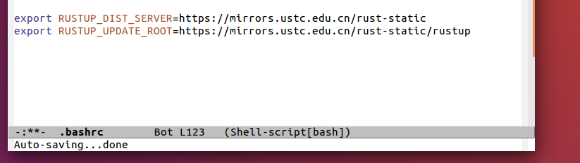

然后保存退出。并更新环境变量：
```shell
$ source ~/.bashrc
```

然后再接着安装：
```shell
$ curl https://sh.rustup.rs -sSf | sh
```
这一次马上就开始并且弹出提示：
```shell
···
You can uninstall at any time with rustup self uninstall and
these changes will be reverted.

Current installation options:


   default host triple: x86_64-unknown-linux-gnu
     default toolchain: stable
               profile: default
  modify PATH variable: yes

1) Proceed with installation (default)
2) Customize installation
3) Cancel installation
>
```
根据提示，我们选择按照默认安装，因此输入 1，并回车。

过了一两分钟就看到提示安装好了：
```shell
···
stable installed - rustc 1.39.0 (4560ea788 2019-11-04)


Rust is installed now. Great!

To get started you need Cargo's bin directory ($HOME/.cargo/bin) in your PATH
environment variable. Next time you log in this will be done
automatically.

To configure your current shell run source $HOME/.cargo/env
```
里面已经安装了很多 Rust 的工具链，更多请参考 [介绍](https://rustlang-cn.org/office/rust/book/ch00-00-introduction.html)：
* `cargo`：Rust 的包管理工具，以及项目管理工具。
* `clippy`
* `rust-docs`：Rust 的文档
* `rust-std`：Rust 的标准库
* `rustc`：Rust 的编译器
* `rustfmt`：Rust 格式化代码的工具。

根据上面的提示，我们需要通过执行以下命令来更新一下环境变量：
```shell
$ source $HOME/.cargo/env
```

接着我们可以验证以下是否安装成功：
```shell
$ cargo --version
$ cargo 1.39.0 (1c6ec66d5 2019-09-30)
```
到现在为止，Rust 环境成功搭建。


### 1.2 Substrate 环境搭建

#### 1.2.1 安装 Substrate 相关环境
官方已经有非常贴心的[安装文档](https://substrate.dev/docs/en/getting-started/installing-substrate)，里面有包括 Fast 模式和 Full 模式。Fast 模式是会跳过 substrate 以及 subkey 的安装过程。这个过程比较花时间，而且不影响我们后续的步骤，因此我们选择 Fast 模式。相反，Full 模式就是会有那两个的安装过程。

执行：
```shell
$ curl https://getsubstrate.io -sSf | bash -s -- --fast
```
期间会安装大量的系统软件，下面是终端的 log 输出：
```shell
Reading state information... Done
build-essential is already the newest version (12.1ubuntu2).
gcc is already the newest version (4:5.3.1-1ubuntu1).
pkg-config is already the newest version (0.29.1-0ubuntu1).
git is already the newest version (1:2.7.4-0ubuntu1.7).
git set to manually installed.
The following additional packages will be installed:
  binfmt-support clang-3.8 cmake-data libclang-3.8-dev libclang-common-3.8-dev
  libclang1-3.8 libffi-dev libjsoncpp1 libobjc-5-dev libobjc4 libssl-doc
  libtinfo-dev llvm-3.8 llvm-3.8-dev llvm-3.8-runtime zlib1g-dev
Suggested packages:
  gnustep gnustep-devel clang-3.8-doc codeblocks eclipse ninja-build
  llvm-3.8-doc
The following NEW packages will be installed:
  binfmt-support clang clang-3.8 cmake cmake-data libclang-3.8-dev
  libclang-common-3.8-dev libclang-dev libclang1-3.8 libffi-dev libjsoncpp1
  libobjc-5-dev libobjc4 libssl-dev libssl-doc libtinfo-dev llvm-3.8
  llvm-3.8-dev llvm-3.8-runtime zlib1g-dev
0 upgraded, 20 newly installed, 0 to remove and 0 not upgraded.
Need to get 65.6 MB of archives.
After this operation, 441 MB of additional disk space will be used.
···
```
最后输出是：
```shell
Receiving objects: 100% (207/207), 45.21 KiB | 8.00 KiB/s, done.
Resolving deltas: 100% (115/115), done.
Checking connectivity... done.
Run source ~/.cargo/env now to update environment
```
根据提示，我们需要更新一下环境变量来让操作系统找得到刚安装的 Substrate 相关的软件。
执行：
```shell
$ source ~/.cargo/env
```
到这里，Substrate 的环境安装好了。

#### 1.2.2 Substrate 相关脚本安装

接下来我们需要安装一些脚本，方便我们以后创建一个新的 Substrate 项目。

这个官方也有[非常贴心的文档](https://substrate.dev/docs/en/getting-started/using-the-substrate-scripts)，我们就参考这个文档来：

分步执行：
```
$ f=`mktemp -d`

$ git clone https://github.com/paritytech/substrate-up $f

$ cp -a $f/substrate-* ~/.cargo/bin

$ cp -a $f/polkadot-* ~/.cargo/bin
```
执行完后我们可以看到：
```shell
$ ls ~/.cargo/bin/
cargo         clippy-driver         rustdoc    rustup
cargo-clippy  polkadot-js-apps-new  rustfmt    substrate-module-new
cargo-fmt     rls                   rust-gdb   substrate-node-new
cargo-miri    rustc                 rust-lldb  substrate-ui-new
```
这些都是一些可执行文件（程序），其中 `substrate-module-new` `substrate-node-new` `substrate-ui-new` 就是我们刚刚安装的脚本，它们分别有以下功能：
- substrate-node-new 开启一个新项目时能用得到，能够马上得到 substrate 的一个 node 模板。
- substrate-module-new 在给某个已有 Substrate 项目新增 module 时用到，Substrate 支持在 runtime 里面有多个 module 来实现不同的逻辑功能。
- substrate-ui-new 这个在创建一个前端 UI 时能用得到。

到这里，这次需要用到的 Substrate 相关的环境就搭建好了。


#### 1.2.3 关于 apt 源问题的解决
⚠️ NOTE: 如果你安装环境没有问题或者安装软件时速度不慢，就不需要执行这个标题下的内容。

第一次安装时出现了一些问题：
```shell
···
build-essential is already the newest version (12.1ubuntu2).
gcc is already the newest version (4:5.3.1-1ubuntu1).
pkg-config is already the newest version (0.29.1-0ubuntu1).
git is already the newest version (1:2.7.4-0ubuntu1.6).
git set to manually installed.
Some packages could not be installed. This may mean that you have
requested an impossible situation or if you are using the unstable
distribution that some required packages have not yet been created
or been moved out of Incoming.
The following information may help to resolve the situation:

The following packages have unmet dependencies:
 clang : Depends: clang-3.6 (>= 3.6~rc1) but it is not going to be installed
 libclang-dev : Depends: libclang-3.6-dev (>= 3.6~rc1) but it is not going to be installed
 libssl-dev : Depends: libssl1.0.0 (= 1.0.2e-1ubuntu1) but 1.0.2g-1ubuntu4.15 is to be installed
              Depends: zlib1g-dev but it is not going to be installed
              Recommends: libssl-doc but it is not going to be installed
E: Unable to correct problems, you have held broken packages.
```

网上搜索，应该是我的 Ubuntu apt 源没有及时更新导致（我之前用的是中科大的 apt 源，可能它没有及时更新），参考[这个文档](https://mirrors.tuna.tsinghua.edu.cn/help/ubuntu/)，把 apt 源换成这个。注意要选择和自己的系统对应的，比如我的是 Ubuntu 16.06，所以选择这个：
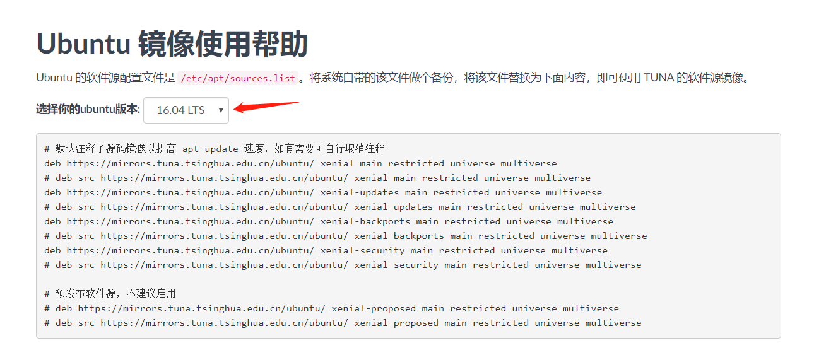

具体操作是：  
一、备份：
```shell
$ sudo cp sources.list sources.list.bak
```
二、用编辑器打开 apt 源的文件，清空里面的内容，将对应的 tuna 源的内容复制粘贴进去：
```shell
$ sudo emacs /etc/apt/sources.list
```
tuan 源：

```shell
deb https://mirrors.tuna.tsinghua.edu.cn/ubuntu/ xenial main restricted universe multiverse
# deb-src https://mirrors.tuna.tsinghua.edu.cn/ubuntu/ xenial main restricted universe multiverse
deb https://mirrors.tuna.tsinghua.edu.cn/ubuntu/ xenial-updates main restricted universe multiverse
# deb-src https://mirrors.tuna.tsinghua.edu.cn/ubuntu/ xenial-updates main restricted universe multiverse
deb https://mirrors.tuna.tsinghua.edu.cn/ubuntu/ xenial-backports main restricted universe multiverse
# deb-src https://mirrors.tuna.tsinghua.edu.cn/ubuntu/ xenial-backports main restricted universe multiverse
deb https://mirrors.tuna.tsinghua.edu.cn/ubuntu/ xenial-security main restricted universe multiverse
# deb-src https://mirrors.tuna.tsinghua.edu.cn/ubuntu/ xenial-security main restricted universe multiverse

# deb https://mirrors.tuna.tsinghua.edu.cn/ubuntu/ xenial-proposed main restricted universe multiverse
# deb-src https://mirrors.tuna.tsinghua.edu.cn/ubuntu/ xenial-proposed main restricted universe multiverse
```
最后结果是：
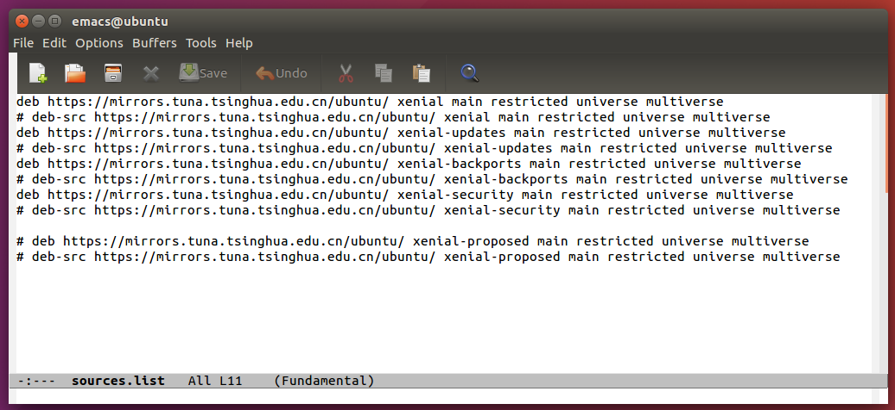

然后保存退出即可。

三、更新软件：  
分步执行：
```shell
$ sudo apt update

$ sudo apt upgrade
```
果然有好多软件没有更新：
```shell
Reading package lists... Done
Building dependency tree       
Reading state information... Done
Calculating upgrade... Done
The following NEW packages will be installed:
  linux-headers-4.15.0-72 linux-headers-4.15.0-72-generic
  linux-image-4.15.0-72-generic linux-modules-4.15.0-72-generic
  linux-modules-extra-4.15.0-72-generic
The following packages will be upgraded:
  amd64-microcode apport apport-gtk cpio cpp-5 dbus dbus-x11 file firefox
  firefox-locale-en g++-5 gcc-5 gcc-5-base ghostscript ghostscript-x git
  git-man gnome-software gnome-software-common grub-common grub-pc grub-pc-bin
  grub2-common imagemagick imagemagick-6.q16 imagemagick-common
  initramfs-tools initramfs-tools-bin initramfs-tools-core intel-microcode
  libarchive13 libasan2 libatomic1 libcc1-0 libcilkrts5 libdbus-1-3
  libdjvulibre-text libdjvulibre21 libgcc-5-dev libgomp1 libgs9 libgs9-common
  libitm1 libjpeg-turbo8 liblsan0 libmagic1 libmagickcore-6.q16-2
  libmagickcore-6.q16-2-extra libmagickwand-6.q16-2 libmpx0 libnss3
  libnss3-nssdb libpam-systemd libpcap0.8 libquadmath0 libsmbclient
  libsqlite3-0 libssh-4 libstdc++-5-dev libstdc++6 libsystemd0 libtsan0
  libubsan0 libudev1 libvpx3 libwbclient0 libwhoopsie0 libxslt1.1
  linux-generic-hwe-16.04 linux-headers-generic-hwe-16.04
  linux-image-generic-hwe-16.04 linux-libc-dev python3-apport
  python3-distupgrade python3-problem-report python3-update-manager samba-libs
  systemd systemd-sysv ubuntu-release-upgrader-core
  ubuntu-release-upgrader-gtk ubuntu-software udev unattended-upgrades
  update-manager update-manager-core whoopsie
87 upgraded, 5 newly installed, 0 to remove and 0 not upgraded.
Need to get 185 MB of archives.
After this operation, 342 MB of additional disk space will be used.
Do you want to continue? [Y/n] Y
Get:1 https://mirrors.tuna.tsinghua.edu.cn/ubuntu xenial-updates/main amd64 dbus-x11 amd64 1.10.6-1ubuntu3.5 [21.5 kB]
···
```
接下来可以回 `1.2.1 安装 Substrate 相关环境` 再次执行那个命令了。

## 二、新建一个 Substrate 项目 erc20
### 2.1 下载 erc20 项目所需源码
为了目录的整洁性，新建一个目录并进入：
```shell
$ mkdir polkadot

$ cd polkadot
```

substrate-node-new 的语法是：`Usage: substrate-node-new <NAME> <AUTHOR>`。作者 AUTHOR 是任意的，下面我的演示就是用 flyq，看者可以使用自己的。项目名 NAME 我们统一使用 erc20 。

使用 substrate-node-new 创建一个名为 erc20 的 substrate 项目：  
执行后脚本会从 GitHub 下载对应的源代码包，需要等待下载。
```shell
$ substrate-node-new erc20 flyq 

  Substrate Node Template Setup 
  Downloading project...
  % Total    % Received % Xferd  Average Speed   Time    Time     Time  Current
                                 Dload  Upload   Total   Spent    Left  Speed
100 71537  100 71537    0     0   2592      0  0:00:27  0:00:27 --:--:--  5026
Customizing project...
Initializing repository...

$ ls
erc20
```

可以看出仅仅用了半分钟就下载好了，对应目录下多出了一个文件夹 `erc20/`，这个就是我们项目文件夹。

PS：有时候会卡很久：
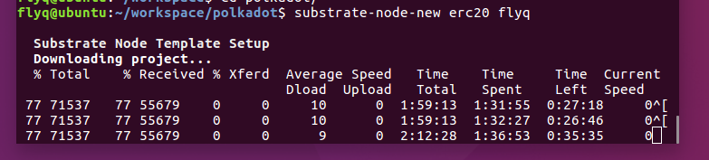
比如上面就是我们卡了一个半小时了，我直接 CTRL+c 中断了，然后删掉那个没下载完整的： `sudo rm -r substrate-node-template/`，重新试了一遍，就好了。

### 2.2 编译启动项目

因为我们的这个脚本 `substrate-node-new` 是安装的 [Substrate 1.0 版本](https://github.com/paritytech/substrate-up/blob/master/substrate-node-new#L44) 的，因此启动项目之前还需要先编译 wasm: `./scripts/build.sh` 。如果是 [Substrate 2.0 版本](https://gist.github.com/flyq/e2471d5f80d4b61e6e7b101a0a36429d#file-substrate-node-new-2-0-L42)，下面 `./scripts/build.sh ` 步骤就可以省略。官方正式的 2.0 版本还没有发布。
下面步骤终端有 log 输出的我贴出部分，方便对比。
```shell
$ cd erc20/

$ ./scripts/init.sh
*** Initializing WASM build environment
info: syncing channel updates for 'nightly-x86_64-unknown-linux-gnu'

  nightly-x86_64-unknown-linux-gnu unchanged - rustc 1.41.0-nightly (3ed3b8bb7 2019-12-17)
···
···
Compiling wasm-gc v0.1.6 (https://github.com/alexcrichton/wasm-gc#deb1c6dc)
    Finished release [optimized] target(s) in 1m 24s
  Installing /home/flyq/.cargo/bin/wasm-gc
   Installed package `wasm-gc v0.1.6 (https://github.com/alexcrichton/wasm-gc#deb1c6dc)` (executable `wasm-gc`)
```
上面 init.sh 脚本为了更新 Rust Toolchain，以及下载安装 Wasm-gc 相关工具。

接着我们执行：
```shell
$ ./scripts/build.sh 
Building webassembly binary in runtime/wasm...
    Updating git repository `https://github.com/paritytech/substrate.git`
···
···
warning: the feature `alloc` has been stable since 1.36.0 and no longer requires an attribute to enable
 --> /home/flyq/workspace/polkadot/erc20/runtime/src/lib.rs:4:43
  |
4 | #![cfg_attr(not(feature = "std"), feature(alloc))]
  |                                           ^^^^^
  |
  = note: `#[warn(stable_features)]` on by default

   Compiling erc20-runtime-wasm v1.0.0 (/home/flyq/workspace/polkadot/erc20/runtime/wasm)
    Finished release [optimized] target(s) in 17m 09s
```
上面为了编译 Substrate 链里面的 Wasm，因为 Substrate 为了升级时不需要硬分叉（想一下比特币或者以太坊升级时的麻烦吧），链上维护了一个 Wasm 形式的链的逻辑。这样如果整个链需要升级，在通过投票等治理环节后，就会上传一份新的 Wasm 代码。那些同步升级了的节点，他们的本地二进制形式的逻辑和链上 Wasm 形式的逻辑相同，就执行二进制逻辑（这样比执行 Wasm 效率更高），而那些暂时还没有同步更新的节点，他们会执行从链上同步过来的 Wasm 形式的逻辑代码，直到节点把二进制形式的程序也成功升级，这样在整个链的升级过程中，避免了节点的分叉。


接下来我们编译链的二进制程序：
```shell
$ cargo build --release
  Downloaded ctrlc v3.1.3 (registry `git://mirrors.ustc.edu.cn/crates.io-index`)
  Downloaded serde_json v1.0.40 (registry `git://mirrors.ustc.edu.cn/crates.io-index`)
  Downloaded slog-async v2.3.0 (registry `git://mirrors.ustc.edu.cn/crates.io-index`)
···
···
  Compiling substrate-service v1.0.0 (https://github.com/paritytech/    substrate.git?rev=cc1d67e973fd02c0c997b164ba516cf041bf21f1#cc1d67e9)
  Compiling substrate-cli v1.0.0 (https://github.com/paritytech/substrate.git?rev=cc1d67e973fd02c0c997b164ba516cf041bf21f1#cc1d67e9)
   Finished release [optimized] target(s) in 21m 23s
```
上面我们花了 21 分钟编译完成。这个取决于网速和电脑 CPU 性能。

这是可以看到多出了一个 target/ 文件夹，这里面包含了我们的编译结果：
```shell
$ ls
build.rs    Cargo.toml  README.md  scripts  target
Cargo.lock  LICENSE     runtime    src
```

### 2.3 Substrate 编译时下载依赖库很慢

⚠️ NOTE: 如果编译时网速不慢，没有下载时卡死等，就不需要执行这个标题下的内容。

在编译 Substrate 的时候，需要下载很多 Rust 库，部分库的下载地址在 GitHub 上，要是出现无法下载，可以参考[这篇文章](https://blog.csdn.net/xiangxianghehe/article/details/53471936)，把它换成国内中科大源就行，最后的效果就是在 `~/.cargo/` 文件夹下新建了一个 config 文件，里面内容是：
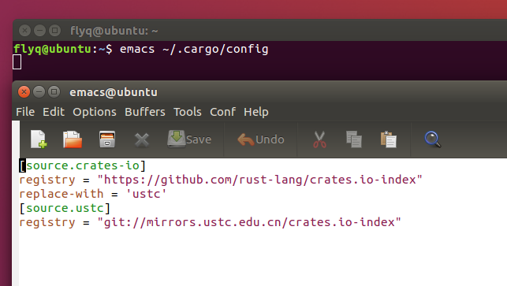


### 2.4 启动节点

```shell
$ ./target/release/erc20 --dev
2019-12-18 18:23:43 Substrate Node
2019-12-18 18:23:43   version 1.0.0-x86_64-linux-gnu
2019-12-18 18:23:43   by flyq, 2017, 2018
2019-12-18 18:23:43 Chain specification: Development
2019-12-18 18:23:43 Node name: scary-limit-0230
2019-12-18 18:23:43 Roles: AUTHORITY
2019-12-18 18:23:43 Initializing Genesis block/state (state: 0xa5fd…b5af, header-hash: 0x7606…b33f)
2019-12-18 18:23:43 Loaded block-time = 10 seconds from genesis on first-launch
···
···
```
上面可以看到，这个条链正常启动，而且 log 输出有很多提示信息，包括版本，出块时间等。

这时我们可以打开和节点运行在同一个操作系统里面的浏览器，输入网址：`https://polkadot.js.org/apps/#/settings`，将链接的链改为 `Local Node (Own, 127.0.0.1:9944)`，最后点击 `Save & Reload`：
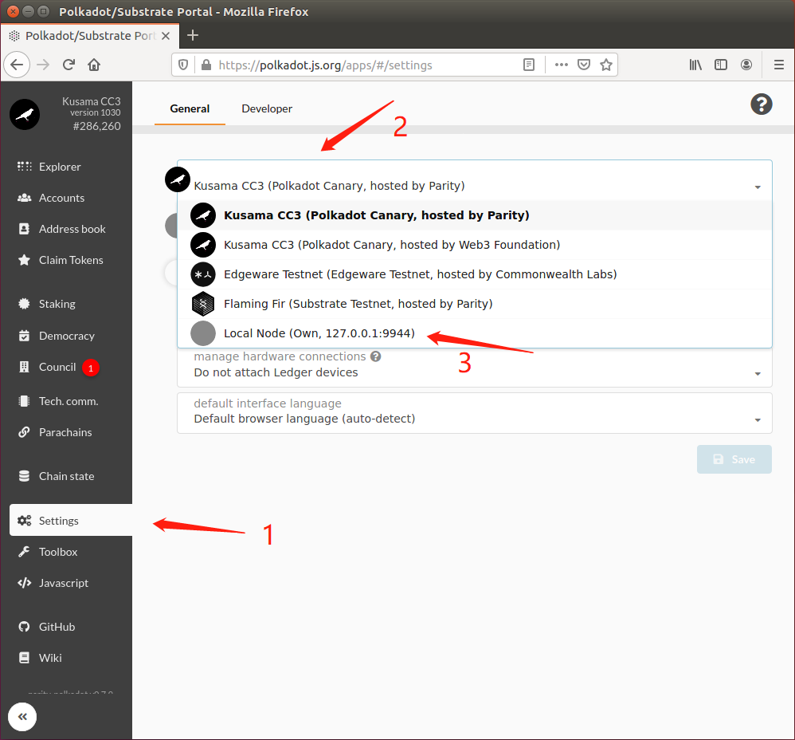

这个是 Substrate 链配套的 UI，包括了浏览器的功能，钱包的功能。我们可以通过 `substrate-ui-new` 工具自己起一个，为了方便这里直接用了 https://polkadot.js.org/apps 的，其效果是相同的。

到这里，我们成功将一条链运行起来了，并且还有了对应的浏览器以及钱包：
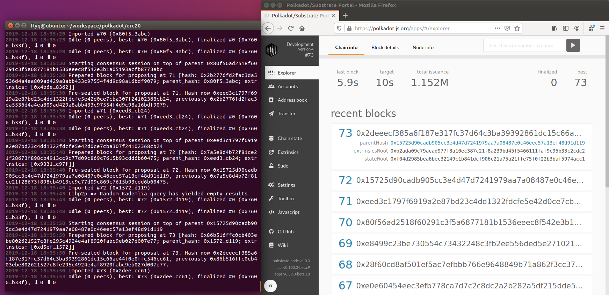

下面是它的钱包功能，系统预定义一系列的初始账号，并且给 ALICE 账号预分配了 1.151M 的 DEV，刚刚我给 BOB 账号转了 1000 DEV。可以看到，左侧栏里面还有很多其他功能，包括：
- 转账（transfer），
- 链上状态查询（Chain state），
- 发起交易包括调用函数之类的（Extrinsics），
- 超级权限（Sudo，一般用于链刚刚启动时还不稳定的时候，后续就交给治理了），
- 设置（Settings）等等。

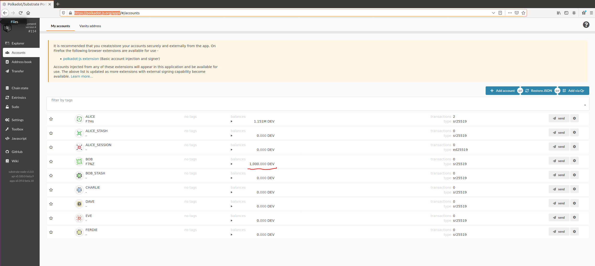

等你探索结束，你可以在链运行的终端按下 CTRL + C 来停止 Substrate。

到这里，你已经看到了我们创建、运行并且与我们自己的本地 Substrate 链进行交互的整个过程是有多么快速。


## 三、定制 erc20 的 Runtime

### 3.1 Substrate 更新 Runtime 的一般步骤
这个小标题下面参考官方 [Substrate-collectables-workshop](https://substrate.dev/substrate-collectables-workshop/#/zh-cn/0/common-patterns-moving-forward) 的内容。


在我们开始创建自定义 Substrate runtime 之前，你应该熟悉一些可以帮助你迭代和运行代码的模式。

你的 Substrate runtime 代码被编译为两个版本：
- WebAssembly（Wasm）image
- 标准二进制可执行文件

Wasm 文件被用来编译二进制文件的一部分，因此在构建可执行文件之前需要先编译 Wasm image。

步骤应该是：
```
./scripts/build.sh               // 构建 Wasm
cargo build --release            // 构建 binary
```

此外，当你对节点进行更改时，之前旧版本节点生成的块仍然存在。你可能会注意到，当重启节点时，块只会从中断处继续生成：

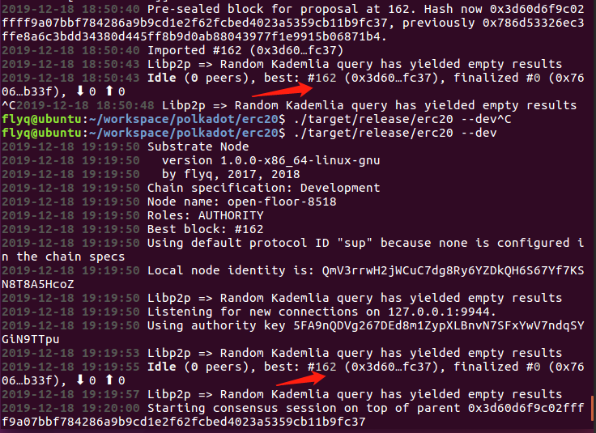  
*链从上次结束的第 162 个块继续出块*


但是，如果你对 runtime 的改动内容很多，那么可能需要使用以下命令清除链上先前的数据：

```shell
$ ./target/release/erc20 purge-chain --dev
Are you sure to remove "/home/flyq/.local/share/erc20/chains/dev/db"? (y/n)y
"/home/flyq/.local/share/erc20/chains/dev/db" removed.
```
完成所有这些后，你将能够再次启动一个没有历史数据的链：
```shell
$ ./target/release/erc20 --dev
```
记住这种模式; 你会经常使用它。

### 3.2 单账本形式的 erc20 的 Runtime 逻辑

关于怎样基于 Substrate 实现更安全的 module，推荐这本 [Substrate Recipes](https://substrate.dev/recipes/)。因为篇幅原因，这里不做过多介绍，后续有时间建议认真过一遍。

我们先回顾一下 [ERC20 标准](https://github.com/ethereum/EIPs/issues/20)：
```solidity
interface IERC20 {
    function totalSupply() external view returns (uint256);
    function balanceOf(address account) external view returns (uint256);
    function transfer(address recipient, uint256 amount) external returns (bool);
    function allowance(address owner, address spender) external view returns (uint256);
    function approve(address spender, uint256 amount) external returns (bool);
    function transferFrom(address sender, address recipient, uint256 amount) external returns (bool);

    event Transfer(address indexed from, address indexed to, uint256 value);
    event Approval(address indexed owner, address indexed spender, uint256 value);
}
```
上面这个就是以太坊 Solidity 形式的 ERC20 标准的对应 function 和 event。

因为一个地址对应一个合约，对应一个 token 账本，我们参考这个先实现一条链对应一个账本，后续再实现一条链对应多个账本，就是多个 Token。


#### 3.2.1 增加 module

```shell
├── runtime
│   ├── Cargo.toml
│   ├── src
│   │   ├── lib.rs
│   │   └── template.rs
···

```
我们先进入到 runtime/src/ 文件夹，可以看到里面有两个文件，一个是 lib.rs，这个是 runtime 模块的总领文件，我们等下新增 module 需要在这里“登记”一下；一个是 template.rs，这个是新增 module 的模板，我们新增的 module 可以参考它来实现。我们先看看这两个文件的内容。

先查看 [lib.rs](https://github.com/flyq/erc20/blob/master/runtime/src/lib.rs)，可以看出有三个地方涉及到 template 这个 module：  
第一个在 59 行这里，作用是告诉 runtime 新增了一个名叫 template 的 module：  
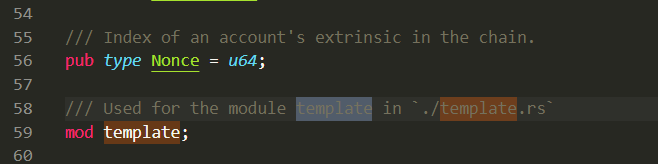  
第二个在 191 行这里，作用是实现 template 的 Trait：  
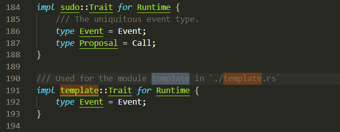  
第三个在 209 行这里，功能类似构造函数：  
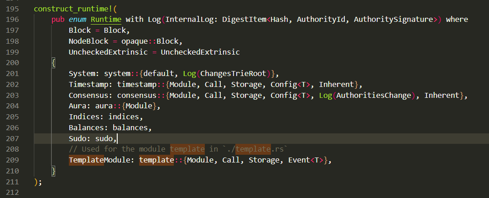  

然后我们可以看一下 [template.rs](https://github.com/flyq/erc20/blob/master/runtime/src/template.rs)，整体来看，其实现了三个宏 `decl_storage!{}`，`decl_module!{}`，`decl_event!()`，分别负责这个 module 的状态变量的数据存储，方法逻辑，以及 event 申明等。具体这三个宏的作用参考官方给出的[文档](https://substrate.dev/rustdocs/v1.0/srml_support/macro.decl_storage.html)：
```rust
decl_storage! {
	trait Store for Module<T: Trait> as TemplateModule {
		Something get(something): Option<u32>;
	}
}

decl_module! {
	pub struct Module<T: Trait> for enum Call where origin: T::Origin {
		fn deposit_event<T>() = default;

    pub fn do_something(origin, something: u32) -> Result {
			let who = ensure_signed(origin)?;
			<Something<T>>::put(something);
			Self::deposit_event(RawEvent::SomethingStored(something, who));
			Ok(())
		}
	}
}

decl_event!(
	pub enum Event<T> where AccountId = <T as system::Trait>::AccountId {
		SomethingStored(u32, AccountId),
	}
);
```

知道 module 在 Runtime 里面的位置以及怎么实现之后，接下来借助 `substrate-module-new` 来新建 erc20 Module：
```shell
flyq@ubuntu:~/workspace/polkadot/erc20$ cd runtime/src/
flyq@ubuntu:~/workspace/polkadot/erc20/runtime/src$ substrate-module-new erc20

  Substrate Module Setup 
  Creating module in ....
  Customising module...

SRML module created as ./erc20.rs and added to git.
Ensure that you include in your ./lib.rs the line:
   mod erc20;

flyq@ubuntu:~/workspace/polkadot/erc20/runtime/src$ ls
erc20.rs  lib.rs  template.rs
```
可以看出，新增了 erc20.rs 文件。

根据提示，我们先去 lib.rs，参考 template，把我们新增的 erc20 module “登记”一下，分别在对应位置依次增加以下部分：
```rust
mod erc20;


impl erc20::Trait for Runtime {
    // add required types here
    type Event = Event;
}


Erc20Module: erc20::{Module, Call, Storage, Event<T>},
```

然后我们尝试检查一下是否有错误：
```shell
$ cd erc20

$ cargo check
   Compiling libc v0.2.62
   Compiling semver-parser v0.7.0
   Compiling arrayvec v0.4.11
   Compiling byteorder v1.3.2
···
    Checking substrate-service v1.0.0 (https://github.com/paritytech/substrate.git?rev=cc1d67e973fd02c0c997b164ba516cf041bf21f1#cc1d67e9)
    Checking substrate-cli v1.0.0 (https://github.com/paritytech/substrate.git?rev=cc1d67e973fd02c0c997b164ba516cf041bf21f1#cc1d67e9)
    Finished dev [unoptimized + debuginfo] target(s) in 5m 30s
```
耗时 5 min 左右。一切正常，没有报错。

到这里，我们已经新建好了 erc20 module。

#### 3.2.2 修改 erc20 module
这里是参考：https://github.com/Genysys/substrate-erc20 ，以及  https://github.com/substrate-developer-hub/substrate-erc20-multi 。
##### 3.2.2.1 设置好类型
我们可以设计一个 TokenBalance 类型来保存发行的币的余额。它本质是一个 u128 类型。
可能有人会问为什么不直接用 u128，想一下以太坊里面的 ERC20 Token 合约，它里面直接用 uint256 类型来表示 Token 余额，结果好几个合约出现溢出错误，导致重大损失。后续也出现了可以自己加上的 SafeMath 库，所以为什么不直接将对应的功能封装在里面，加完后对应代码为：
```rust
pub trait Trait: system::Trait {
    // TODO: Add other types and constants required configure this module.

    /// The overarching event type.
    type Event: From<Event<Self>> + Into<<Self as system::Trait>::Event>;
    type TokenBalance: Parameter + Member + SimpleArithmetic + Codec + Default + Copy + As<usize> + As<u128>;    
}
```
而上面用了一系列的 Trait，类似 Parameter，Member 等，这些需要我们在 erc20.rs 说明来源。同样的，可以在 https://substrate.dev/rustdocs/v1.0/sr_primitives/traits/trait.Member.html 里面查询这些 Trait 的功能。

并且需要在 lib.rs 里面添加其具体类型：
```rust
impl erc20::Trait for Runtime {
    // add required types here
    type Event = Event;
    type TokenBalance = u128;
}
```
##### 3.2.2.1 设置状态变量
我们先设计好状态变量，状态变量的用处在代码里面注释说明：
```rust
decl_storage! {
	trait Store for Module<T: Trait> as erc20 {
    // 记录是否被初始化，启动后，有且只允许初始化一次。bool类型
		Init get(is_init): bool;
    // 记录一个 owner，类似管理员角色，有一些特权，这是一个账号，因此是 AccountId 类型
		Owner get(owner) config(): T::AccountId;
    // 总供应量，返回值是 TokenBalance 类型
		TotalSupply get(total_supply) config(): T::TokenBalance;
		// 下面两个是这个 Token 的名字和简称，因为 Wasm 里面不支持标准库，所以没用 String。
		Name get(name) config(): Vec<u8>;
		Ticker get (ticker) config(): Vec<u8>;
		// 下面是我们熟悉的两个变量，都是映射。一个表示余额，一个表示 A 允许 B 使用 A 多少 Token。
		BalanceOf get(balance_of): map T::AccountId => T::TokenBalance;
		Allowance get(allowance): map (T::AccountId, T::AccountId) => T::TokenBalance;
	}
}
```
上面出现 config() ，表示对应的状态变量在链启动时会有对应的配置。具体怎么配置查看 [3.2.2.4 其他方面的小修改](#3224-%e5%85%b6%e4%bb%96%e6%96%b9%e9%9d%a2%e7%9a%84%e5%b0%8f%e4%bf%ae%e6%94%b9)

##### 3.2.2.2 设置 Event
```rust
decl_event!(
    pub enum Event<T>
    where
        AccountId = <T as system::Trait>::AccountId,
	Balance = <T as self::Trait>::TokenBalance,
    {
        // 发生转账时发出该事件。
        Transfer(AccountId, AccountId, Balance),
        // 发生 approval 时发出该事件。
        Approval(AccountId, AccountId, Balance),
    }
);
```

##### 3.2.2.3 编写 module 里面的 function
```rust
decl_module! {
    pub struct Module<T: Trait> for enum Call where origin: T::Origin {
      fn deposit_event<T>() = default;

      // 初始化函数，检查完 Init 状态，是否有对应权限后，将所有的的 Token 记在 Owner 地址下。
      fn init(origin) -> Result {
          let sender = ensure_signed(origin)?;
          ensure!(Self::is_init() == false, "Already initialized.");
          ensure!(Self::owner() == sender, "Only owner can initialize.");

          <BalanceOf<T>>::insert(sender.clone(), Self::total_supply());
          <Init<T>>::put(true);

          Ok(())
      }

      // 转账函数。因为多次用到转账逻辑，因此把这部分逻辑抽出去独立成一个 _transfer() 函数
      fn transfer(_origin, to: T::AccountId, #[compact] value: T::TokenBalance) -> Result {
          let sender = ensure_signed(_origin)?;
          Self::_transfer(sender, to, value)
      }

      // 允许 spender 使用调用这个函数的人的部分 Token。
      fn approve(origin, spender: T::AccountId, #[compact] value: T::TokenBalance) -> Result {
          let sender = ensure_signed(origin)?;
          // 保证“我”有这个 Token
          ensure!(<BalanceOf<T>>::exists(&sender), "Account does not own this token");

          // 拿到现有的允许额度，如果没有会返回 0
          let allowance = Self::allowance((sender.clone(), spender.clone()));

          // 现有额度 + 这次将增加的额度。并且检测了是否溢出。
          let updated_allowance = allowance.checked_add(&value).ok_or("overflow in calculating allowance")?;

          // 将更新后的额度保存在 Allowance 状态变量里面
          <Allowance<T>>::insert((sender.clone(), spender.clone()), updated_allowance);

          // 发出对应的 Event。
          Self::deposit_event(RawEvent::Approval(sender, spender, value));
          Ok(())
      }

      // 从 From 转 value 数量的 Token 给 to
      fn transfer_from(_origin, from: T::AccountId, to: T::AccountId, #[compact] value: T::TokenBalance) -> Result {
          ensure!(<Allowance<T>>::exists((from.clone(), to.clone())), "Allowance does not exist.");
          let allowance = Self::allowance((from.clone(), to.clone()));
          ensure!(allowance >= value, "Not enough allowance.");

          let updated_allowance = allowance.checked_sub(&value).ok_or("overflow in calculating allowance")?;
          <Allowance<T>>::insert((from.clone(), to.clone()), updated_allowance);

          Self::deposit_event(RawEvent::Approval(from.clone(), to.clone(), value));
          Self::_transfer(from, to, value)
      }
    }
}

// 实现 _transfer() 的具体逻辑。
impl<T: Trait> Module<T> {
    fn _transfer(
        from: T::AccountId,
        to: T::AccountId,
        value: T::TokenBalance,
    ) -> Result {
        ensure!(<BalanceOf<T>>::exists(from.clone()), "Account does not own this token");
        let sender_balance = Self::balance_of(from.clone());
        ensure!(sender_balance >= value, "Not enough balance.");

        let updated_from_balance = sender_balance.checked_sub(&value).ok_or("overflow in calculating balance")?;
        let receiver_balance = Self::balance_of(to.clone());
        let updated_to_balance = receiver_balance.checked_add(&value).ok_or("overflow in calculating balance")?;
        <BalanceOf<T>>::insert(from.clone(), updated_from_balance);
        <BalanceOf<T>>::insert(to.clone(), updated_to_balance);
        Self::deposit_event(RawEvent::Transfer(from, to, value));
        Ok(())
    }
}
```
这里有个小插曲，不知道大家有没有认真看上面的代码，尤其是 transfer_from 函数。它的逻辑功能竟然是把 from 允许 to 使用的额度转给 to。这是不合常理的，因为这个函数可以任何人调用，就是有人有对某人的额度 Allowance 就会被旁人转到对应人的地址下。虽然不会不会造成 Token 的损失，但会让 Allowance 失去意义。我记得 ERC20 Token 里面 transferFrom 的逻辑是把 from 允许“我”（函数调用者）使用的额度（_allowances）对应数量的 token 转给 to。参考：https://github.com/OpenZeppelin/openzeppelin-contracts/blob/master/contracts/token/ERC20/ERC20.sol#L86-L102  

下面的逻辑和注释也说得很清楚: the caller must have allowance for ***`sender`***'s tokens of at least `amount`.
```solidity
    /**
     * @dev See {IERC20-transferFrom}.
     *
     * Emits an {Approval} event indicating the updated allowance. This is not
     * required by the EIP. See the note at the beginning of {ERC20};
     *
     * Requirements:
     * - `sender` and `recipient` cannot be the zero address.
     * - `sender` must have a balance of at least `amount`.
     * - the caller must have allowance for `sender`'s tokens of at least
     * `amount`.
     */
    function transferFrom(address sender, address recipient, uint256 amount) public returns (bool) {
        _transfer(sender, recipient, amount);
        _approve(sender, _msgSender(), _allowances[sender][_msgSender()].sub(amount, "ERC20: transfer amount exceeds allowance"));
        return true;
    }
```
所以我决定把 transfer_from 那部分的逻辑改一下：
```rust
      // 从 From 转 value 数量的 Token 给 to
      fn transfer_from(_origin, from: T::AccountId, to: T::AccountId, #[compact] value: T::TokenBalance) -> Result {
          let sender = ensure_signed(_origin)?;
          ensure!(<Allowance<T>>::exists((from.clone(), sender.clone())), "Allowance does not exist.");
          let allowance = Self::allowance((from.clone(), sender.clone()));
          ensure!(allowance >= value, "Not enough allowance.");

          let updated_allowance = allowance.checked_sub(&value).ok_or("overflow in calculating allowance")?;
          <Allowance<T>>::insert((from.clone(), sender.clone()), updated_allowance);

          Self::deposit_event(RawEvent::Approval(from.clone(), to.clone(), value));
          Self::_transfer(from, to, value)
      }
```

##### 3.2.2.4 其他方面的小修改
a. 在 runtime/src/lib.rs 的 218 行里面增加 Config<T> ：  
```rust
		Erc20Module: erc20::{Module, Call, Storage, Event<T>, Config<T>},
```

b. 在 src/chain_spec.rs 第 4 行最后加上 Erc20ModuleConfig
```rust
use erc20_runtime::{
	AccountId, GenesisConfig, ConsensusConfig, TimestampConfig, BalancesConfig,
	SudoConfig, IndicesConfig, Erc20ModuleConfig,
};
```
c. 在 src/chain_spec.rs 31 行加入，这个函数主要用于 d. 中：
```rust
fn account_key(s: &str) -> AccountId {
	sr25519::Pair::from_string(&format!("//{}", s), None)
		.expect("static values are valid; qed")
		.public()
}
```

d. 在 src/chain_spec.rs 118 行加入：
```rust
		erc20: Some(Erc20ModuleConfig {
			owner: account_key("Alice");
			// setting total supply of erc20 tokens to 21M because `Satoshi` said so
			total_supply: 21000000,
			name: "SubstrateDemoToken".as_bytes().into(),
			ticker: "SDT".as_bytes().into(),
    }),
```
这就是在链启动时，就对 owner 等状态变量进行了设置。


最后，整个项目代码在：  
https://github.com/flyq/erc20  
可以自行对比参考。


## 四、启动 erc20 链，并检验。
### 4.1 检测是否有语法错误：
```shell
$ cargo check
    Checking erc20-runtime v1.0.0 (/home/flyq/workspace/polkadot/erc20/runtime)
    Checking erc20 v1.0.0 (/home/flyq/workspace/polkadot/erc20)
    Finished dev [unoptimized + debuginfo] target(s) in 1.46s
```

这里省略了一个步骤，测试，更多关于测试的内容参考：https://substrate.dev/recipes/testing/index.html

### 4.2 编译、运行这条链
按照前面之前说得，先编译 Wasm，然后编译二进制程序：
```shell
$ cd erc20


$ ./scripts/build.sh 
Building webassembly binary in runtime/wasm...
   Compiling erc20-runtime v1.0.0 (/home/flyq/workspace/polkadot/erc20/runtime)
warning: the feature `alloc` has been stable since 1.36.0 and no longer requires an attribute to enable
 --> /home/flyq/workspace/polkadot/erc20/runtime/src/lib.rs:4:43
  |
4 | #![cfg_attr(not(feature = "std"), feature(alloc))]
  |                                           ^^^^^
  |
  = note: `#[warn(stable_features)]` on by default

   Compiling erc20-runtime-wasm v1.0.0 (/home/flyq/workspace/polkadot/erc20/runtime/wasm)
    Finished release [optimized] target(s) in 4.11s


$ cargo build --release 
   Compiling erc20 v1.0.0 (/home/flyq/workspace/polkadot/erc20)
    Finished release [optimized] target(s) in 1m 42s
```
编译过程一切正常。

### 4.3 清理之前的链的历史数据，然后启动这条链
```shell
$ ./target/release/erc20 purge-chain --dev 
Are you sure to remove "/home/flyq/.local/share/erc20/chains/dev/db"? (y/n)y
"/home/flyq/.local/share/erc20/chains/dev/db" did not exist.


$ ./target/release/erc20 --dev 
2019-12-19 07:52:47 Substrate Node
2019-12-19 07:52:47   version 1.0.0-65481ac-x86_64-linux-gnu
2019-12-19 07:52:47   by flyq, 2017, 2018
2019-12-19 07:52:47 Chain specification: Development
2019-12-19 07:52:47 Node name: pumped-cats-3507
2019-12-19 07:52:47 Roles: AUTHORITY
···
```
链已经正常启动：  
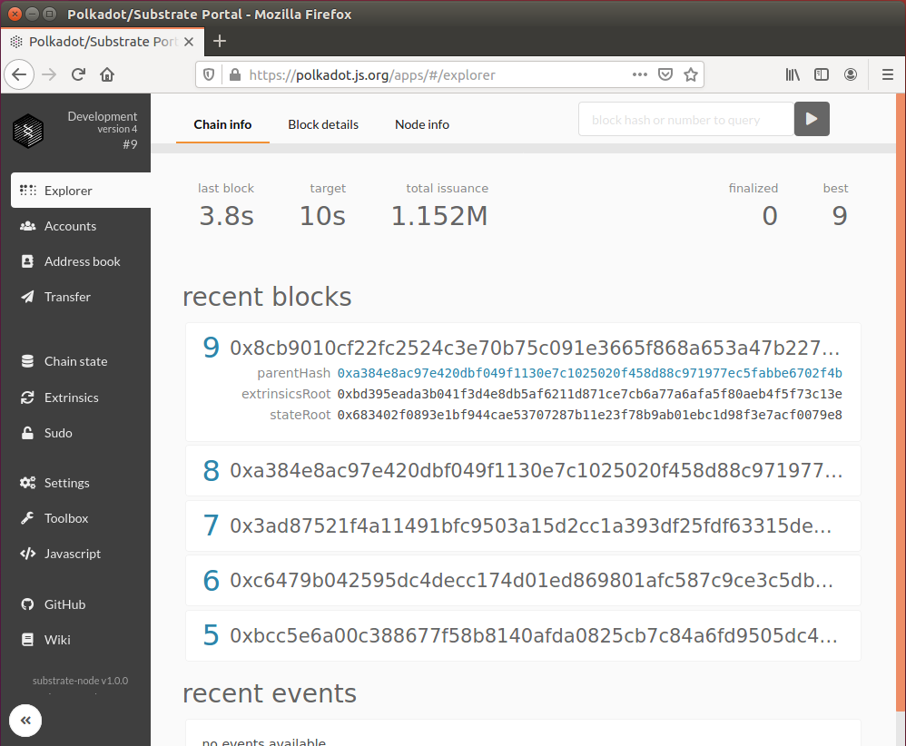


### 4.5 测试/体验一下对应的功能
#### 4.5.1 设置前端
因为我们链里面新建一个类型，TokenBalance，前端拿到这个数据不清楚这个代表什么，需要我们设置一下：

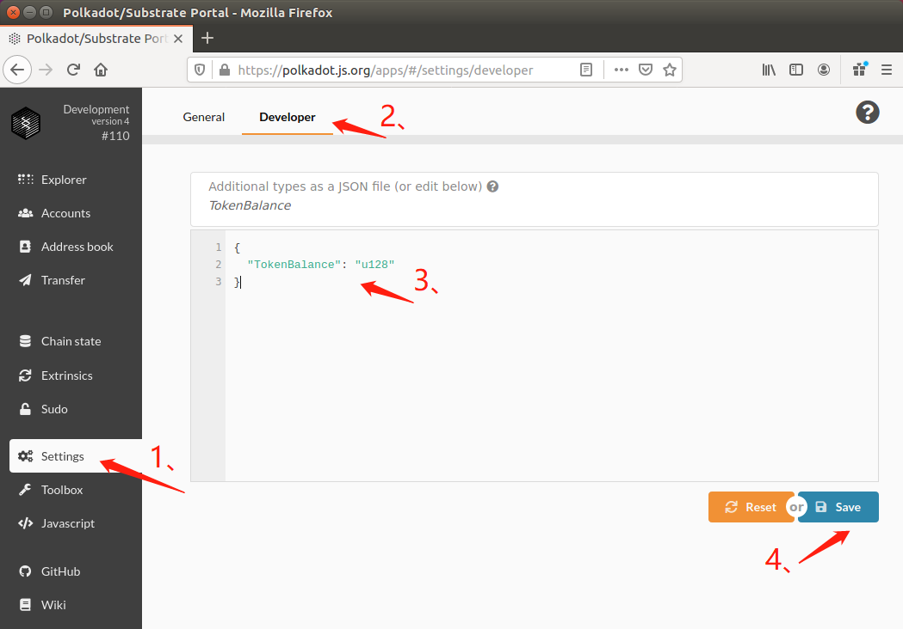

按步骤把下面这个 json 填进去就好：
```json
{
  "TokenBalance": "u128"
}
```

#### 4.5.2 转 DEV
链本身自带了一个币，符号是 DEV，全部 DEV 都分配给了 ALICE。先转一些给 BOB，这样等下测试时 BOB 有 DEV 去交手续费了。

因此先让 ALICE 转 10000 DEV 给 BOB，然后 BOB 转 1000 DEV　给　CHARILIE。结果如下图：　　

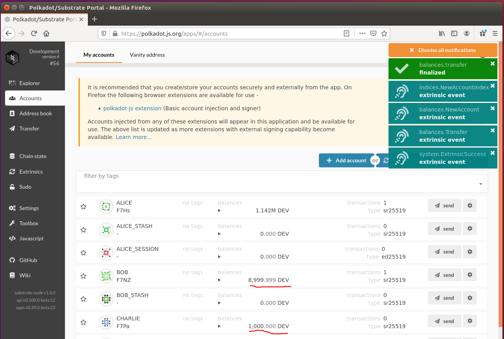

右上角是确认信息，表示转账成功。


#### 4.5.3 查询某个 module 状态
可以按照以下步骤查询 erc20 module 里面的状态变量值：

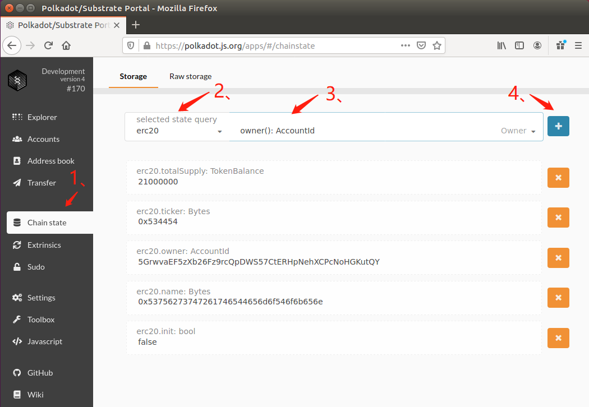

1. 点击 Chain state。
2. 选择 erc20 module（选择别的就是查询其他的 module）。
3. 选择想查询的状态变量对应的方法。
4. 点击 + 号，就能得到结果。

刚刚查了一些，比如依次是总量 21000000 的 Token，简称的 u8 编码是 0x534454，owner 是 5Grw 开头的要给账号，然后对比了一下，正是 ALICE，然后 init 状态是 false，表示还没初始化。因此一切正常。

#### 4.5.4 调用 init 函数
可以按照以下方法调用 init 函数：

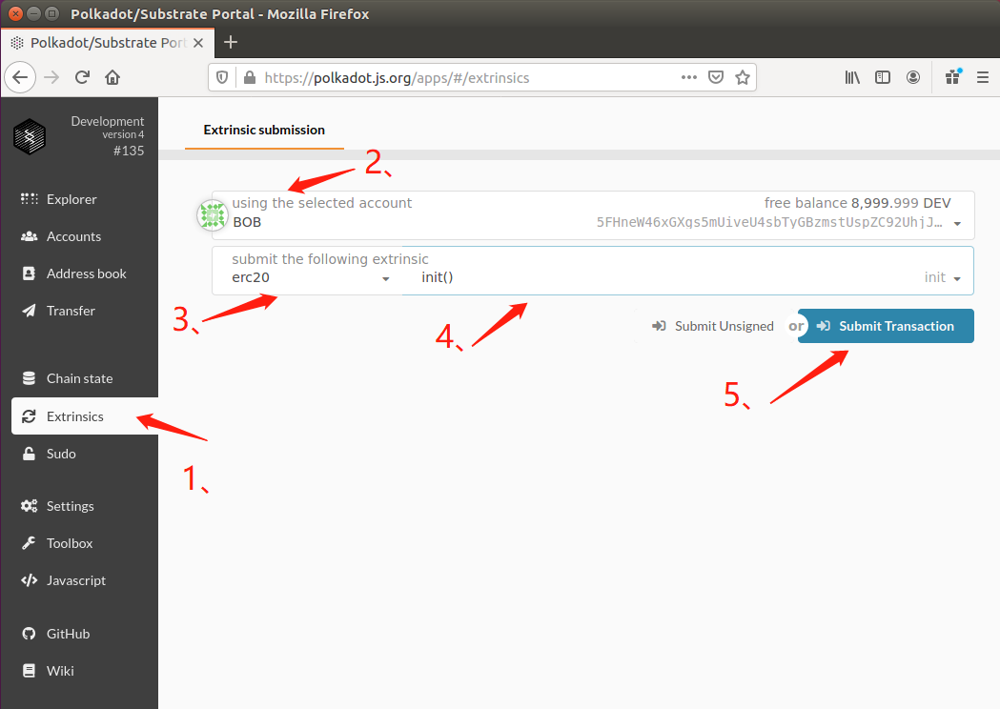

1. 选择 Extrinsics。
2. 选择账号，就是选择用哪个身份执行接下来的这个函数，这里选择 BOB，因为想测试一下链里面的权限控制逻辑是否正确，如果不是 ALICE，链应该拒绝执行。
3. 选择 module。
4. 选择想执行的函数。
5. 点击执行，然后输入密码签名（如果是新建的账号）。

前端返回结果果然是执行失败：

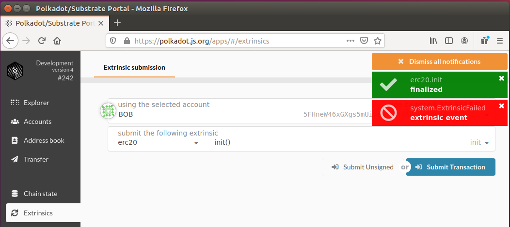

然后账号改成 ALICE，就执行成功了，因为我们设置了 ALICE 是 Owner，有这个权限：

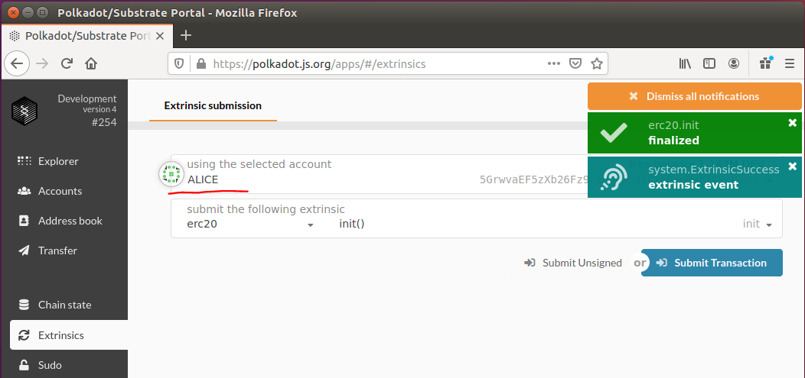

因为 init 代码逻辑包括将所有的 Token 转给 ALICE，因此可以查到 ALICE 的余额是：

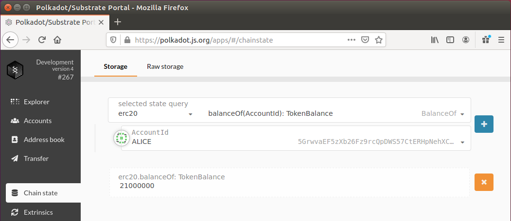

#### 4.5.5 测试其他功能
接下来，ALICE 转 10000 Token 给 BOB，并且再给 BOB 10000 Token 的额度。
然后 BOB 用自己的**额度**转 5000 Token 给 CHARLIE。

上面两步前端都提示成功执行了，  
最后我们查询相应的结果：

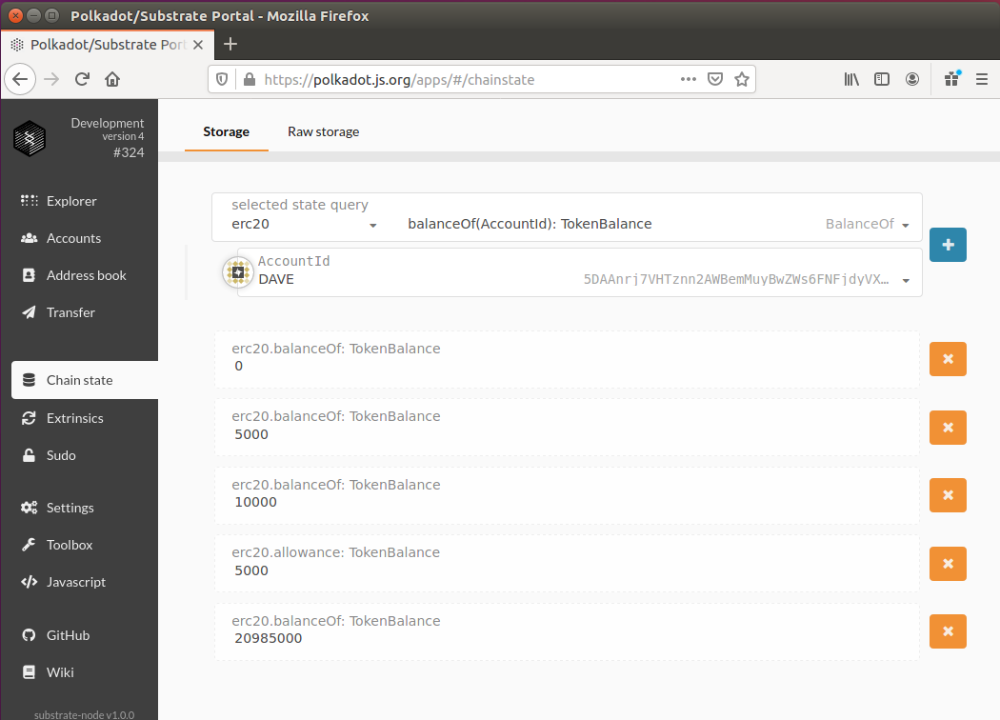
从下往上看：
1. 20985000 表示 ALICE 余额，21000000 - 10000 - 5000，正确；
2. 5000 表示 ALICE 给 BOB 的额度，10000 - 5000（用掉了5000），正确；
3. 10000 表示 BOB 的余额，正确；
4. 5000 表示 CHARLIE 的余额，正确；
5. 0 表示 Dave 的余额，正确。


## 五、总结
到现在为止，大家应该拥有了一个 Substrate 的开发环境，并且掌握了一个简单的 Substrate module 该怎么实现，甚至还找到参考资料的一个 Bug，收获很多。


后续可以参考以下资料：  
- https://substrate.dev/substrate-collectables-workshop/#/zh-cn/README
- https://substrate.dev/recipes/base/index.html

进行更深入的学习。

更多 Substrate 相关的资料：  
[Polkadot 学习资源汇总](https://github.com/flyq/blogs/blob/master/Polkadot%20%E5%AD%A6%E4%B9%A0%E8%B5%84%E6%BA%90%E6%B1%87%E6%80%BB.md)
