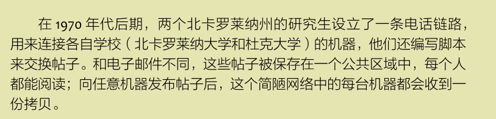
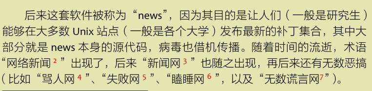
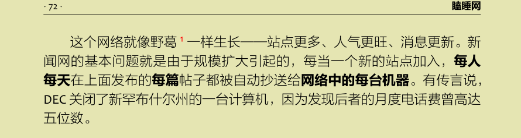
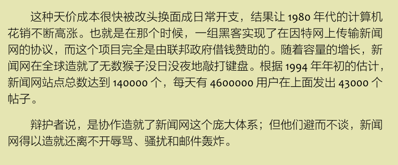
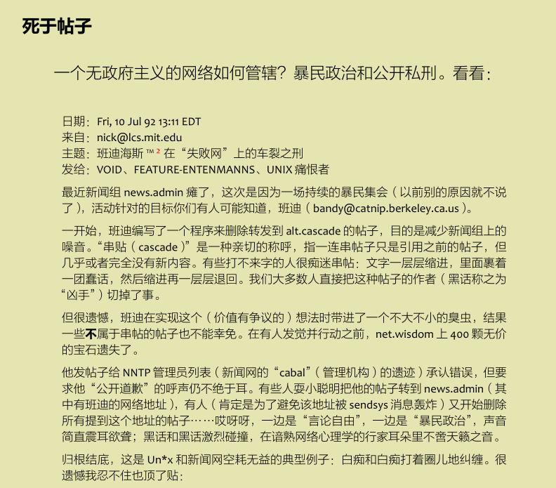

# 读 Unix 痛恨者手册

最近在读 Unix 痛恨者手册，这是一本 Unix 用户，系统管理员，程序员等角色对 Unix 操作系统的吐槽，当然，有时候会拐弯抹角的用词很激烈，让人感受一股真正的恨意。之前也粗粗看过，最近机缘巧合又开始从头读起。它给我带来不少欢乐的同时竟然还有不少启发。

以前学习计算机的历史，Unix 都是以光正伟大的形象著称，以致后面服务器端的 Linux （包括移动端的安卓），苹果的 Mac OS 以及 iOS，都或多或少来源于 Unix。还有那些 Unix 哲学之类的，其实等你读完这篇文章后就会觉得其实没有绝对的优点和缺点，同一特征在不同环境下表现出来的可能是好处，也可能是坏处，看当时的取舍罢了。

不过要有感同身受的乐趣和体会，最好是有 *nix 的使用经验，这样才能 get 到一些梗。

## `Contents`
- [读 Unix 痛恨者手册](#%e8%af%bb-unix-%e7%97%9b%e6%81%a8%e8%80%85%e6%89%8b%e5%86%8c)
  - [`Contents`](#contents)
  - [第五章 瞌睡网](#%e7%ac%ac%e4%ba%94%e7%ab%a0-%e7%9e%8c%e7%9d%a1%e7%bd%91)
    - [5-1](#5-1)
    - [5-2](#5-2)
    - [5-3](#5-3)
    - [5-4](#5-4)
    - [5-5](#5-5)

## 第五章 瞌睡网
> 我“水”故我在

我水故我在，太真实了。现在即时通讯，像微信QQ，其实大部分都是水群，也没啥有价值的信息交流。这个几十年前的 Usenet 就这样了。不过我也觉得挺正常的。

### 5-1

这两个研究生可能也只是兴趣使然，但是这绝对是互联网世界的一个里程碑。

### 5-2

骂人，看样子那个时候的网络“喷子”就有了，祖安文科状元在此。

谎言，互联网还是充斥着谎言，谣言。

### 5-3

**每人每天在上面发布的每篇帖子都被自动抄送给网络中的每一天机器。**
这里让我想起了区块链，想起了两个范式。
| 特定 | 分布式 | 集中式 |
| :---: | :---: | :---: |
 例子 | 像上面这样，内容保存在网络里面的每一台机器中 | 像现在一样，内容保证在Google，Facebook 的服务里面 
花费|昂贵|便宜（相对来说）

当时为什么这么设计，而不是搞一个集中的地方让别人来访问，肯定尤其原因，考虑到当时可能连 TCP/IP 协议簇都没有，文件资料的传输都是靠邮寄软盘之类的。

与区块链一样，这种所有节点都备份一份的做法也是非常昂贵。

### 5-4

事物的发展规律还是先有一个能满足基本痛点的产品，然后用户上去了再去迭代。

原始的基于电话线新闻网->互联网传输新闻网的协议->联邦政府给钱

上古时代的互联网同样充斥着谩骂，骚扰，邮件轰炸，而且这可能占了当时流量的很大一部分。就像 EOS 上面的交易很多就是 0.0001 EOS 的广告，虽然我不喜欢 EOS，哈哈哈。

### 5-5

92 年的帖子。
新生事物总是充满活力。

